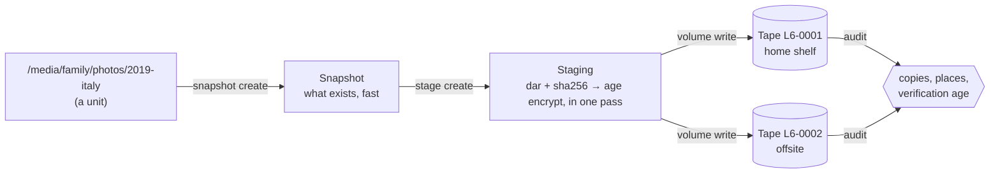

# tapectl

**Long-term, encrypted, multi-tenant archiving to LTO tape — built so the tapes can be
read back decades later, by someone else, without tapectl.**

tapectl turns directories into encrypted archives (`dar` + `age`), plans each tape
before writing it, writes it in one verified session, and keeps a catalog of what is
where: which files, which version, which cartridge, on which shelf, in how many
copies. Every tape carries its own recovery instructions, so the data outlives the
software, the database and the machine that wrote it.



## Why tapectl

- **Self-describing tapes.** Each tape begins with a plaintext guide, a `RESTORE.sh`
  and a map of every file on it. With the right key, the data comes back with `mt`,
  `dd`, `age`, `dar`, `sha256sum`, `head`, `truncate` and `tar` alone — no database,
  no tapectl.
- **Tenants that cannot read each other.** Family, business, a friend's backups: each
  tenant has its own keys, and nothing about a tenant's content — not even file
  names — is written to tape in plaintext.
- **A key you can put in an envelope.** A permanent *escrow* key, printed once and kept
  on paper, can decrypt every tape and, if the machine is lost, rebuild from each tape
  what the catalog knew about it when it was written. Where each cartridge is kept,
  its verification history and your policy are not on any tape: they come back from
  the encrypted catalog in the printed **Heir Kit** (as of its last refresh), which
  also tells whoever finds it what to do.
- **Plan first, write once.** The whole tape is planned before the first byte; the
  write ends with a seal marker, then reads back the front index and the seal marker,
  and only a tape whose two ends agree with the plan is recorded as sealed; a sealed
  tape is never appended to. `--full-confirm` reads every byte back at write time;
  otherwise the `volume verify` that follows is the tape's first full read-back, and
  `audit` names the tape (`no_full_verify`) until one passes.
- **It knows where everything is.** Copies, locations, versions and verification
  history are tracked, and `audit` tells you what is short of your policy and the
  exact command that fixes it.

## A taste

```bash
TAPE=/dev/tape/by-id/scsi-<SERIAL>-nst                 # your drive, by serial

tapectl init --operator mike                             # write the printed escrow secret on paper
tapectl backend add --name lto6 --device-tape "$TAPE" --device-sg /dev/sg1 --generation LTO-6
tapectl tenant add family -d "family photos and letters"
tapectl unit init-bulk /media/family/photos --tenant family

tapectl snapshot create family/photos/2019-italy         # fast: what is there
tapectl stage create family/photos/2019-italy            # dar + sha256 + age, into staging
tapectl volume init L6-0001 --device "$TAPE"             # reads the cartridge's chip
tapectl volume write L6-0001 --device "$TAPE"            # plan, write, seal marker, confirm the ends
tapectl volume verify L6-0001 --device "$TAPE" --full    # the first full read-back

tapectl audit --action-plan                              # "has 1 copies, needs 2" — and the fix
tapectl restore unit --unit family/photos/2019-italy --from L6-0001 --to /tmp/restore --device "$TAPE"
```

The [walkthrough](docs/walkthrough.md) runs a complete session like this — two tapes,
two places, a restore, the Heir Kit and a disaster-recovery rehearsal — with the real
output of every command.

## Requirements

- **Linux** with the kernel `st` tape driver, and an **LTO drive** (tested on an HP
  LTO-6; one drive writes every generation it supports — each cartridge's generation is
  read from the cartridge). A virtual library ([mhvtl](docs/operator-guide.md)) works for
  trying things out.
- **`dar` ≥ 2.6** (2.7.20+ recommended), `mt-st`, `sg3-utils`, `acl`, `python3`,
  `lsscsi`. The installer checks for all six and offers to install them.
- **`age`** (the command-line tool, with `age-keygen`) is not used by tapectl, which
  encrypts with the `rage` library. It is needed for recovery — the on-tape
  `RESTORE.sh` (the heir's path), decrypting the Heir Kit's catalog, checking a typed
  escrow secret — and by the installer's rehearsal.
- Staging space for one tape's worth of data (up to 2.5 TB for a full LTO-6).
- Rust 1.94 to build (pinned in `rust-toolchain.toml`).

## Install

The guided route builds a release binary, creates a dedicated `tapectl` service user
to own the keys and catalog, finds the drive by serial, walks you through the escrow
key and the Heir Kit, rehearses on a test cartridge, and writes your first tape:

```bash
git clone https://github.com/mikmorg/tapectl && cd tapectl
scripts/first-run.sh            # resumable: --from N / --to N; --help lists every step
```

[docs/install.md](docs/install.md) is the runbook: what each step creates, how to
resume, reinstall, move to a new host, or uninstall. To build by hand:
`cargo build --release` (binary at `target/release/tapectl`).

## Documentation

| If you want to… | Read |
|---|---|
| See a whole session, start to finish | [Walkthrough](docs/walkthrough.md) |
| Understand the model: tenants, units, snapshots, volumes, copies | [Concepts](docs/concepts.md) |
| Install it properly | [Install](docs/install.md) |
| Run it day to day: archive, copy, restore, compact, audit | [Operator guide](docs/operator-guide.md) |
| Configure it: every `config.toml` key, collections, policy | [Configuration](docs/configuration.md) |
| Understand the keys, the Heir Kit, and recover from a disaster | [Keys and recovery](docs/keys-and-recovery.md) |
| Make sense of a refusal or an error | [Troubleshooting](docs/troubleshooting.md) |
| Look up a command or flag | [Command reference](docs/cli/README.md) |
| Know exactly what is on a tape | [On-tape format v2](docs/design/volume-format-v2.md) |

The full index, including design records and test procedures, is
[docs/README.md](docs/README.md).

## What is on a tape

Every tape uses **Layout Version 2**
([specification](docs/design/volume-format-v2.md)):

| File | Contents | Encrypted? |
|---|---|---|
| 0 | ID thunk: label, uuid, where the index is, the cartridge's identity | No |
| 1 | Recovery guide (Markdown, written for a human or an AI assistant) | No |
| 2 | `RESTORE.sh` — scripted recovery | No |
| 3 | Front index: every file's position, type, size and ciphertext sha256 | No |
| 4 … | Envelopes: one per tenant (file lists, restore recipe), then the operator's two (the catalog) | Yes |
| … | Data slices (`dar` archives) | Yes |
| last | Seal marker: binds the front index; written after the last slice, before the read-back that confirms it | No |

Nothing in the plaintext files says what the data *is* — no names, no paths, no
tenants. A tape without its seal marker was never finished and says so.

## Status

tapectl is not yet in production use: no production tape has been written, and the
first one waits on the maintainer's go-ahead (September 2026). The on-tape format is
frozen and pinned by byte-level tests; changes to it are deliberate decisions recorded
as [ADRs](docs/adr/). It has been validated end to end on a real HP LTO-6 — writes,
verification, every restore path including the heir's script off the tape, catalog
rebuild from tape, and a measured end-of-tape fill.

## Development

```bash
cargo check --all-targets
cargo test                      # ~2,200 tests; needs `dar` on PATH, no tape hardware
cargo clippy --all-targets      # must stay warning-clean
cargo fmt --check
scripts/check-docs.py           # `tapectl …` examples: subcommands and long flags must exist
```

After a CLI change, regenerate the references:
`cargo run --example gen_man` (man pages, `docs/man/`) and
`cargo run --example gen_cli_md` (Markdown, `docs/cli/`; a test fails while it is
stale).

The mhvtl end-to-end tests and the verification gate need a virtual tape library
([mhvtl](docs/operator-guide.md)). They take the `/dev/nstN` of an **LTO-8** emulated
drive, named explicitly — numbering is not stable across reboots, so look it up first
(`ls -l /dev/tape/by-id/`: the `scsi-XYZZY_A*` links are mhvtl; `lsscsi` shows which
are `ULT3580-TD8`). Their discovery refuses anything that is not mhvtl, so a real
drive is never written by mistake.

```bash
TAPECTL_GATE_TAPE=/dev/nst3 TAPECTL_MHVTL=1 \
    cargo test --test mhvtl_e2e -- --ignored --nocapture
TAPECTL_GATE_TAPE=/dev/nst3 TAPECTL_MHVTL=1 \
    scripts/mhvtl-verify-gate.sh        # the operator-level verification gate
scripts/lifecycle-suite.sh --help       # years of use in minutes
```

Staging writes no plaintext to the staging device (ADR-0012). `cargo test` audits a
real stage with inotify; `scripts/plaintext-scan.sh <tapectl binary>` (needs sudo, no
tape) stages a marker tree onto a `sync,nodiscard` loop-mounted image and scans the raw
image for the marker, with a deleted canary as its positive control.

The [lifecycle suite](docs/lifecycle-suite.md) is different on both counts: it takes
an mhvtl drive of any generation, and on a drive that is not mhvtl it switches to a
real-drive mode that runs only with `--erase short`, `--single-cartridge` and
`--i-will-lose-the-cartridge SERIAL`, and erases that cartridge.

Code map: `src/cli/` (commands), `src/db/` (SQLite catalog, migrations),
`src/staging/` (dar + age pipeline), `src/volume/` (the v2 layout, the write session,
verify, restore, catalog rebuild), `src/tape/` (st driver ioctls, cartridge memory),
`src/policy/` (copies, escrow coverage, audit), `src/collection/` (folder-per-unit
sources). Design records: [docs/adr/](docs/adr/), [docs/design/](docs/design/),
[CONTEXT.md](CONTEXT.md) (the vocabulary).

## License

See [LICENSE](LICENSE).
