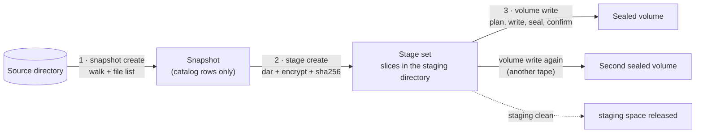
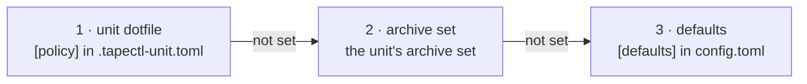
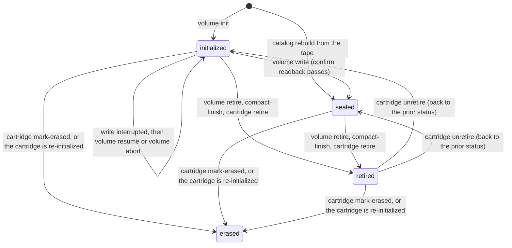
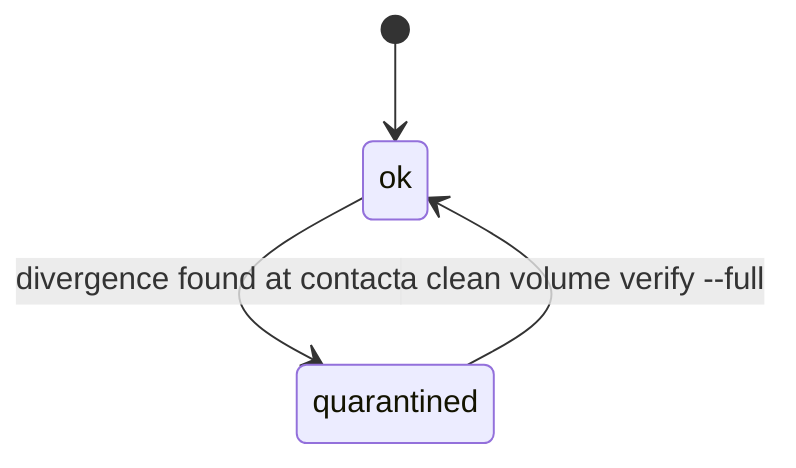
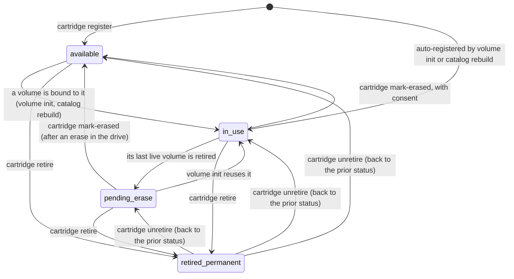
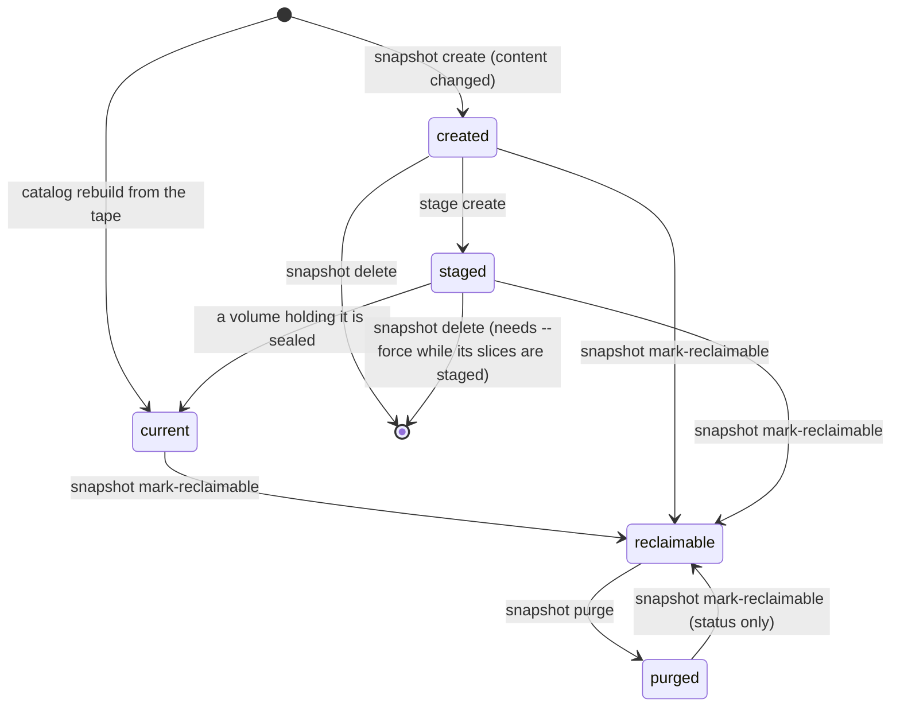
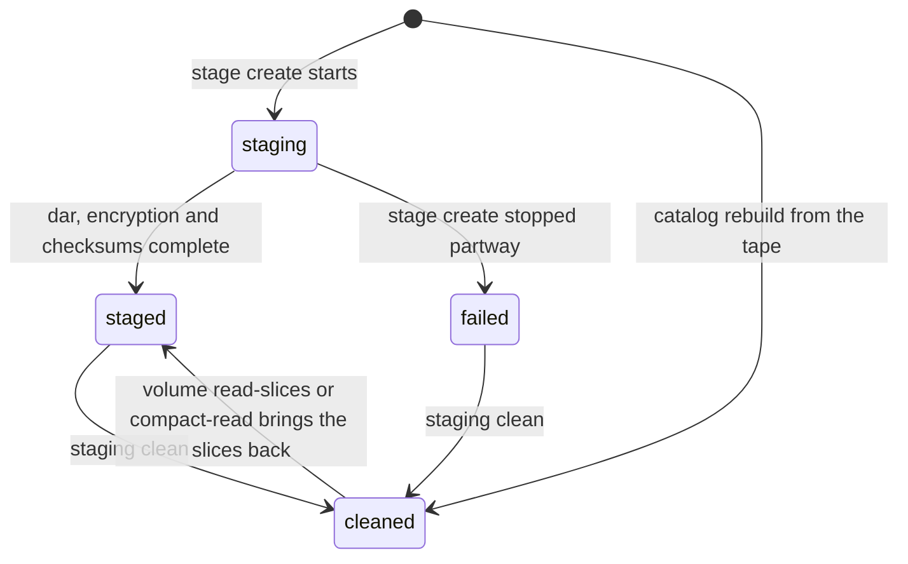

# How tapectl thinks

This page is the mental model to have before you run anything. It explains the
nouns tapectl uses (tenant, unit, snapshot, stage set, volume, cartridge,
location, copy, and the rest), why each one exists, and how they fit together.
It also lists the states you will see in `list` and `info` output and says what
is written on a tape. It is not a tutorial: for a first run end to end, see
[the walkthrough](walkthrough.md). For every flag, see
[the command reference](cli/README.md).

> [!NOTE]
> Commands on this page are written `tapectl …`. If you installed with
> `scripts/first-run.sh`, tapectl runs as a service user, so the same command is
> `tapectl-op …` (or `sudo -u tapectl -H tapectl …`).

The examples are real output from a session on a virtual tape library. It used
the operator `mike`, two tenants (`family` and `work`), units under `/media`, and
two LTO-8 volumes, `L8-0001` and `L8-0002`, kept at the locations `home-rack`
and `offsite`.

## Contents

1. [The big picture](#the-big-picture)
2. [The three-phase pipeline](#the-three-phase-pipeline)
3. [Who owns what: tenants, units, tags, collections](#who-owns-what-tenants-units-tags-collections)
4. [Versions of content: snapshots, stage sets, slices, receipts](#versions-of-content-snapshots-stage-sets-slices-receipts)
5. [Where it lives: volumes, cartridges, locations](#where-it-lives-volumes-cartridges-locations)
6. [How safe is it: copies and coverage](#how-safe-is-it-copies-and-coverage)
7. [Policy: archive sets and audit](#policy-archive-sets-and-audit)
8. [The states you see in listings](#the-states-you-see-in-listings)
9. [What is on a tape](#what-is-on-a-tape)
10. [Keys, briefly](#keys-briefly)
11. [Glossary](#glossary)

## The big picture

tapectl keeps a SQLite **catalog** (`~/.tapectl/tapectl.db`) that records what
you archived, where every copy is, and how sure it is of each claim. Your data
moves from a directory on disk, through staging, to one or more sealed tapes
(the [pipeline](#the-three-phase-pipeline) below).

Three ideas run through the whole design:

- **Tape is write-once, and a tape describes itself.** tapectl plans a whole tape
  before it writes a byte. A finished (**sealed**) tape is never written again,
  and it carries everything needed to restore it without tapectl or the catalog.
- **The catalog holds claims; the tape is the evidence.** A catalog row saying
  "slice 7 is on L8-0001" is a belief until a tape is loaded and checked. That is
  why listings show when each volume was last verified.
- **Coverage is counted, not assumed.** A unit is safe when enough identical
  copies of its content sit on sealed tapes in enough places. `audit` does the
  counting.

## The three-phase pipeline

Archiving always goes through three commands, and each one can run at a
different time:



| Phase | Command | What it does | Touches tape? |
|---|---|---|---|
| 1 | [`snapshot create`](cli/snapshot.md#tapectl-snapshot-create) | Walks the unit's directory and records every file's path, size, and mtime in the catalog. Fast, metadata only. | No |
| 2 | [`stage create`](cli/stage.md#tapectl-stage-create) | Checks the source still matches the snapshot, runs `dar` to cut it into slices, encrypts each slice with age, and records checksums. | No |
| 3 | [`volume write`](cli/volume.md#tapectl-volume-write) | Builds the complete layout of the tape, checks it fits, writes it, writes the seal marker, then reads the front index and seal marker back to confirm it (every file with `--full-confirm`; otherwise a later `volume verify` does that). | Yes |

From the session (the other three units were snapshotted and staged the same
way before the write):

```text
$ tapectl snapshot create family/letters
snapshot created: family/letters v1 (2 files, 224 B)

$ tapectl stage create family/letters
staged: family/letters (1 slices, 1.1 KiB dar, 1.8 KiB encrypted)

$ tapectl volume write L8-0001 --device /dev/tape/by-id/scsi-XYZZY_A1-nst --yes
about to write to volume "L8-0001":
  family/letters v1: 1 slices, 1.8 KiB
  family/photos/2019-italy v1: 1 slices, 1.1 MiB
  family/photos/2020-garden v1: 1 slices, 588.1 KiB
  work/invoices-2024 v1: 1 slices, 1.7 KiB

total: 4 slices, 1.7 MiB
volume "L8-0001" write completed
```

### Why staging exists

tapectl could stream a directory straight to tape. It deliberately does not,
because tape punishes surprises.

- **Plan first, then write.** A tape is written from beginning to end and is
  never appended to. Before the first byte goes out, tapectl needs to know every
  file that will be on the tape, its exact size, and its checksum. Only then can
  it write the plaintext front index (the map of the tape) at the front. Staged,
  encrypted slices are what make those numbers known in advance.
- **The pre-flight capacity gate.** Because every size is known, `volume write`
  adds up the whole layout and refuses before touching the tape if it will not
  fit. This check is tapectl's only defense against running out of tape: if the
  drive hits the physical end of tape anyway, the write aborts cleanly and leaves
  an unsealed tape. It never salvages a partial tape.
  [`volume plan`](cli/volume.md#tapectl-volume-plan) shows you the same arithmetic:

  ```text
  $ tapectl volume plan --copies 2
  volume write plan (2 copy/copies):
    family/photos/2019-italy v1: 1 slices, 1.1 MiB
    family/photos/2020-garden v1: 1 slices, 588.1 KiB
    family/letters v1: 1 slices, 1.8 KiB
    work/invoices-2024 v1: 1 slices, 1.7 KiB

  total: 4 slices, 1.7 MiB x 2 = 3.4 MiB
  estimated tapes: 1 (at the 97% fill ceiling)
  ```

- **Stage once, write many.** A stage set stays on disk after it is written, so
  the same encrypted slices can go to a second and a third tape. The second copy
  is bit-for-bit the same ciphertext as the first. `volume write` picks up
  everything currently staged, so after the first tape is written, the next
  `volume write` to another tape writes the same stage sets again.
  The `Writes` column of `staging status` shows how many times each stage set
  has been written.

- **Release deliberately.**
  [`staging clean`](cli/staging.md#tapectl-staging-clean) deletes the slice files
  once a stage set has been written and its unit meets its copy requirement. It
  does not touch stage sets whose units are still short of copies unless you
  pass `--force`.

## Who owns what: tenants, units, tags, collections

### Tenant

A **tenant** is a key domain: a set of encryption keys, and the data encrypted to
them. It is not a Unix account and has nothing to do with file ownership. Use
one tenant for each "class of data whose keys you might hand to different
people": for example, family photos that your heirs should be able to open
and business records that your accountant should be able to open. A tenant's
key cannot decrypt another tenant's data. That is enforced by the encryption
itself, not by the catalog.

[`tenant add`](cli/tenant.md#tapectl-tenant-add) creates a tenant with a
primary and a backup key:

```text
$ tapectl tenant add family -d "family photos and letters"
tenant "family" created (id=2) with primary and backup keys
```

**The operator tenant.** [`init`](cli/init.md) creates a special tenant named
after you (`--operator mike`). The operator's keys can decrypt everything on
every tape, alongside each tenant's own keys and the permanent escrow recipient
(see [Keys, briefly](#keys-briefly)). You do not archive units into the operator
tenant; it exists so that you, the person running the system, can always read
and rebuild what you wrote.

```text
$ tapectl tenant list
+--------+--------+----------+---------------------+---------------------------+
| Name   | Status | Operator | Created             | Description               |
+--------+--------+----------+---------------------+---------------------------+
| family | active |          | 2026-09-29 08:19:49 | family photos and letters |
+--------+--------+----------+---------------------+---------------------------+
| mike   | active | yes      | 2026-09-29 08:19:49 | System operator           |
+--------+--------+----------+---------------------+---------------------------+
| work   | active |          | 2026-09-29 08:19:50 | business records          |
+--------+--------+----------+---------------------+---------------------------+
```

### Unit

A **unit** is a directory archived as one entity. It is the thing you snapshot,
stage, restore, and count copies of. Every unit belongs to exactly one tenant.
A unit cannot sit inside another unit: `unit init` and `snapshot create` both
refuse nested units.

[`unit init`](cli/unit.md#tapectl-unit-init) registers one directory, and
[`unit init-bulk`](cli/unit.md#tapectl-unit-init-bulk) registers each immediate
subdirectory of a parent (hidden directories are skipped):

```text
$ tapectl unit init /media/family/letters --tenant family --tag letters
unit "family/letters" initialized (id=1)

$ tapectl unit init-bulk /media/family/photos --tenant family --tag photos
  ok: /media/family/photos/2020-garden (id=2)
  ok: /media/family/photos/2019-italy (id=3)
2 units created, 0 skipped
```

**How names are made.** Unless you pass `--name`, the unit's name is its
absolute path with the leading `/` removed. A leading `media` or `mnt`
component is also dropped:

| Directory | Unit name |
|---|---|
| `/media/family/letters` | `family/letters` |
| `/mnt/archive/photos` | `archive/photos` |
| `/home/user/data` | `home/user/data` |

**The dotfile.** `unit init` writes `.tapectl-unit.toml` into the directory. Its
`uuid` is the unit's permanent identity. If you move or rename the directory,
[`unit discover`](cli/unit.md#tapectl-unit-discover) (which scans the
`[discovery] watch_roots` you configure) or `collection sync` finds the dotfile
at its new path and reconnects it to the same unit, so the unit's
history carries over. The dotfile can also hold per-unit policy overrides (see
[Policy](#policy-archive-sets-and-audit)). It is an ordinary file inside the
unit, so it is archived with the rest of the unit (`catalog ls family/letters`
lists `.tapectl-unit.toml` next to `1998-letter-to-mum.txt`).

A unit's status is `active` (the normal state), `tape_only` (you have declared
that its disk copy may be deleted, see [tape-only units](#tape-only-units)), or
`missing` (`collection sync` found that its directory is gone).

### Tags

**Tags** are free-form labels on a unit (`--tag` on `unit init`, or
[`unit tag`](cli/unit.md#tapectl-unit-tag) later). They are for your own
organizing and filtering (`unit list --tag photos`). They do not affect policy
or what gets written.

### Collection

A **collection** is a source root in `config.toml` whose child folders, at a
fixed depth, each become one unit. Use it for "a folder per film" or
"a folder per year" shapes, where calling `unit init` by hand would be tedious.
A collection is a factory and a batch driver over ordinary units. It is not a
place where data is stored.

```toml
[[collections]]
name = "films"
root = "/media/films"
tenant = "family"
unit_depth = 1              # 1 = immediate children; 2 = grandchildren (show/season)
archive_set = "bulk-media"  # optional policy for every unit it registers
```

A collection's units are named `<collection name>/<relative path>`, for example
`films/alien-1979`. They are not named with the path rule above.
[`collection sync`](cli/collection.md#tapectl-collection-sync) registers new
folders, reconnects moved or renamed ones by their dotfile uuid, and marks
vanished ones `missing`. It never deletes anything. On a scratch
home, after renaming the folder `alien-1979` to `alien`:

```text
$ tapectl collection sync
collection "films": 0 created, 1 moved, 0 reactivated, 0 missing, 1 pending, 0 dirty
```

The unit kept its name, `films/alien-1979`, and its history. `collection plan`
and `collection run` then batch the pending units onto tapes, filling each
batch in alphabetical order. See [configuration](configuration.md) for every
collection key.

## Versions of content: snapshots, stage sets, slices, receipts

### Snapshot and Version

A **snapshot** records what a unit's directory contained at a moment: every
file's path, size, and mtime (and sha256, depending on the unit's checksum
mode). Each snapshot has a **version** number within its unit: v1, v2, and so on.

A version names content, not a moment. A new version is minted only when the
content differs from the unit's latest snapshot. Running `snapshot create` on
an unchanged directory creates nothing:

```text
$ tapectl snapshot create films/heat-1995
snapshot created: films/heat-1995 v1 (2 files, 212 B)
$ tapectl snapshot create films/heat-1995
unit "films/heat-1995" is unchanged since v1; no snapshot created
```

So two versions of a unit never hold identical content, and "v2" always means
"something changed".

Two related words appear in reports:

- **Dirty**: the unit's directory no longer matches its latest snapshot. This is
  routine. The fix is a new snapshot, not an investigation.
- **Pending**: a unit with archival work to do. It is either never archived (no
  snapshot at all) or dirty.

A snapshot that has been sealed onto a tape is **current**. More than one
version of a unit can be current at once. Archiving v2 does not demote v1, and
v1 keeps counting (and being carried forward by compaction) until you
explicitly mark it reclaimable with
[`snapshot mark-reclaimable`](cli/snapshot.md#tapectl-snapshot-mark-reclaimable).

That release is gated on the version that replaces it. A newer current version
must exist, and it must meet the unit's copy requirement and hold a copy at
every location the unit's policy names (see
[Requirements](#requirements-and-seeing-them)). If it falls short, the command
lists the shortfall and asks on a terminal; `--force` or the global `--yes`
confirms in advance, and a run with no terminal and neither flag refuses.
A version with no newer current version above it is a different case. That
includes the unit's newest current version, even while an older version is
also current. Neither a prompt nor `--yes` accepts it; only an explicit
`--force` releases it.

### Stage set and slices

A **stage set** is one snapshot turned into encrypted, checksummed files in the
staging directory. `stage create` runs `dar` with its archive on standard
output, and tapectl cuts the archive into **slices** of at most `slice_size`
(default `1G`), each a dar slice exactly as dar itself would cut it. Each slice
is encrypted with age, as it is cut, to the unit's tenant, the operator, and
the escrow recipient, so only ciphertext is ever written to the staging
directory. A slice is the unit of tape I/O: one slice becomes one file on tape.

For each slice, tapectl records the sha256 of the plaintext `dar` slice and of
the encrypted file. The encrypted hash is later printed in plaintext on the tape
(it reveals nothing about the content), so the tape's integrity can be checked
with no key at all.

### Receipt

A **receipt** is the list of recipients a stage set was encrypted to. It is
recorded at staging and, on tapes written since 2026-09-11, carried on the tape
inside the operator envelope. It is how tapectl knows the escrow recipient can
decrypt a copy. `audit` reports escrow coverage as covered, a gap, or unknown,
and `catalog locate` shows it in its Escrow column. A catalog rebuilt from tape
recovers the receipts the tape carried
(`escrow receipts: 4 stage set(s) carried theirs on the tape`).

Two nearby things are not receipts:

| You see | What it is |
|---|---|
| **Stage reports** in `~/.tapectl/stage-reports/` | A text file per stage set, headed `tapectl stage report`: the unit, tenant, snapshot, and each slice's plaintext and encrypted size and sha256. It is for your records and is private to the machine (mode 0600). |
| **Writes** in `volume info` | One line per stage set written to that volume, with its outcome and time (see [Write sessions](#write-sessions)). |

`volume deposit add --receipt` is unrelated: it records the warehouse provider's
own receipt or object-version identifier for a deposit.

A home created before 2026-09-29 kept its stage reports in `receipts/`. The
first tapectl command run on that home moves the directory to `stage-reports/`.
If both directories already exist, both are kept and new reports go to
`stage-reports/`.

## Where it lives: volumes, cartridges, locations

### Volume and cartridge

A **cartridge** is the physical object: the plastic shell with tape in it. A
**volume** is the logical tape image tapectl writes onto a cartridge, with a
label you choose (`L8-0001`). They are tracked separately because a cartridge
outlives its volumes. You can retire a volume, erase the cartridge in the
drive, and initialize a new volume on the same cartridge. Never degauss
(bulk-erase) an LTO cartridge: that destroys the servo tracks written on it at
the factory, and no drive can use it again.

- **A cartridge is known by its chip serial.** Every LTO cartridge has a memory
  chip (MAM) that reports a serial number. That serial is the cartridge's
  identity for life. The **barcode** is a sticker you can relabel at any time
  ([`cartridge relabel`](cli/cartridge.md#tapectl-cartridge-relabel)). When
  `volume init` meets a cartridge it has never seen, it registers the cartridge
  and uses the serial as a placeholder barcode:

  ```text
  $ tapectl volume init L8-0001 --device /dev/tape/by-id/scsi-XYZZY_A1-nst
  cartridge E01001L8_1775794348 auto-registered from MAM (barcode = medium serial)
  volume "L8-0001" initialized (id=1)
  ```

  Only when no chip serial can be read does the barcode you give
  (`volume init --cartridge`) become the identity.

- **Generation is a property of the cartridge, not the drive.** An LTO-6 drive
  can write LTO-6 and LTO-5 media, so the drive's configured generation says
  nothing about the tape in it. `volume init` detects the medium's generation
  from the cartridge itself, refuses if the drive cannot write that medium
  (`--force` never overrides this), and fixes the volume's capacity from it.
  Capacity is decided once, at init, and stored on the volume. Cartridge
  capacities are decimal (as printed on the box); data sizes are binary
  (KiB, MiB).

- **Sealed volumes are immutable.** A volume becomes **sealed** when its write
  session finishes and the readback confirm passes. It is then never written
  again: there is no append. A later `volume write` to a sealed label is refused,
  and no flag overrides that. The cost is that a half-full tape stays half-full.
  Batch your writes, and use `volume compact` later to consolidate underused
  tapes. The rule's benefit is that every claim about a sealed tape is a claim
  about an object that can no longer change, which is the simplest thing to hand
  to an heir. See [ADR-0003](adr/0003-sealed-volumes-immutable-no-append.md).

- **Interrupted is not sealed.** A write that stops partway leaves the volume
  **unsealed**: it is not a copy and not self-describing. What comes next
  depends on how it stopped:
  - **Stopped from outside** (a crash, a power loss, Ctrl-C): the session is
    `interrupted`. [`volume resume`](cli/volume.md#tapectl-volume-resume)
    continues it on the same cartridge, and
    [`volume abort`](cli/volume.md#tapectl-volume-abort) abandons it.
  - **Failed** (the real end of tape, a drive error, a staged file that no
    longer matches its checksum): the session aborts itself. A session
    aborted before its seal is never resumed. The volume stays `initialized`,
    and `volume write` starts a new session on it from the beginning of the
    tape.

### Location

A **location** is where a cartridge physically is: a **shelf** (a rack at home,
a fire safe at a relative's house) or a **warehouse** (cold cloud storage that
receives recorded deposits of sealed volumes rather than cartridges).

```text
$ tapectl location add offsite -d "a fire-safe box at a relative's house"
location "offsite" added (id=2, kind=shelf)
```

A cartridge's place is a location, never a status. A new volume starts where
its cartridge is: at the cartridge's location if it has one (a reused tape, or
a spare you placed with `cartridge move`), and `(not placed)` otherwise. When
you carry a tape somewhere, record it with
[`volume move`](cli/volume.md#tapectl-volume-move) or
[`cartridge move`](cli/cartridge.md#tapectl-cartridge-move). Both do the same
thing from different ends: they move the cartridge and every volume on it
together, in one transaction, so the shelf and the catalog cannot disagree.

```text
$ tapectl volume move L8-0002 --to offsite
volume "L8-0002" moved to "offsite"
  cartridge "E01003L8_1775794348" moved with it
```

Locations are something only you know. Nothing on the tape records where the
tape is kept, which is why a lost catalog loses locations but not data (see
[what "self-describing" promises](#what-self-describing-does-and-does-not-promise)).

## How safe is it: copies and coverage

### What counts as a copy

A **copy** is one version of a unit, with identical content, on a volume that is
sealed, not quarantined, and not retired. Three consequences follow:

- **Coverage is per version.** v2 on tape is not a copy of v1, however little
  changed. A unit is only as covered as its **least-covered live version**,
  where live means current (not yet marked reclaimable). If v1 is on three tapes
  and v2 on one, the unit has one copy.
- **Only sealed volumes count.** An unsealed tape from an interrupted or
  failed write counts for nothing.
- **Copies are distinct volumes.** Writing the same stage set to two volumes
  gives two copies. The number of locations is the number of distinct places
  those volumes are kept (a recorded warehouse deposit also counts as a copy and
  as a location).

How recently a copy was verified never changes whether it counts. It is shown
next to the copy (the Verified column) and at every destructive prompt, so you
can judge it yourself.

### Requirements, and seeing them

A unit's **minimum copies** comes from its policy (default 2, see
[Policy](#policy-archive-sets-and-audit)). Its archive set can also name
**required locations**. Those are checked by name: every current version needs a
copy at each named location, and copies spread over other places do not stand
in for a missing one. After the first tape in the session, `audit` reported
every unit one copy short:

```text
$ tapectl audit
VIOLATIONS (4):
  [copy_count] family/letters: has 1 copies, needs 2
  [copy_count] family/photos/2019-italy: has 1 copies, needs 2
  [copy_count] family/photos/2020-garden: has 1 copies, needs 2
  [copy_count] work/invoices-2024: has 1 copies, needs 2
WARNINGS (1):
  [escrow_kit_missing] archive: 1 sealed volume(s) exist but no heir kit has ever been generated — nothing off-site can decrypt them
audit: 4 violations, 1 warnings (exit 2)
```

After writing `L8-0002` and moving it offsite:

```text
$ tapectl report copies
  family/letters: 2 copies, 2 locations [tapes holding any version: L8-0001,L8-0002]
  family/photos/2019-italy: 2 copies, 2 locations [tapes holding any version: L8-0001,L8-0002]
  family/photos/2020-garden: 2 copies, 2 locations [tapes holding any version: L8-0001,L8-0002]
  work/invoices-2024: 2 copies, 2 locations [tapes holding any version: L8-0001,L8-0002]
```

[`catalog locate`](cli/catalog.md#tapectl-catalog-locate) shows each copy of a
unit with its volume, location, escrow coverage, and last verification.
The `MIN COPIES` column in `volume list` looks from the tape's side. It shows
the copy count of the least-covered unit on that tape, counted as of now, and
that count includes this tape while it is still a copy. It is not what losing
the tape would leave: a
`MIN COPIES` of 1 can mean this tape holds a unit's only copy.

### Tape-only units

Marking a unit **tape-only**
([`unit mark-tape-only`](cli/unit.md#tapectl-unit-mark-tape-only)) is how you
say "the tapes are now the only copy, and I may delete the disk copy". Because
that is irreversible in practice, the command is gated:

- A unit that was **never archived** (it has no snapshot at all) is refused
  outright. No flag overrides this. The check reads the unit's directory, so
  it works only while that directory is still at the unit's recorded path. If
  the directory has moved or is gone, a never-archived unit falls through to
  the four facts below, and its zero copies become a shortfall that `--force`
  or `--yes` confirms. Check `snapshot list` before you confirm.
- A unit whose policy cannot be resolved (for example, a malformed dotfile) is
  refused. The gate does not guess at a policy.
- Otherwise the command checks the unit against four facts: its copies against
  its resolved `min_copies`, its number of locations against the
  `[defaults] min_locations` floor (default 2), a copy at each of its named
  required locations, and whether it is **dirty**. A unit that meets all four
  is marked at once. Any shortfall is listed, and on a terminal the command
  asks before marking. `--force` or the global `--yes` confirms in advance; a
  run with no terminal and neither flag refuses, naming each shortfall.

Tape-only units stay in every audit check except `dirty`, since their disk copy
may be gone. Releasing an old version of a tape-only unit with
`snapshot mark-reclaimable` is held to a stricter bar: the copy requirement and
the number of required locations are both multiplied by
`[compaction] tape_only_safety_multiplier` (default 2).

## Policy: archive sets and audit

### Archive sets and resolution order

An **archive set** is a named policy: minimum copies, required locations,
encryption, compression, checksum mode, slice size, verify interval, warehouse
copies, and which file attributes to keep (extended attributes, and with them
the ACLs Linux stores as extended attributes; filesystem flags). Define archive
sets in `config.toml` and load them with
[`archive-set sync`](cli/archive-set.md#tapectl-archive-set-sync), or create
them with [`archive-set create`](cli/archive-set.md#tapectl-archive-set-create).
`sync` writes only the keys each table names, so a value you set with
`archive-set edit` for a key the table leaves out survives the next sync.
Warehouse copies relies on that: an `[[archive_sets]]` table cannot name it
(`warehouse_copies` there is an unknown key, and the config does not load), so
set it with `--warehouse-copies` on `archive-set create` or `archive-set edit`.
A unit joins one with `unit init --archive-set`, or through its collection's
`archive_set`.

```toml
[[archive_sets]]
name = "irreplaceable"
min_copies = 3
required_locations = ["home-rack", "offsite", "bank-box"]
```

Each name in `required_locations` must be a location you have already
registered with [`location add`](cli/location.md#tapectl-location-add). Here
that means registering `bank-box` first: `archive-set sync`, `create` and
`edit` refuse a name that is not a registered location.

The `encrypt` key exists but is never honoured: every slice is encrypted to its
tenant, the operator and the escrow recipient, and `stage create` warns when a
policy says `encrypt = false`.

A policy value resolves through up to three layers, and the first layer that
sets it wins:



Not every key exists at every layer. A dotfile's `[policy]` can set only
`checksum_mode`, `compression`, `slice_size` and `warehouse_copies`. The copy
requirement is the archive set's `min_copies`, or else `[defaults] min_copies`
(default 2). Named required locations come only from an archive set.
`[defaults] min_locations` (default 2) is a floor on the number of distinct
locations. It has no per-set layer, and only `unit mark-tape-only` reads it. A
misspelled key at any layer is an error, not a silent fallback to the next
layer. See [configuration](configuration.md) for every key.

> [!NOTE]
> Configs written before 2026-09-29 spell these two keys
> `min_copies_for_tape_only` and `min_locations_for_tape_only`. A config that
> still uses either old name does not load, and the error names the new keys.
> Rename the lines; the values carry over unchanged.

### Audit is advisory

[`audit`](cli/audit.md) checks every unit against its resolved policy (copy
count, each named required location, verification age, escrow coverage, and
more) and reports **violations** and **warnings**. It never blocks anything and
never changes anything. Its exit code tells a script how bad things are:

| Exit | Meaning |
|---|---|
| 0 | Clean |
| 1 | Warnings only |
| 2 | At least one violation |

`audit --action-plan` adds a suggested fix under each finding. The audit after
the first tape, with its plan:

```text
$ tapectl audit --action-plan
VIOLATIONS (4):
  [copy_count] family/letters: has 1 copies, needs 2
    fix: tapectl volume init <OTHER-LABEL> && tapectl volume write <OTHER-LABEL>
  [copy_count] family/photos/2019-italy: has 1 copies, needs 2
    fix: tapectl volume init <OTHER-LABEL> && tapectl volume write <OTHER-LABEL>
  [copy_count] family/photos/2020-garden: has 1 copies, needs 2
    fix: tapectl volume init <OTHER-LABEL> && tapectl volume write <OTHER-LABEL>
  [copy_count] work/invoices-2024: has 1 copies, needs 2
    fix: tapectl volume init <OTHER-LABEL> && tapectl volume write <OTHER-LABEL>
WARNINGS (1):
  [escrow_kit_missing] archive: 1 sealed volume(s) exist but no heir kit has ever been generated — nothing off-site can decrypt them
    fix: tapectl key escrow-kit --out <dir>
audit: 4 violations, 1 warnings (exit 2)
```

Once `L8-0002` was written and moved offsite, only the heir-kit warning was
left, so `audit` exited 1:

```text
$ tapectl audit
WARNINGS (1):
  [escrow_kit_missing] archive: 2 sealed volume(s) exist but no heir kit has ever been generated — nothing off-site can decrypt them
audit: 0 violations, 1 warnings (exit 1)
```

The commands that do give things up enforce the same coverage facts
themselves, in tiers. Staleness is shown but never gates. A shortfall is
listed as facts and asked about on a terminal. The global `--yes` (or the
command's own `--force`, where it has one) confirms in advance, and a run with
no terminal and neither flag refuses.

The commands that take a copy out of service (`volume retire`,
`volume compact-finish`, `cartridge retire` and `cartridge mark-erased`) also
have a floor. Removing the last eligible copy of a live version is refused
outright, and no flag reaches it. `unit mark-tape-only` and
`snapshot mark-reclaimable` remove no copy, so they have no such floor. With
consent, `unit mark-tape-only` marks a unit that has no copy on tape.
`snapshot mark-reclaimable` releases a version even when the newer version
that replaces it has no eligible copy. Their hard stops are different: a unit
that was never archived is refused outright while its directory is still at
its recorded path, and a version with no newer current version needs an
explicit `--force`. See
[Tape-only units](#tape-only-units),
[Snapshot and Version](#snapshot-and-version) and
[ADR-0008](adr/0008-destructive-consent-tiers.md).

## The states you see in listings

The state names below are exactly the values the catalog stores and the
listings print (and the values each `list --status` filter accepts).

### Volume status



The retire and erase commands do not look at a volume's status.
`cartridge retire` retires every volume on the cartridge, and
`cartridge mark-erased`, or binding the cartridge to a new volume, erases every
volume on it. So an `active` volume (below) leaves the same ways a
`sealed` one does. `cartridge unretire` restores only the volumes that were
retired with the cartridge, each to the status it had before.

| Status | Meaning |
|---|---|
| `initialized` | `volume init` wrote the ID file. This is the only status `volume write` or `volume resume` accepts. An interrupted write leaves the volume here; the session's own progress is tracked separately. |
| `sealed` | Written, sealed, confirmed. Immutable. The only status that counts as a copy. |
| `retired` | You took it out of service (`volume retire` shows the impact first; `compact-finish` and `cartridge retire` also retire volumes). Not a copy. `volume retire` accepts a volume in any status. |
| `erased` | Its cartridge was erased (`cartridge mark-erased`) or re-initialized with a new volume. The bytes are gone. |
| `active` | Set only by [`import`](cli/import.md), for a volume written outside this catalog. |

When you retire the last live volume on a cartridge, the cartridge moves to
`pending_erase` (see below).

### Volume condition

**Condition** is a separate column (`CONDITION` in `volume list`) recording
whether tapectl has seen a reason to distrust the medium. It is independent of
status, so a quarantined volume keeps its status.



A volume is **quarantined** when a tape contradicts what the catalog says about
it: the ID file names a different volume, the front index and seal marker
disagree, or a readback or `volume verify` finds a hash mismatch. A quarantined
volume is not a copy and not a write target. A full verify that reads every file
back cleanly returns it to `ok`. A read that fails without proving anything
about the medium (a drive or transport error, an empty drive) leaves the
condition alone. `volume verify` tells the two apart in its exit status: 2 when
it proved the medium bad, 3 when it was inconclusive.

### Cartridge status



| Status | Meaning |
|---|---|
| `available` | Registered and holding no live volume, ready for `volume init`. |
| `in_use` | Holds at least one volume. |
| `pending_erase` | Its volumes have all been retired. It is waiting for you to erase it in the drive (`mt erase`, or a filemark at the start with `mt weof 1`; never a degausser) and run `cartridge mark-erased`. |
| `retired_permanent` | You declared the medium unfit (`cartridge retire`, from any status). It is never written again. `cartridge mark-erased` refuses it. Only `cartridge unretire` brings it back, restoring the prior status when the catalog's event history still has it. |

`cartridge mark-erased` on a cartridge that is not `pending_erase` needs
consent, and it is refused if one of its volumes holds the last copy of a live
version. There is no `offsite` status: where a cartridge is kept is its
[location](#location).

### Snapshot status



| Status | Meaning |
|---|---|
| `created` | File list recorded, nothing staged yet. |
| `staged` | A stage set exists for it. |
| `current` | On at least one sealed volume. Counts as live coverage. Several versions of one unit can be current. |
| `reclaimable` | You released it. Compaction may drop its slices, and it no longer counts toward coverage. |
| `purged` | Released and its per-file catalog rows deleted. The row remains as a record. |

A newer version never demotes an older one on its own: `reclaimable` is the only
way out of `current`, and only you set it.
[`snapshot mark-reclaimable`](cli/snapshot.md#tapectl-snapshot-mark-reclaimable)
also takes a version that never reached a tape (`created` or `staged`), under
the same gate as a current one (see [Snapshot and Version](#snapshot-and-version)).
It refuses only a version that is already `reclaimable`. Given a `purged`
version, it sets the status back to `reclaimable`, but the per-file rows stay
deleted.

[`snapshot delete`](cli/snapshot.md#tapectl-snapshot-delete) removes a snapshot
that has no completed write to any volume, and refuses one that has. It goes by
writes, not status, so a version you released before it ever reached a tape
can be deleted too. While the
snapshot's stage set is still `staged` (its slices are in the staging
directory), the delete also needs `--force`, and it removes those slice files
too.

### Stage set status



| Status | Meaning |
|---|---|
| `staging` | `stage create` is running. |
| `staged` | Slices are on disk and eligible for the next `volume write`. It stays `staged` after being written, so you can write more copies. |
| `failed` | `stage create` stopped partway: it crashed, or refused after it had begun (for example, the source changed since the snapshot, or the staging directory proved too small once the unit had been read). The next tapectl command that opens the catalog marks it `failed`; `staging clean` removes the leftovers. |
| `cleaned` | Slice files deleted from staging. The record and its checksums remain. A stage set rebuilt from tape by `catalog rebuild` also starts here. |

### Write sessions

Behind each `volume write` is one row per stage set in the session (a
**write**), with its own status: `planned` → `in_progress` → `completed`, or
`interrupted` (resumable with `volume resume`) or `aborted` (by `volume abort`,
or by the session itself when a write fails or its readback finds a mismatch).
`volume info` lists a volume's writes under `Writes:`:

```text
$ tapectl volume info L8-0001
...
Writes:
    work/invoices-2024 v1: completed (2026-09-29 08:20:01)
    family/photos/2020-garden v1: completed (2026-09-29 08:20:01)
    family/photos/2019-italy v1: completed (2026-09-29 08:20:01)
    family/letters v1: completed (2026-09-29 08:20:01)
```

## What is on a tape

A sealed tape is one partition of numbered tape files, in a fixed order, written
in 512 KiB blocks. The session's `L8-0002` had 13 files: two tenants' envelopes
and four slices.

| File | Zone | On tape | What it holds |
|---|---|---|---|
| 0 | ID thunk | plaintext | Label, uuid, format version, where the front index and seal marker are, and a `[media]` block describing the cartridge. What `volume identify` prints. |
| 1 | System guide | plaintext | The heir's manual: how to recover with `mt`, `dd`, `age`, `dar`, `tar`, `sha256sum`. |
| 2 | `RESTORE.sh` | plaintext | A standalone recovery script that reads the front index and restores with the same standard tools. |
| 3 | Front index | plaintext | The map: for every file, its position, type, byte size, and sha256 of its on-tape bytes. No names. |
| 4 … | Tenant envelopes | encrypted to tenant + operator + escrow | One per tenant on the tape: `MANIFEST.toml` (each unit's name, uuid and version, the `dar` version and command, and each slice's position, sizes and plaintext and encrypted sha256), `RECOVERY.md`, and the `dar` catalogs, which are where the archived file names are. |
| next 2 | Operator envelope + backup | encrypted to operator + escrow | One `MANIFEST.toml` covering every tenant's units, `RECOVERY.md`, every unit's `dar` catalog, the write plan (`PLAN.toml`), and a `catalog.db` covering this write (used by `catalog rebuild`). The backup is a second copy. |
| … M−1 | Data slices | encrypted to tenant + operator + escrow | The archived data itself, one `dar` slice per file, each unit's slices together. |
| M | Seal marker | plaintext | "Everything before me is here": file count, seal time, the front index's hash, and a full copy of the front index. |

The envelopes come before the slices on purpose. If a tape is damaged at the end
or cut short, only trailing slices are lost. Everything needed to find and
decrypt what did land survives.

[`volume identify`](cli/volume.md#tapectl-volume-identify) prints File 0; for
`L8-0002` its `[layout]` table read `front_index = 3`, `seal_marker = 12`,
`total_files = 13`.

### What is plaintext

Nothing in plaintext on a tape reveals file names, tenant or unit names,
plaintext content hashes, or key fingerprints. The plaintext files hold only
structure: positions, file types, on-tape sizes, and hashes of ciphertext.
Anyone holding the tape can compute those anyway. All content metadata lives
inside the encrypted envelopes.

One thing is disclosed by design. Sizes are visible, and with one unit per
slice the size of each slice approximates the size of that unit's content.

### The integrity chain

Checking a tape needs no key. The seal marker holds the hash of the front index,
and the front index holds the hash of every other file:

```text
seal marker ──front_index_sha256──► front index (File 3)
front index ──sha256 of each file──► every other file (0, 1, 2, envelopes, slices)
```

[`volume verify`](cli/volume.md#tapectl-volume-verify) walks this chain. An heir
can do the same with `dd` and `sha256sum` decades from now. A tape without a
seal marker is visibly unsealed.

### What "self-describing" does and does not promise

A sealed volume promises two things and withholds a third:

1. **Data.** Every unit on it can be restored by its tenant, with that tenant's
   key and standard tools (`mt`, `dd`, `age`, `dar`, `tar`, `sha256sum`), with no
   tapectl and no database. This is the heir path.
2. **Catalog.** With the operator or escrow key,
   [`catalog rebuild --from-volume`](cli/catalog.md#tapectl-catalog-rebuild)
   reconstructs what the catalog knew about that write at staging time: volume
   identity, units, snapshots, the slice map and plaintext hashes, tenant
   ownership, and each stage set's recipient list (on tapes written since
   2026-09-11).
3. **Never on the tape:** where the cartridge is kept, whether and when it was
   verified, what policy applies to a unit, warehouse deposits, and anything
   else the catalog learned because you did something after the write. Those
   survive a lost database only through [`db backup`](cli/db.md#tapectl-db-backup)
   and the heir kit.

That is why, in the session, `unit list` on a catalog rebuilt from `L8-0002`
showed all four units and their tenants but empty Path and Tags columns.

The full byte format is in
[docs/design/volume-format-v2.md](design/volume-format-v2.md).

## Keys, briefly

Every slice is encrypted with [age](https://age-encryption.org) to several
recipients at once: its tenant's keys, the operator's keys, and the **escrow
recipient**. The escrow recipient is one permanent identity created by `init`
and never rotated. Its secret is printed exactly once, for you to copy onto
paper, and is never stored on the machine. Anyone holding any one of those keys
can decrypt that slice, and nobody else can. The **heir kit**
([`key escrow-kit`](cli/key.md#tapectl-key-escrow-kit)) is the printed cover
sheet plus an encrypted catalog snapshot that, together with the escrow secret,
lets someone recover everything without this machine. Keys, rotation, the heir
kit, and disaster recovery are covered in
[keys and recovery](keys-and-recovery.md).

> [!IMPORTANT]
> The escrow secret is shown once, at `init`. If it is not written down, no
> future tape can fall back on it.

## Glossary

| Term | One line | Section |
|---|---|---|
| Archive set | A named policy (copies, locations, encryption, …) that units can join. | [Policy](#archive-sets-and-resolution-order) |
| Audit | An advisory check of every unit against its policy; exit 0/1/2. | [Audit](#audit-is-advisory) |
| Barcode | The relabelable sticker on a cartridge; not its identity. | [Volume and cartridge](#volume-and-cartridge) |
| Cartridge | The physical tape, known for life by its chip serial. | [Volume and cartridge](#volume-and-cartridge) |
| Catalog | The SQLite database of claims about what is where. | [The big picture](#the-big-picture) |
| Collection | A config source root whose child folders each become a unit. | [Collection](#collection) |
| Condition | `ok` or `quarantined`: whether tapectl distrusts a volume's medium. | [Volume condition](#volume-condition) |
| Copy | One version, identical content, on a sealed, unquarantined, unretired volume. | [Copies](#what-counts-as-a-copy) |
| Current | A snapshot sealed onto tape that still counts; several can be current. | [Snapshot and Version](#snapshot-and-version) |
| Dirty | The directory no longer matches its latest snapshot. | [Snapshot and Version](#snapshot-and-version) |
| Escrow recipient | The permanent key in every encryption; its secret is on paper only. | [Keys](#keys-briefly) |
| Front index | File 3 on a tape: the plaintext map of every file. | [What is on a tape](#what-is-on-a-tape) |
| Generation | Which LTO the medium is; detected from the cartridge at `volume init`. | [Volume and cartridge](#volume-and-cartridge) |
| Heir kit | Printed escrow cover sheet plus encrypted catalog, kept off-site. | [Keys](#keys-briefly) |
| Location | Where a cartridge is: a shelf or a warehouse. | [Location](#location) |
| Operator tenant | The tenant `init` creates for you; can decrypt everything. | [Tenant](#tenant) |
| Pending | A unit with work to do: never archived, or dirty. | [Snapshot and Version](#snapshot-and-version) |
| Quarantine | A volume whose tape contradicted the catalog; not a copy until it verifies clean. | [Volume condition](#volume-condition) |
| Receipt | The recipient list a stage set was encrypted to. | [Receipt](#receipt) |
| Reclaimable | A version you released; it stops counting and compaction may drop it. | [Snapshot status](#snapshot-status) |
| Seal marker | The last file on a tape, asserting everything before it is present. | [What is on a tape](#what-is-on-a-tape) |
| Sealed | A volume whose write confirmed; immutable, never appended. | [Volume and cartridge](#volume-and-cartridge) |
| Slice | One encrypted piece of a `dar` archive; one file on tape. | [Stage set and slices](#stage-set-and-slices) |
| Snapshot | A recorded file list of a unit at one version. | [Snapshot and Version](#snapshot-and-version) |
| Stage report | The text file per stage set in `stage-reports/`: slice sizes and hashes. Not a receipt. | [Receipt](#receipt) |
| Stage set | A snapshot turned into encrypted slices on disk, ready to write. | [Stage set and slices](#stage-set-and-slices) |
| Tag | A free-form label on a unit, for filtering. | [Tags](#tags) |
| Tape-only | A unit whose disk copy you may delete; gated on its resolved policy. | [Tape-only units](#tape-only-units) |
| Tenant | A key domain; one tenant's keys cannot read another's data. | [Tenant](#tenant) |
| Unit | A directory archived as one entity, identified by its dotfile uuid. | [Unit](#unit) |
| Unsealed | A volume whose write was interrupted; not a copy. | [Volume and cartridge](#volume-and-cartridge) |
| Version | A snapshot's number within its unit, minted only when content changed. | [Snapshot and Version](#snapshot-and-version) |
| Volume | The logical tape image written onto a cartridge, with your label. | [Volume and cartridge](#volume-and-cartridge) |
| Write | One stage set's row in a write session; `volume info` lists them under `Writes:`. | [Write sessions](#write-sessions) |

## Related pages

- [README](../README.md) and the [documentation index](README.md)
- [Install](install.md) and the [walkthrough](walkthrough.md)
- [Operator guide](operator-guide.md) for day-to-day procedures
- [Configuration](configuration.md) for every config key
- [Keys and recovery](keys-and-recovery.md)
- [Troubleshooting](troubleshooting.md)
- [Command reference](cli/README.md)
