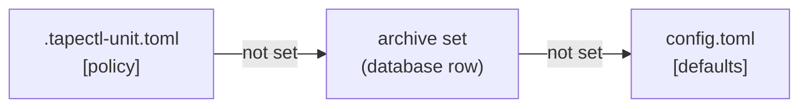

# Configuration

This page covers everything you can configure in tapectl. That means every table and
key in `config.toml` with its default and the commands that read it, the per-unit
`.tapectl-unit.toml` dotfile, archive sets and how a unit's policy is worked out,
the environment variables tapectl reads, and how to check a configuration before you
rely on it. Defaults and behaviour here are taken from the source, not from the
original design document. Where the two disagree, this page describes what the
code does.

> [!NOTE]
> If tapectl was installed with `scripts/first-run.sh`, it runs as a service user,
> and every `tapectl …` command on this page is written `tapectl-op …` there (or
> `sudo -u tapectl -H tapectl …`). That install keeps its configuration at
> `/var/lib/tapectl/.tapectl/config.toml`, in the service user's home. See
> [Install](install.md).

## Contents

- [Where the configuration lives](#where-the-configuration-lives)
- [Rules for the whole file](#rules-for-the-whole-file)
- [`config.toml` reference](#configtoml-reference)
  - [`[dar]`](#dar) · [`[staging]`](#staging) · [`[defaults]`](#defaults) ·
    [`[[backends.lto]]`](#backendslto) · [`[[archive_sets]]`](#archive_sets) ·
    [`[[collections]]`](#collections) · [`[discovery]`](#discovery) ·
    [`[compaction]`](#compaction) · [`[logging]`](#logging) ·
    [`[host_check]`](#host_check)
  - [Keys that are accepted but do less than their name says](#keys-that-are-accepted-but-do-less-than-their-name-says)
- [Example: a single-drive home setup](#example-a-single-drive-home-setup)
- [Example: collections, archive sets and a host check](#example-collections-archive-sets-and-a-host-check)
- [The per-unit dotfile: `.tapectl-unit.toml`](#the-per-unit-dotfile-tapectl-unittoml)
- [Policy resolution](#policy-resolution)
- [Environment variables](#environment-variables)
- [Validating a configuration](#validating-a-configuration)
- [Related pages](#related-pages)

## Where the configuration lives

Everything tapectl keeps lives in one directory, the **home**: the database
(`tapectl.db`), the keys, dar catalogs, receipts, logs, and `config.toml`. The config
file is always `<home>/config.toml`. tapectl picks the home in this order. The first
rule that applies wins:

| Order | Source | Notes |
|---|---|---|
| 1 | `--home <dir>` | Explicit, on any command. An empty value is refused. |
| 2 | `TAPECTL_HOME=<dir>` | Same as `--home`. An empty value counts as unset. A value that is not valid UTF-8 is refused, so tapectl never silently falls back to `~/.tapectl`. |
| 3 | `--config <file>` on its own | The home becomes the config file's **parent directory**, and tapectl prints a warning saying so. Use `--home` when you mean a different archive. Give `--config` together with `--home` only to pick a different file inside that home. |
| 4 | `$HOME/.tapectl` | The default. If `HOME` is unset or empty, tapectl refuses and tells you to use `--home` or `TAPECTL_HOME`. It never guesses `/root/.tapectl`. This matters for cron, systemd and container runs. |

`tapectl init` creates the home and writes a complete `config.toml` holding every
default. It also appends two commented-out examples: a `[[backends.lto]]` block and a
`[host_check]` block. Every other command needs an initialised home. The two
exceptions are `completions` and `host check`, which run without one.
See [`init`](cli/init.md).

## Rules for the whole file

**Unknown keys are errors.** Every table rejects keys it does not declare. A typo
anywhere, such as `slize_size`, `[polcy]`, or a key from an older version, stops
every command with an error that names the file and the key. The one exception is
`config check`, which reports every problem at once instead. Values from closed sets
(`compression`, `checksum_mode`, `logging.level`, `logging.format`, a drive
`generation`), sizes and ranges are all checked when the file loads, not hours later
when a stage or a write reaches them.

```text
$ tapectl config check
config: INVALID
  - configuration error: ~/.tapectl/config.toml: TOML parse error at line 12, column 1
   |
12 | slize_size = "5G"
   | ^^^^^^^^^^
unknown field `slize_size`, expected one of `slice_size`, `compression`, `checksum_mode`, `encrypt`, `preserve_xattrs`, `preserve_acls`, `preserve_fsa`, `dirty_on_metadata_change`, `global_excludes`, `large_file_warn_threshold`, `min_copies_for_tape_only`, `min_locations_for_tape_only`, `warehouse_copies`

  - unknown key: defaults.slize_size
  - ~/.tapectl/config.toml: defaults.compression: invalid compression "zip": accepted values are none, gzip, bzip2, lzo, xz, lzma, zstd, lz4
...
```

**Keys that older versions wrote and this one refuses.** When one of these is
present, the load fails with a message that says where the setting went. Delete the
line, or rename the key as the table shows.

| Key | What happened | What to do |
|---|---|---|
| `backends.lto[].media_type` | Renamed. A drive declares only its own `generation`. The generation of the *cartridge* is detected at `volume init` ([ADR-0010](adr/0010-media-generation-is-a-cartridge-property.md)). | Replace it with `generation = "LTO-6"` (the drive's generation). |
| `backends.lto[].nominal_capacity` | Renamed. Capacity follows the loaded cartridge's generation. | Delete it. Use `capacity_override` only for a virtual drive. For one unusual cartridge, use `cartridge register --capacity`. |
| `backends.lto[].block_size` | Removed. The block size (512 KiB) is a constant of the tape format and is written into the recovery text on every tape. | Delete the line. |
| `backends.lto[].hardware_compression` | Removed. The write path always turns drive compression off. | Delete the line. |
| `[packing]` (`strategy`, `fill_threshold`, `min_free_for_append`) | Whole table removed. Batches are chosen alphabetically, first-fit, and tapes are never appended to. | Delete the table. |
| `[labels]` (`format`) | Whole table removed. Volume labels always come from `--label`. | Delete the table. |
| `defaults.hash` | Removed. Every checksum tapectl takes is sha256. | Delete the line. `checksum_mode` is the real setting. |
| `defaults.min_copies` | Was never a setting. | Rename it to `min_copies_for_tape_only`, or put `min_copies` on an `[[archive_sets]]` entry. |

The removed keys fail with a message that names them:

```text
config: INVALID
  - configuration error: ~/.tapectl/config.toml: backends.lto["lto6"]: "media_type" and "nominal_capacity" moved — declare the DRIVE's generation as generation = "LTO-6"; capacity now follows the cartridge's generation (ADR-0010); capacity_override is for virtual drives only
  - unknown key: backends.lto[0].media_type
```

**Size units.** Two parsers are used, and they differ on purpose:

- *Data sizes* are **binary**: `slice_size`, `large_file_warn_threshold`,
  `enospc_buffer`, and an archive set's `slice_size`. `K`, `M`, `G` and `T` (or
  `KB`…`TB`, in any case) mean powers of 1024. A bare number is bytes, and decimals
  such as `1.5G` are allowed. `GiB`-style suffixes are **not** accepted.
- *Cartridge capacities* are **decimal**, as printed on the cartridge:
  `capacity_override`. `K`…`T` mean powers of 1000, so `2.5T` is 2,500,000,000,000
  bytes.

**Adding array tables by hand.** A fresh `config.toml` starts with the lines
`archive_sets = []` and `collections = []`. TOML refuses to have both those lines and
a later `[[archive_sets]]` or `[[collections]]` table. Before you add your first
archive set or collection, **delete the matching `= []` line**. Otherwise the file
will not load:

```text
config: INVALID
  - configuration error: ~/.tapectl/config.toml: TOML parse error at line 69, column 1
   |
69 | [[archive_sets]]
   | ^
invalid table header
duplicate key `archive_sets` in document root
```

This does not affect drives. `init` does not write an `lto = []` stub, and
[`backend add`](cli/backend.md#tapectl-backend-add) appends a
`[[backends.lto]]` block for you without disturbing your comments.

## `config.toml` reference

Every table is optional. A missing table, or a missing key inside one, takes the
default shown. "Read by" names the commands whose behaviour the key changes.

### `[dar]`

| Key | Type | Default | What it does | Read by |
|---|---|---|---|---|
| `binary` | string | `"dar"` | The dar program. A bare name is looked up on `PATH`. A path containing `/` is used as given. dar 2.6 or newer is required. | [`stage create`](cli/stage.md#tapectl-stage-create), [`restore`](cli/restore.md), [`archive-set create/edit/sync`](cli/archive-set.md) (to check that dar supports a compression), `init` and `config check` (to report the version found) |

### `[staging]`

| Key | Type | Default | What it does | Read by |
|---|---|---|---|---|
| `directory` | string (path) | `<home>/staging` as written by `init` | Where `stage create` puts the encrypted slices waiting for tape, and where write sessions keep their working files. It must be writable and, ideally, big enough for a full cartridge. `config check` warns when it is not. | [`stage create`](cli/stage.md#tapectl-stage-create), [`volume write`](cli/volume.md#tapectl-volume-write), [`volume read-slices`](cli/volume.md#tapectl-volume-read-slices), [`volume compact-read`](cli/volume.md#tapectl-volume-compact-read), [`staging status/clean`](cli/staging.md), [`collection run`](cli/collection.md#tapectl-collection-run) |

`init` always writes the real path. If you delete the key while using a
non-default home, the fallback is `$HOME/.tapectl/staging`, not `<home>/staging`,
so keep the key.

### `[defaults]`

These are the system-wide defaults. They form the bottom layer of
[policy resolution](#policy-resolution).

| Key | Type | Default | What it does | Read by |
|---|---|---|---|---|
| `slice_size` | size (binary) | `"10G"` | Maximum size of one dar slice. A slice is the unit that is encrypted, written, retried and restored. Can be overridden by an archive set or a dotfile. | `stage create`, `collection run` |
| `compression` | `none` \| `gzip` \| `bzip2` \| `lzo` \| `xz` \| `lzma` \| `zstd` \| `lz4` | `"none"` | dar compression. Must also be supported by your dar build. `archive-set create/edit/sync` check this against the real binary. | `stage create` |
| `checksum_mode` | `mtime_size` \| `sha256` \| `sha256_on_archive` | `"mtime_size"` | Validated and resolved, but in this version it does not reach dirty detection. See [below](#keys-that-are-accepted-but-do-less-than-their-name-says). | — |
| `encrypt` | bool | `true` | Encryption **cannot** be turned off: the escrow recipient takes part in every write. `false` at any layer makes `stage create` warn, and it encrypts anyway. `audit` checks that stage sets are encrypted. | `stage create`, `audit` |
| `preserve_xattrs` | bool | `true` | `true` adds dar's `-am` option when archiving. See [below](#keys-that-are-accepted-but-do-less-than-their-name-says). | `stage create` |
| `preserve_acls` | bool | `true` | Has no effect. dar has no separate ACL switch, and ACLs are kept along with extended attributes. `config check` prints a note when this is `false`. | `config check` (advisory) |
| `preserve_fsa` | bool | `true` | `true` passes `--fsa-scope extX` to dar (Linux ext2/3/4 file-system attributes). | `stage create` |
| `dirty_on_metadata_change` | bool | `false` | Resolved, but not read by any command in this version. | — |
| `global_excludes` | list of globs | `["*.nfo", "Thumbs.db", ".DS_Store", "*.tmp"]` | Files never archived from any unit. They are matched against the file's **name only**, ignoring case, and never match directories. They are added to each unit's own `[excludes]` patterns. | `snapshot create`, `stage create`, `unit status`, `report dirty`, `collection sync/status/plan`, `unit mark-tape-only` |
| `large_file_warn_threshold` | size (binary) | `"100G"` | `snapshot create` warns about any file bigger than this. It only warns and never refuses. | [`snapshot create`](cli/snapshot.md#tapectl-snapshot-create) |
| `min_copies_for_tape_only` | integer | `2` | **Two jobs, despite the name.** (1) It is the bottom-layer `min_copies` for *every* unit: the number of Copies that `audit`, `collection status/run` and `staging clean` expect when neither an archive set nor a dotfile says otherwise. (2) It is the copy floor that [`unit mark-tape-only`](cli/unit.md#tapectl-unit-mark-tape-only) enforces. | `audit`, `collection status/run`, `staging clean`, `unit mark-tape-only` |
| `min_locations_for_tape_only` | integer | `2` | How many distinct locations a unit's copies must span before `unit mark-tape-only` accepts it. | `unit mark-tape-only` |
| `warehouse_copies` | integer | `0` | How many warehouse deposits each unit should have in addition to its tape copies ([ADR-0006](adr/0006-storage-interface-first-class-stores.md)). `0` means none are expected, and `audit` says nothing about warehouses. | `audit` |

`unit mark-tape-only` reads `min_copies_for_tape_only` and
`min_locations_for_tape_only` straight from `[defaults]`. It does not use a unit's
archive-set `min_copies`.

### `[[backends.lto]]`

This declares one tape drive per block. Nothing can touch tape until at least one
block exists. The easy way to add one is
[`backend add`](cli/backend.md#tapectl-backend-add), which validates its input and
appends the block:

```bash
TAPE=/dev/tape/by-id/scsi-<SERIAL>-nst
tapectl backend add --name lto6 --device-tape "$TAPE" --device-sg /dev/sg1 --generation LTO-6
tapectl config check
```

| Key | Type | Default | What it does |
|---|---|---|---|
| `name` | string | *required* | Your name for the drive. Must be unique among the blocks. |
| `device_tape` | path | *required* | The non-rewinding tape device. **Use the `/dev/tape/by-id/…-nst` path**, because `/dev/nstN` numbers can change after a reboot. Two blocks that resolve to the same device make the config invalid. |
| `device_sg` | path | *required* | The SCSI generic node of the **same** drive (find it with `lsscsi -g`). It is used to read the cartridge memory chip (serial, generation) and the drive's health log pages. A write refuses if this node is provably a different drive from `device_tape`. |
| `generation` | string | *required* | The generation the drive natively writes, such as `"LTO-6"` or `"LTO-8"`. `LTO-5`, `L5` and `lto5` are all accepted. `"LTO-7-M8"` is refused here: it is a cartridge format, and the drive that writes it declares `LTO-8`. |
| `capacity_override` | size (**decimal**) | unset | **Virtual drives only** (mhvtl, test harnesses). It overrides the capacity for every cartridge this drive touches. A real drive gets its capacity from the loaded cartridge's detected generation, so leave this unset. `config check` warns whenever it is set. |
| `usable_capacity_factor` | float | `0.92` | The fraction of a cartridge's nominal capacity that *planning* assumes you can fill. |
| `enospc_buffer` | size (binary) | `"50M"` | Headroom kept free before end of tape. The pre-write capacity check reserves it, and planning subtracts it. |

Which commands read which keys:

- **Every drive command** reads `device_tape` and `device_sg`. Write paths
  ([`volume init`](cli/volume.md#tapectl-volume-init), `volume write`, `resume`,
  `compact-read`, `compact-write`, `collection run`) are **strict**: a `--device` that
  matches no block is an error. With several blocks and no `--device`, they ask you
  to choose. Read paths (`volume identify/verify/read-slices`, `restore`,
  `catalog rebuild`) are **lenient**: they accept any `--device`, even with no block
  configured, so disaster recovery works on a machine that has keys but no drive
  set up yet.
- **`generation`** is read by `volume init`. It refuses a cartridge this drive cannot
  write, and `--force` does not override that. `volume plan` and `collection plan`
  also use it to size a tape that is not loaded yet.
- **Capacity** is decided **once**, at `volume init`, from the generation detected
  on the loaded cartridge. It is stored on the volume. After that, no command reads
  capacity from `config.toml`.
- **`usable_capacity_factor`** is read only by
  [`volume plan`](cli/volume.md#tapectl-volume-plan), `collection plan` and
  `collection run` budgeting.
- **`enospc_buffer`** is read by `volume write` (pre-flight capacity check),
  `collection plan` and `collection run`.

### `[[archive_sets]]`

An archive set is a named policy that units can share: "critical documents, three
copies, two named places, verify yearly". The *live* archive sets are rows in the
database, and [policy resolution](#policy-resolution) reads them from there.
`config.toml` entries are one way to fill those rows, through
[`archive-set sync`](cli/archive-set.md#tapectl-archive-set-sync). The other way is
[`archive-set create`](cli/archive-set.md#tapectl-archive-set-create) /
[`edit`](cli/archive-set.md#tapectl-archive-set-edit). A `config.toml` entry does
nothing until you run `sync`.

Every key except `name` is optional. A key you leave out means "defer to
`[defaults]`".

| Key | Type | What it does | Synced to the database? |
|---|---|---|---|
| `name` | string | The set's name. `unit init --archive-set`, a dotfile's `archive_set`, and a collection's `archive_set` refer to it. | yes (the key used for matching) |
| `min_copies` | integer | Copies each Version of the unit needs. `audit`, `collection status/run` and `staging clean` enforce it. | yes |
| `required_locations` | list of location names | `audit` requires the unit's copies to span **as many** distinct locations as this list has names. Only the count is compared. The names themselves are not checked. | yes |
| `encrypt` | bool | See `[defaults] encrypt`: `false` is warned about and ignored. | yes |
| `compression` | closed set, as in `[defaults]` | Overrides `[defaults] compression`. | yes |
| `checksum_mode` | closed set, as in `[defaults]` | Resolved but not used, as in `[defaults]`. | yes |
| `slice_size` | size (binary) | Overrides `[defaults] slice_size`. | yes |
| `verify_interval_days` | integer | `audit` warns (`verify_age`) when a unit with copies has had no passing `volume verify` within this many days. There is no system-wide default: without it, verify age is not checked. | yes |
| `preserve_xattrs`, `preserve_acls`, `preserve_fsa`, `dirty_on_metadata_change` | bool | Accepted here, but **`sync` does not write them** and `create`/`edit` have no flags for them. They have no effect at the archive-set layer, so set them in `[defaults]`. | **no** |

`warehouse_copies` cannot be set in `config.toml` at all. It is reachable only with
`archive-set create/edit --warehouse-copies`.

> [!IMPORTANT]
> `archive-set sync` makes `config.toml` the source of truth for the seven synced
> fields (`min_copies`, `required_locations`, `encrypt`, `compression`,
> `checksum_mode`, `slice_size`, `verify_interval_days`). For every set named in
> the file, **all seven are overwritten, and a key you left out is reset to empty**.
> A value you set with `archive-set edit` is lost at the next `sync` unless it is
> also in the file. Pick one way of managing each set: the file plus `sync`, or the
> CLI. Sets that are not named in the file are left alone. `sync` never deletes a set.

`sync` validates every entry (compression against your dar, checksum mode, slice
size) before it writes any row, so a bad entry changes nothing. It prints what it
did:

```text
sync: 0 created, 1 updated from config.toml
```

### `[[collections]]`

A Collection is a source folder whose child folders each become a unit
automatically. It is meant for media libraries (movies, TV seasons, scanned
archives), where registering units one at a time would be a chore. See
[`collection`](cli/collection.md) and [Concepts](concepts.md).

| Key | Type | Default | What it does |
|---|---|---|---|
| `name` | string | *required* | The collection's name, and the prefix of every unit name it creates: a folder `root/Alien (1979)` becomes the unit `movies/Alien (1979)`. It must follow unit-name rules: letters, digits, `.`, `_` and `-`, not starting with `-`. |
| `root` | path | *required* | The folder to walk. |
| `tenant` | string | *required* | The tenant new units are registered under. The tenant must already exist. |
| `unit_depth` | integer | `1` | How deep below `root` a folder becomes a unit. `1` means the immediate children. `2` means grandchildren, as in `show/season`. |
| `exclude` | list of globs | `[]` | Unit folders to skip, matched against the **folder name** and case-sensitive. For example, `"*.partial"` skips an in-flight copy. This is separate from `global_excludes`, which applies to files *inside* units. |
| `archive_set` | string | unset | The archive set new units are bound to. It must already exist in the database (run `archive-set sync` first). Unset means the units use `[defaults]`. |
| `dotfiles` | bool | `true` | `true`: each new unit gets a `.tapectl-unit.toml`, so renaming or moving the folder keeps its identity. `false`: units are identified by path, for read-only sources you cannot write to. A renamed folder then looks like a new unit. |

Read by: [`collection sync`](cli/collection.md#tapectl-collection-sync),
[`status`](cli/collection.md#tapectl-collection-status),
[`plan`](cli/collection.md#tapectl-collection-plan) and
[`run`](cli/collection.md#tapectl-collection-run).

### `[discovery]`

| Key | Type | Default | What it does | Read by |
|---|---|---|---|---|
| `watch_roots` | list of paths | `[]` | Directories that [`unit discover`](cli/unit.md#tapectl-unit-discover) searches (at any depth) for `.tapectl-unit.toml` files. It registers units it has not seen and updates the path of units that moved. A root that does not exist is skipped with a warning. | `unit discover` |

### `[compaction]`

| Key | Type | Default | Allowed | What it does | Read by |
|---|---|---|---|---|---|
| `utilization_threshold` | float | `0.5` | greater than 0, at most 1 | A volume whose live bytes are below this fraction of its total is flagged as a compaction candidate. | `audit` (warning), [`report compaction-candidates`](cli/report.md#tapectl-report-compaction-candidates) |
| `tape_only_safety_multiplier` | integer | `2` | 1 or more | For a tape-only unit, [`snapshot mark-reclaimable`](cli/snapshot.md#tapectl-snapshot-mark-reclaimable) multiplies the required copies and locations by this number. `1` means no extra margin. | `snapshot mark-reclaimable` |

### `[logging]`

| Key | Type | Default | Allowed | What it does |
|---|---|---|---|---|
| `level` | string | `"warn"` | `trace`, `debug`, `info`, `warn`, `error` | How much diagnostic logging goes to **stderr**. `--verbose` raises it to at least `debug` and never lowers it. |
| `format` | string | `"full"` | `full`, `compact`, `pretty`, `json` | The log line format. |

Logging never goes to stdout, so `--json` output stays clean. The warning about
`--config` being used without `--home` is always printed, whatever `level` says.

### `[host_check]`

The quiet-host check. `tapectl host check` runs it on demand, and `volume write`
runs it before every write. An LTO drive that is fed too slowly stops and restarts,
which wears it and uses more tape. A process killed for lack of memory in the middle
of a write loses that write session. When a limit is exceeded, tapectl **warns and
asks for confirmation**. It never refuses. `--yes` answers the question, and a
non-interactive run without `--yes` declines. See
[`host check`](cli/host.md#tapectl-host-check) and the
[Operator guide](operator-guide.md).

`init` writes this table commented out. Without the table, every key takes its
default.

| Key | Type | Default | Allowed | What it does |
|---|---|---|---|---|
| `contender_units` | list of systemd unit names | `[]` | | Units that compete with a write while they are active. A timer counts as active while it is armed. List this host's own heavy jobs here. |
| `contender_processes` | list of process names | `["cargo", "rustc", "docker", "Runner.Worker"]` | | Process names, as in `/proc/<pid>/comm`, which the kernel truncates to 15 characters. Their presence counts as competition. |
| `max_load_per_cpu` | float | `1.0` | greater than 0 | Above this 1-minute load average per CPU, the host counts as loaded. |
| `min_available_mb` | integer (MiB) | `2048` | `0` turns the check off | Below this much `MemAvailable`, the host counts as short of memory. |
| `max_memory_pressure_pct` | float | `10.0` | greater than 0, at most 100 | The limit for `/proc/pressure/memory` `full avg60`. |
| `max_io_pressure_pct` | float | `10.0` | greater than 0, at most 100 | The limit for `/proc/pressure/io` `full avg60`. |

`config check` prints the limits that are in force, and where they came from:

```text
host check (defaults, no [host_check] table): units none; processes cargo, rustc, docker, Runner.Worker; max load 1.00/CPU; min available 2048 MiB; max memory pressure 10.00%; max I/O pressure 10.00% — `tapectl host check` runs it
```

### Keys that are accepted but do less than their name says

`config check` catches bad values, but it does not tell you when a valid key does
nothing. This is the honest list for this version:

| Key | What actually happens |
|---|---|
| `encrypt = false` (any layer) | A warning at `stage create`. The data is encrypted anyway. |
| `preserve_acls = false` (any layer) | No effect, because ACLs travel with extended attributes. `config check` prints a note when `[defaults]` or an archive set sets it. |
| `preserve_xattrs` | `true` adds dar's `-am` flag, and `false` leaves it off. The source describes `-am` as a mask-ordering option that is unrelated to extended attributes. Because tapectl passes dar no EA exclusion mask, extended attributes are kept either way. |
| `dirty_on_metadata_change` | Resolved through the policy chain. No command reads it. |
| `checksum_mode` in `[defaults]` or an archive set | Validated and resolved, but no command reads the resolved value. Dirty detection and version minting use the checksum mode **recorded on the unit when it was registered**. For `unit init`, `init-bulk`, and a fresh folder in `collection sync`, that is always `mtime_size`. For a unit adopted from an existing dotfile by `unit discover` or `collection sync`, it is that dotfile's `[policy] checksum_mode`, or `mtime_size` if the dotfile has none. `unit status` shows the recorded mode. |
| `[[archive_sets]]` `preserve_*`, `dirty_on_metadata_change` | Accepted, but never written to the database by `sync`. |
| `capacity_override` on a real drive | It works, and that is the problem: it overrides capacity for every cartridge. `config check` warns. |

## Example: a single-drive home setup

This is one LTO-6 drive, two tenants' worth of folders under `/media`, and the
defaults for everything else. It is a complete file that you can check as it
stands. Replace `<SERIAL>` with your drive's name from `ls -l /dev/tape/by-id/`, and
the sg node with the one `lsscsi -g` shows for the same drive.

```toml
# ~/.tapectl/config.toml — one drive, defaults everywhere else.

[dar]
binary = "dar"                      # found on PATH

[staging]
directory = "/srv/tapectl-staging"  # needs room for a cartridge's worth of slices

[defaults]
slice_size = "10G"
compression = "none"
checksum_mode = "mtime_size"
encrypt = true
preserve_xattrs = true
preserve_acls = true
preserve_fsa = true
dirty_on_metadata_change = false
global_excludes = ["*.nfo", "Thumbs.db", ".DS_Store", "*.tmp"]
large_file_warn_threshold = "100G"
min_copies_for_tape_only = 2        # every unit wants two copies...
min_locations_for_tape_only = 2     # ...in two places before it may go tape-only
warehouse_copies = 0

[discovery]
watch_roots = ["/media"]            # `unit discover` finds moved units here

[compaction]
utilization_threshold = 0.5
tape_only_safety_multiplier = 2

[logging]
level = "warn"
format = "full"

[[backends.lto]]
name = "lto6"
device_tape = "/dev/tape/by-id/scsi-<SERIAL>-nst"
device_sg = "/dev/sg1"
generation = "LTO-6"
```

`config check` on this file reports `config: valid`. It then adds a `note:` if the
drive is not attached, and a `warning:` if `/srv/tapectl-staging` does not exist
yet or is smaller than one cartridge. Neither of those makes the config invalid.

## Example: collections, archive sets and a host check

This home archives a media library as collections and keeps documents under a
stricter archive set. The host also runs a nightly backup job, which must not
overlap a tape write. Keys left out of `[defaults]` take their defaults. There is no
`archive_sets = []` or `collections = []` line, because the file uses the array
tables instead.

```toml
[dar]
binary = "dar"

[staging]
directory = "/scratch/tapectl-staging"

[defaults]
slice_size = "10G"
compression = "none"
global_excludes = ["*.nfo", "Thumbs.db", ".DS_Store", "*.tmp", "*.part"]
min_copies_for_tape_only = 2
min_locations_for_tape_only = 2

[compaction]
utilization_threshold = 0.5
tape_only_safety_multiplier = 2

[logging]
level = "info"
format = "compact"

[host_check]
contender_units = ["nightly-backup.timer", "nightly-backup.service"]
contender_processes = ["cargo", "rustc", "docker", "Runner.Worker", "ffmpeg", "HandBrakeCLI"]
max_load_per_cpu = 1.0
min_available_mb = 4096
max_memory_pressure_pct = 10.0
max_io_pressure_pct = 10.0

[[backends.lto]]
name = "lto6"
device_tape = "/dev/tape/by-id/scsi-<SERIAL>-nst"
device_sg = "/dev/sg1"
generation = "LTO-6"
usable_capacity_factor = 0.92
enospc_buffer = "50M"

# Policies. These take effect after `tapectl archive-set sync`.
[[archive_sets]]
name = "critical"
min_copies = 3
required_locations = ["home-rack", "offsite"]
compression = "zstd"
slice_size = "4G"
verify_interval_days = 365

[[archive_sets]]
name = "media"
min_copies = 2
required_locations = ["home-rack", "offsite"]
verify_interval_days = 730

# Every folder directly under /media/movies becomes one unit.
[[collections]]
name = "movies"
root = "/media/movies"
tenant = "family"
archive_set = "media"
exclude = ["*.partial"]

# Seasons are the units: /media/tv/<show>/<season>.
[[collections]]
name = "tv"
root = "/media/tv"
tenant = "family"
unit_depth = 2
archive_set = "media"

# A read-only share: no dotfiles, units identified by path.
[[collections]]
name = "scans"
root = "/mnt/scans-ro"
tenant = "work"
archive_set = "critical"
dotfiles = false
```

To bring it into use, create the tenants, sync the archive sets, then sync the
collections:

```bash
tapectl tenant add family -d "family photos and media"
tapectl tenant add work -d "business records"
tapectl archive-set sync
tapectl collection sync
tapectl collection plan
```

The order matters. If a collection's tenant or archive set does not exist yet,
`collection sync` registers none of that collection's folders. It prints one error
per folder and exits 1:

```text
collection "movies": 0 created, 0 moved, 0 reactivated, 0 missing, 0 pending, 0 dirty
  error: <home>/movies/A: tenant not found: nobody
  error: <home>/movies/B: tenant not found: nobody
```

## The per-unit dotfile: `.tapectl-unit.toml`

`unit init` writes this file into the unit's directory. So does `collection sync`,
for a collection with `dotfiles = true`. It gives the directory a permanent identity
(the uuid), so a moved or renamed directory is recognised as the same unit, and it
is the top layer of [policy resolution](#policy-resolution). Here is the file `unit
init` wrote for a unit bound to an archive set:

```toml
[unit]
uuid = "d580a814-ce23-40e7-9c00-93a8fbab9459"
name = "family/letters"
created = "2026-09-28T21:48:18.261950335+00:00"
tags = ["letters"]
tenant = "family"
archive_set = "critical"

[excludes]
patterns = []
```

The file may contain only the tables `[unit]`, `[policy]` and `[excludes]`. Unknown
tables and unknown keys are refused by name, as in `config.toml`.

### `[unit]`: written by tapectl

| Field | Meaning | Editable? |
|---|---|---|
| `uuid` | The unit's permanent identity. | **Never edit it.** Changing it makes tapectl treat the directory as a different unit. |
| `name` | The unit's name. | Change it with [`unit rename`](cli/unit.md#tapectl-unit-rename), which updates both the database and this field. |
| `created` | When the dotfile was written. | No. It is informational. |
| `tags` | Tags given at `unit init --tag`. | Tags live in the database. Use [`unit tag`](cli/unit.md#tapectl-unit-tag), which does **not** rewrite this field. |
| `tenant` | The owning tenant. | No. Change ownership with `tenant reassign`. |
| `archive_set` | The archive set the unit was registered with. | No. |

The database, not the dotfile, is the source of truth for a registered unit. The
`[unit]` fields are read only when tapectl **first** registers a unit from an
existing dotfile. That happens in `unit discover`, or in `collection sync` when it
meets a folder that already has one. For a uuid tapectl already knows, it updates
only the path. Editing `tags`, `tenant` or `archive_set` by hand changes nothing for
a registered unit.

### `[policy]`: yours to edit

`unit init` never writes this table. Add it by hand to give one unit its own
policy. It is read from disk every time the unit's policy is resolved, which happens
at `stage create`, `audit`, `collection status/plan/run` and elsewhere. So a change
takes effect straight away. It accepts exactly four keys:

| Key | Type | Overrides |
|---|---|---|
| `slice_size` | size (binary) | the archive set, then `[defaults]` |
| `compression` | closed set, as in `[defaults]` | the archive set, then `[defaults]` |
| `checksum_mode` | closed set, as in `[defaults]` | Takes effect only when the unit is first registered from this dotfile (see [above](#keys-that-are-accepted-but-do-less-than-their-name-says)). It is still validated every time the policy is resolved, so a bad value makes every command refuse the unit. |
| `warehouse_copies` | integer | the archive set, then `[defaults]` |

`min_copies`, `required_locations` and `verify_interval_days` are **not** dotfile
keys. Copy and location requirements come from the archive set or `[defaults]`.
If one of them appears here, it is refused. So is any misspelled key. `audit`,
`stage create` and `unit status` then refuse that unit, and `config check` names the
file:

```text
warning: unit 'family/letters' dotfile cannot be read, so every command that resolves policy for this unit will refuse: …/letters/.tapectl-unit.toml: TOML parse error at line 12, column 1
   |
12 | min_copies = 3
   | ^^^^^^^^^^
unknown field `min_copies`, expected one of `checksum_mode`, `compression`, `slice_size`, `warehouse_copies`
```

### `[excludes]`: yours to edit

| Key | Type | Meaning |
|---|---|---|
| `patterns` | list of globs | Files in this unit that are never archived, added to `[defaults] global_excludes`. They match the file's **name** only (never its path), ignore case, and never match a directory. `"*.iso"` excludes every ISO file anywhere in the unit, but `"cache"` does not exclude a directory called `cache`. |

There is no command for this table. Edit it by hand. A unit with its own policy and
excludes looks like this:

```toml
[unit]
uuid = "d580a814-ce23-40e7-9c00-93a8fbab9459"
name = "family/letters"
created = "2026-09-28T21:48:18.261950335+00:00"
tags = ["letters"]
tenant = "family"
archive_set = "critical"

[policy]
slice_size = "2G"

[excludes]
patterns = ["*.iso", "*.bak"]
```

## Policy resolution

Each policy field of a unit is resolved separately. The first layer that sets the
field wins:



A layer being present does not mean every field is set. An archive set that sets
only `min_copies` still lets `compression` fall through to `[defaults]`. The table
shows which layer can carry which field:

| Field | Dotfile `[policy]` | Archive set | `[defaults]` |
|---|---|---|---|
| copies required | — | `min_copies` | `min_copies_for_tape_only` |
| locations required | — | `required_locations` | — (none required) |
| verify interval | — | `verify_interval_days` | — (not checked) |
| slice size | `slice_size` | `slice_size` | `slice_size` |
| compression | `compression` | `compression` | `compression` |
| warehouse deposits | `warehouse_copies` | `warehouse_copies` (CLI only) | `warehouse_copies` |
| encryption | — | `encrypt` (always on) | `encrypt` (always on) |
| xattrs, ACLs, FSA | — | not settable, see above | `preserve_xattrs`, `preserve_acls`, `preserve_fsa` |

A unit with no dotfile, or whose dotfile has no `[policy]` table, simply defers to
the next layer. That is normal. What is *not* normal is a dotfile that is present
but cannot be read, or that names an archive set that no longer exists. Then policy
resolution fails loudly: `audit` reports it as a `policy_unresolvable` violation,
and `stage create` refuses. tapectl never quietly falls back to the weaker defaults.

### A worked example

Start from `config.toml` `[defaults]` at their defaults: `min_copies_for_tape_only =
2`, `slice_size = "10G"`, `compression = "none"`, `warehouse_copies = 0`. Add the
archive set `critical` from the second example above: `min_copies = 3`,
`required_locations = ["home-rack", "offsite"]`, `compression = "zstd"`,
`slice_size = "4G"`, `verify_interval_days = 365`. The unit `family/letters` is
bound to `critical`, and its dotfile adds `[policy] slice_size = "2G"`.

| Field | Resolved value | From |
|---|---|---|
| copies required | 3 | archive set |
| locations required | 2 (the length of `["home-rack", "offsite"]`) | archive set |
| verify interval | 365 days | archive set |
| slice size | 2 GiB | dotfile |
| compression | zstd | archive set |
| warehouse deposits | 0 | defaults |

Now suppose the dotfile also set `compression = "none"`. The unit would archive
uncompressed, and `config check` would point out that the dotfile overrides the
archive set:

```text
warning: unit 'family/letters' dotfile sets [policy] compression — this overrides its archive set (…/letters/.tapectl-unit.toml)
  hint: remove the shadowing key(s) from each dotfile's [policy] table to defer to the archive set
```

### Managing archive sets

Create one from the CLI, bind units to it, and check it:

```bash
tapectl archive-set create critical -d "documents we cannot lose" \
    --min-copies 3 --required-locations home-rack,offsite \
    --compression zstd --slice-size 4G --verify-interval-days 365
tapectl unit init /media/family/letters --tenant family --archive-set critical
tapectl archive-set edit critical --warehouse-copies 1
tapectl archive-set list
tapectl archive-set info critical
```

Or declare sets in `config.toml` and run `tapectl archive-set sync`. Remember that
`sync` overwrites the seven synced fields of every set it names (see
[`[[archive_sets]]`](#archive_sets)).

| Command | Flags that set policy |
|---|---|
| [`archive-set create <NAME>`](cli/archive-set.md#tapectl-archive-set-create) | `--min-copies`, `--required-locations a,b`, `--encrypt true\|false`, `--compression`, `--checksum-mode`, `--slice-size`, `--verify-interval-days`, `--warehouse-copies`, `-d/--description` |
| [`archive-set edit <NAME>`](cli/archive-set.md#tapectl-archive-set-edit) | the same flags. Only the ones you pass change. |
| [`archive-set sync`](cli/archive-set.md#tapectl-archive-set-sync) | none. It reads `[[archive_sets]]` from `config.toml`. `--dry-run` is refused. |
| [`archive-set list`](cli/archive-set.md#tapectl-archive-set-list) / [`info <NAME>`](cli/archive-set.md#tapectl-archive-set-info) | none. These show what is stored. |

A unit is bound to an archive set when it is registered: with `unit init
--archive-set`, a collection's `archive_set`, or the dotfile's `archive_set` when
the unit is adopted.

## Environment variables

| Variable | Read by | Effect |
|---|---|---|
| `TAPECTL_HOME` | every command | Selects the home, like `--home`. `--home` wins if both are given. An empty value counts as unset. A value that is not valid UTF-8 is refused. |
| `HOME` | every command | The default home is `$HOME/.tapectl`. If `HOME` is unset or empty and no `--home`/`TAPECTL_HOME` is given, tapectl refuses to run. |
| `USER` | `init` | The default operator name when `--operator` is not given. Falls back to `operator`. |
| `PATH` | `stage create`, `restore`, `init`, `config check`, … | Used to find a bare `[dar] binary` such as `dar`. `init` and `config check` print where it was found. |

That is the complete list an operator can use. The source also reads
`TAPECTL_TEST_PAUSE_AFTER_PLAN` and `TAPECTL_TEST_PAUSE_AFTER_SEAL`. These are test
hooks that deliberately stall a tape write partway through, so **never set them**.
`TAPECTL_MHVTL`, `TAPECTL_GATE_TAPE` and `TAPECTL_PERF_TESTS` belong to the test
suites, not to the `tapectl` binary.

## Validating a configuration

### `config check`

[`config check`](cli/config.md#tapectl-config-check) is the command to run after
every hand edit. Unlike every other command, it does not stop at the first problem.
It parses the file leniently and reports all problems at once, then tests whether
the configuration will actually *work*. From the walkthrough session, on a fresh
home with no drive configured yet:

```text
$ tapectl config check
config: valid
dar: 2.7.13 at '/usr/bin/dar' (meets minimum 2.6)
staging: '/srv/staging' exists and is writable
host check (defaults, no [host_check] table): units none; processes cargo, rustc, docker, Runner.Worker; max load 1.00/CPU; min available 2048 MiB; max memory pressure 10.00%; max I/O pressure 10.00% — `tapectl host check` runs it
```

How to read it:

| Line | Meaning |
|---|---|
| `config: valid` / `config: INVALID` followed by `- …` lines | Whether every other command can load the file. This is the **only** line that sets the exit code: **0** when valid, **2** when invalid. |
| `dar: …` | The dar binary was found, and its version meets the minimum. Otherwise you get a warning saying why not. |
| `staging: …` | The staging directory exists and is writable. |
| `warning: staging … has N GB free; one LTO-6 cartridge is up to 2.5 TB …` | Staging is smaller than one cartridge of the configured drive's generation, so a stage run large enough to fill a tape would fail partway. |
| `note: backend "…" device path(s) not present: …` | The drive's device nodes do not exist right now. This is normal if the drive is switched off or detached. |
| `warning: backend "…" sets capacity_override …` | See [`[[backends.lto]]`](#backendslto). |
| `warning: unit '…' dotfile sets [policy] …` | A dotfile overrides its archive set's `compression` or `checksum_mode`. |
| `warning: unit '…' dotfile cannot be read …` | That unit's dotfile has a syntax error or an unknown key. Every command that resolves its policy will refuse. |
| `note: … sets preserve_acls = false, which cannot take effect …` | See [above](#keys-that-are-accepted-but-do-less-than-their-name-says). |
| `host check (…)` | The quiet-host limits in force, and whether they came from a `[host_check]` table or the defaults. |

Everything after the first line is advice. It never changes the exit code, and
`config check` never edits your files or touches a tape. `--json` gives the same
report as one object, with fields such as `valid`, `problems`, `dar`, `staging`,
`staging_space`, `tape_devices`, `shadowing_dotfiles`, `host_check` and more.

Other commands fail on an invalid config with the first problem only, and exit 2:

```text
error: failed to load config: configuration error: ~/.tapectl/config.toml: defaults.compression: invalid compression "zip": accepted values are none, gzip, bzip2, lzo, xz, lzma, zstd, lz4
```

### `config show`

[`config show`](cli/config.md#tapectl-config-show) prints `config.toml` exactly as
it is on disk, comments included. With `--json`, it prints the parsed TOML as JSON
instead, without the comments. It shows only what the file contains, not the
defaults filled in for keys you left out. Unlike `config check`, it loads the
config strictly first, so it fails on a file that is invalid.

```bash
tapectl config show
tapectl --json config show
```

## Related pages

- [Documentation index](README.md) and the [project README](../README.md)
- [Concepts](concepts.md): tenants, units, collections, copies and policy
- [Walkthrough](walkthrough.md): one complete session with real output
- [Operator guide](operator-guide.md): day-to-day operation, including the quiet host
- [Install](install.md): the service-user install and where its home lives
- [Keys and recovery](keys-and-recovery.md)
- [Troubleshooting](troubleshooting.md): exit codes and refusals
- [Command reference](cli/README.md): [`config`](cli/config.md),
  [`archive-set`](cli/archive-set.md), [`backend`](cli/backend.md),
  [`collection`](cli/collection.md), [`host`](cli/host.md), [`unit`](cli/unit.md)
