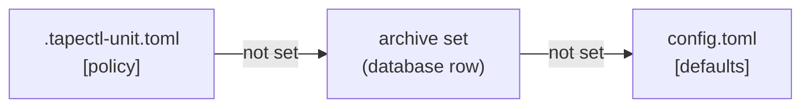

# Configuration

This page covers everything you can configure in tapectl. That means every table and
key in `config.toml` with its default and the commands that read it, the per-unit
`.tapectl-unit.toml` dotfile, archive sets and how a unit's policy is worked out,
the environment variables tapectl reads, and how to check a configuration before you
rely on it. Defaults and behaviour here are taken from the source, not from the
original design document. Where the two disagree, this page describes what the
code does.

> [!NOTE]
> If tapectl was installed with `scripts/first-run.sh`, it runs as a service user,
> and every `tapectl …` command on this page is written `tapectl-op …` there (or
> `sudo -u tapectl -H tapectl …`). That install keeps its configuration at
> `/var/lib/tapectl/.tapectl/config.toml`, in the service user's home. See
> [Install](install.md).

## Contents

- [Where the configuration lives](#where-the-configuration-lives)
- [Rules for the whole file](#rules-for-the-whole-file)
- [`config.toml` reference](#configtoml-reference)
  - [`[dar]`](#dar) · [`[staging]`](#staging) · [`[defaults]`](#defaults) ·
    [`[[backends.lto]]`](#backendslto) · [`[[archive_sets]]`](#archive_sets) ·
    [`[[collections]]`](#collections) · [`[discovery]`](#discovery) ·
    [`[compaction]`](#compaction) · [`[logging]`](#logging) ·
    [`[host_check]`](#host_check) · [`[health]`](#health) · [`[ops]`](#ops)
  - [Keys that are accepted but do less than their name says](#keys-that-are-accepted-but-do-less-than-their-name-says)
- [Example: a single-drive home setup](#example-a-single-drive-home-setup)
- [Example: collections, archive sets and a host check](#example-collections-archive-sets-and-a-host-check)
- [The per-unit dotfile: `.tapectl-unit.toml`](#the-per-unit-dotfile-tapectl-unittoml)
- [Policy resolution](#policy-resolution)
- [Environment variables](#environment-variables)
- [Validating a configuration](#validating-a-configuration)
- [Related pages](#related-pages)

## Where the configuration lives

Everything tapectl keeps lives in one directory, the **home**: the database
(`tapectl.db`), the keys, dar catalogs, stage reports (`stage-reports/`), logs, and
`config.toml`. The config file is always `<home>/config.toml`. tapectl picks the home
in this order. The first rule that applies wins:

| Order | Source | Notes |
|---|---|---|
| 1 | `--home <dir>` | Explicit, on any command. An empty value is refused. |
| 2 | `TAPECTL_HOME=<dir>` | Same as `--home`. An empty value counts as unset. A value that is not valid UTF-8 is refused, so tapectl never silently falls back to `~/.tapectl`. |
| 3 | `--config <file>` on its own | The home becomes the config file's **parent directory**, and tapectl prints a warning saying so. Use `--home` when you mean a different archive. Give `--config` together with `--home` only to pick a different file inside that home. |
| 4 | `$HOME/.tapectl` | The default. If `HOME` is unset or empty, tapectl refuses and tells you to use `--home` or `TAPECTL_HOME`. It never guesses `/root/.tapectl`. This matters for cron, systemd and container runs. |

`tapectl init` creates the home and writes a complete `config.toml` holding every
default. It also appends two commented-out examples: a `[[backends.lto]]` block and a
`[host_check]` block. It writes no drive, archive set or collection, so you can append
`[[backends.lto]]`, `[[archive_sets]]` and `[[collections]]` tables to the file as it
stands. Every other command needs an initialised home. The two exceptions are
`completions` and `host check`, which run without one. See [`init`](cli/init.md).

A home made by an older version may still have a `receipts/` directory. The first
command you run moves it to `stage-reports/`. If both directories exist, both are
kept, and new stage reports go to `stage-reports/`.

## Rules for the whole file

**Unknown keys are errors.** Every table rejects keys it does not declare. A typo
anywhere, such as `slize_size`, `[polcy]`, or a key from an older version, stops
every command with an error that names the file and the key. The one exception is
`config check`, which reports every problem at once instead. Values from closed sets
(`compression`, `checksum_mode`, `logging.level`, `logging.format`, a drive
`generation`), sizes and ranges are all checked when the file loads, not hours later
when a stage or a write reaches them. One thing loading cannot tell you is whether
your dar build supports a `compression` value. Only archive sets get that check, and
only at `archive-set create/edit/sync` (see [`[defaults] compression`](#defaults)).

```text
$ tapectl config check
config: INVALID
  - configuration error: ~/.tapectl/config.toml: TOML parse error at line 7, column 1
  |
7 | slize_size = "5G"
  | ^^^^^^^^^^
unknown field `slize_size`, expected one of `slice_size`, `compression`, `checksum_mode`, `encrypt`, `preserve_xattrs`, `preserve_acls`, `preserve_fsa`, `dirty_on_metadata_change`, `global_excludes`, `large_file_warn_threshold`, `min_copies`, `min_locations`, `warehouse_copies`

  - unknown key: defaults.slize_size
  - ~/.tapectl/config.toml: defaults.compression: invalid compression "zip": accepted values are none, gzip, bzip2, lzo, xz, lzma, zstd, lz4
dar: 2.7.13 at '/usr/bin/dar' (meets minimum 2.6)
staging: '~/.tapectl/staging' exists and is writable
[defaults].slize_size is not a recognised setting — the config will not load while it is present; check the spelling, or remove it.
...
```

**Keys that older versions wrote and this one refuses.** When one of these is
present, the load fails with a message that says where the setting went. Delete the
line, or rename the key as the table shows.

| Key | What happened | What to do |
|---|---|---|
| `backends.lto[].media_type` | Renamed. A drive declares only its own `generation`. The generation of the *cartridge* is detected at `volume init` ([ADR-0010](adr/0010-media-generation-is-a-cartridge-property.md)). | Replace it with `generation = "LTO-6"` (the drive's generation). |
| `backends.lto[].nominal_capacity` | Renamed. Capacity follows the loaded cartridge's generation. | Delete it. Use `capacity_override` only for a virtual drive. For one unusual cartridge, use `cartridge register --capacity`. |
| `backends.lto[].block_size` | Removed. The block size (512 KiB) is a constant of the tape format and is written into the recovery text on every tape. | Delete the line. |
| `backends.lto[].hardware_compression` | Removed. The write path always turns drive compression off. | Delete the line. |
| `[packing]` (`strategy`, `fill_threshold`, `min_free_for_append`) | Whole table removed. Batches are chosen alphabetically, first-fit, and tapes are never appended to. | Delete the table. |
| `[labels]` (`format`) | Whole table removed. Volume labels always come from `--label`. | Delete the table. |
| `defaults.hash` | Removed. Every checksum tapectl takes is sha256. | Delete the line. `checksum_mode` is the real setting. |
| `defaults.min_copies_for_tape_only` | Renamed `min_copies`. The meaning and the default (2) are unchanged: it is the copy requirement every unit starts from. | Rename the key and keep the value. |
| `defaults.min_locations_for_tape_only` | Renamed `min_locations`. The meaning and the default (2) are unchanged. | Rename the key and keep the value. |

The removed keys fail with a message that names them:

```text
config: INVALID
  - configuration error: ~/.tapectl/config.toml: backends.lto["lto6"]: "media_type" and "nominal_capacity" moved — declare the DRIVE's generation as generation = "LTO-6"; capacity now follows the cartridge's generation (ADR-0010); capacity_override is for virtual drives only
  - unknown key: backends.lto[0].media_type
```

Every `config.toml` written by `init` before the rename carries both old
`[defaults]` names, so a home that predates it stops loading until you rename them.
`config check` says what to do:

```text
config: INVALID
  - configuration error: ~/.tapectl/config.toml: defaults.min_copies_for_tape_only and defaults.min_locations_for_tape_only were renamed: the keys are now defaults.min_copies and defaults.min_locations, with the same meaning — the copy and location requirement every unit starts from (an [[archive_sets]] entry's min_copies overrides it). Rename the lines; the values carry over unchanged.
  - unknown key: defaults.min_copies_for_tape_only
  - unknown key: defaults.min_locations_for_tape_only
dar: 2.7.13 at '/usr/bin/dar' (meets minimum 2.6)
staging: '~/.tapectl/staging' exists and is writable
[defaults].min_copies_for_tape_only was renamed to [defaults].min_copies — the config will not load while the old name is present. Rename the key; its meaning and value are unchanged.
[defaults].min_locations_for_tape_only was renamed to [defaults].min_locations — the config will not load while the old name is present. Rename the key; its meaning and value are unchanged.
...
```

Every other command refuses with the first problem only, the `configuration error:`
line, and exits 2. For the service-user install, `scripts/first-run.sh` checks for the
old names at step 0 and offers to rename them in place. It keeps a copy of the old
file beside it.

**Size units.** Two parsers are used, and they differ on purpose:

- *Data sizes* are **binary**: `slice_size`, `large_file_warn_threshold`,
  `enospc_buffer`, and an archive set's `slice_size`. `K`, `M`, `G` and `T` (or
  `KB`…`TB`, in any case) mean powers of 1024. A bare number is bytes, and decimals
  such as `1.5G` are allowed. `GiB`-style suffixes are **not** accepted.
- *Cartridge capacities* are **decimal**, as printed on the cartridge:
  `capacity_override`. `K`…`T` mean powers of 1000, so `2.5T` is 2,500,000,000,000
  bytes.

**Adding array tables by hand.** Append `[[archive_sets]]`, `[[collections]]` and
`[[backends.lto]]` tables to the end of the file. A `config.toml` written by this
version's `init` has no line that gets in their way.

> [!NOTE]
> A `config.toml` written by an older `init` has the lines `archive_sets = []` and
> `collections = []` near the top. TOML refuses to have one of those lines
> and a `[[archive_sets]]` or `[[collections]]` table in the same file. If your file
> has them, **delete the matching `= []` line** before you add the first table.
> Otherwise the file will not load:
>
> ```text
> config: INVALID
>   - configuration error: ~/.tapectl/config.toml: TOML parse error at line 69, column 1
>    |
> 69 | [[archive_sets]]
>    | ^
> invalid table header
> duplicate key `archive_sets` in document root
> ```

Drives are not affected. `init` writes no `lto = []` stub, and
[`backend add`](cli/backend.md#tapectl-backend-add) appends a
`[[backends.lto]]` block for you without disturbing your comments.

## `config.toml` reference

Every table is optional. A missing table, or a missing key inside one, takes the
default shown. The one exception is `[defaults] global_excludes`: see its row. "Read
by" names the commands whose behaviour the key changes.

### `[dar]`

| Key | Type | Default | What it does | Read by |
|---|---|---|---|---|
| `binary` | string | `"dar"` | The dar program. A bare name is looked up on `PATH`. A path containing `/` is used as given. dar 2.6 or newer is required. | [`stage create`](cli/stage.md#tapectl-stage-create), [`restore`](cli/restore.md), [`archive-set create/edit/sync`](cli/archive-set.md) (to check that dar supports a compression), `init` and `config check` (to report the version found; `config check` also checks each stored archive set's compression against it) |

### `[staging]`

| Key | Type | Default | What it does | Read by |
|---|---|---|---|---|
| `directory` | string (path) | `<home>/staging` as written by `init` | Where `stage create` puts the encrypted slices waiting for tape, and where write sessions keep their working files. It must be writable and, ideally, big enough for a full cartridge. `config check` warns when it is not. | [`stage create`](cli/stage.md#tapectl-stage-create), [`volume write`](cli/volume.md#tapectl-volume-write), [`volume read-slices`](cli/volume.md#tapectl-volume-read-slices), [`volume compact-read`](cli/volume.md#tapectl-volume-compact-read), [`staging status/clean`](cli/staging.md), [`collection run`](cli/collection.md#tapectl-collection-run) |
| `hash_threads` | integer, 1 to 64 | `1` | How many source files one `stage create` reads and hashes at once, beside dar. Files are handed out in dar's read order and their hashes recorded in that order, so the result is the same at any setting; only the speed changes. It never runs more threads than the host has cores. Every file is still read within 1 GiB of where dar reads (the source leaves its disk once), so threads run at once only over files that fit in that window: a unit of many small files gains, one of a few large files is hashed about a file at a time. Each thread reads its own file, so on a single spinning disk more threads can mean more seeking. The default, `1`, is the one-file-at-a-time pass; it stays the default until a many-file unit has been measured on the production host at 1, 2, 4 and 8 threads (ADR-0012, 2026-10-07). If you raise it and a stage reads the source slower than before, lower it again. | [`stage create`](cli/stage.md#tapectl-stage-create), [`collection run`](cli/collection.md#tapectl-collection-run), [`quick-archive`](cli/quick-archive.md) |
| `jobs` | integer, 1 to 16 | `1` | How many units are staged at once when several are staged together: `stage create` with several unit names, `collection run`, and first-run's staging step. `--jobs` on `stage create` and `collection run` overrides it for one run. The largest units start first, each prints a line as it starts and ends, and after a failure no further unit is started (the ones running finish). Each stage in flight keeps up to 1 GiB of its source in the page cache, so fewer run when the host's available memory cannot hold that many, and it says so. The stages share the cores: each hashes with its share of `hash_threads`. | [`stage create`](cli/stage.md#tapectl-stage-create), [`collection run`](cli/collection.md#tapectl-collection-run) |

`init` always writes the real path. If you delete the key while using a
non-default home, the fallback is `$HOME/.tapectl/staging`, not `<home>/staging`,
so keep the key.

`stage create` (and `collection run` and `quick-archive`, which call it) checks this
directory before it runs dar. A directory it cannot create or write to is refused by
path. Staging one unit needs room for its encrypted slices, and only those: no
plaintext is written there. That comes to about the unit's size, plus dar's own records
for each file, for which the check allows up to 1 KiB a file. When the free space is
below that, the stage only *may* not fit (with compression on, how far dar shrinks the
data cannot be known in advance, and dar stores runs of zeros and hard-linked files in
less space), so you are asked on a terminal. `--yes` proceeds, and a non-interactive run
without `--yes` refuses. Other stages running at the same time, in this command
or another, count against the free space: what each may still write is set
aside before this unit is checked.

### `[defaults]`

These are the system-wide defaults. They form the bottom layer of
[policy resolution](#policy-resolution).

| Key | Type | Default | What it does | Read by |
|---|---|---|---|---|
| `slice_size` | size (binary) | `"1G"` | Maximum size of one dar slice. A slice is the unit that is encrypted, written, retried and restored. Can be overridden by an archive set or a dotfile. | `stage create`, `collection run` |
| `compression` | `none` \| `gzip` \| `bzip2` \| `lzo` \| `xz` \| `lzma` \| `zstd` \| `lz4` | `"none"` | dar compression. Must also be supported by your dar build, and for this key (and a dotfile's `compression`) nothing checks that in advance. Loading checks only the spelling, and `config check` says `config: valid`. A codec your dar lacks is found only when `stage create` runs dar. An archive set's value is checked against the real binary: `archive-set create/edit/sync` refuse a codec it cannot perform, and `config check` warns about a stored set that has one. | `stage create` |
| `checksum_mode` | `mtime_size` \| `sha256` \| `sha256_on_archive` | `"mtime_size"` | How a unit's files are compared with its last snapshot to decide whether it is dirty. `mtime_size` compares each file's path, size and modification time. `sha256` also compares a content hash when those match. `sha256_on_archive` detects changes as `mtime_size` does. A new unit takes the resolved mode (dotfile, then archive set, then `[defaults]`) **when it is registered**, and keeps it. A later change here does not reach units already registered. See [below](#keys-that-are-accepted-but-do-less-than-their-name-says). | `unit init`, `unit init-bulk`, `collection sync`, `unit discover`, `quick-archive` (at registration) |
| `encrypt` | bool | `true` | Encryption **cannot** be turned off: the escrow recipient takes part in every write. When a unit's *resolved* `encrypt` is `false`, `stage create` prints a warning for it that `[logging] level` cannot silence, and encrypts anyway. `false` here is overridden by an archive set that sets `encrypt = true`, so that set's units stage with no warning. `audit` checks that a unit's stage sets on tape are encrypted, but only while the unit's resolved `encrypt` is `true`: `false` turns that check off for the unit. | `stage create`, `audit` |
| `preserve_xattrs` | bool | `true` | `true` archives every extended attribute, and with them the POSIX ACLs that Linux stores as extended attributes. `false` passes dar `-u "*"`, which drops them all, ACLs included. | `stage create` |
| `preserve_acls` | bool | `true` | No effect of its own. dar has no separate ACL switch, so ACLs follow `preserve_xattrs`. `config check` prints a note wherever this disagrees with `preserve_xattrs`, in either direction. | `config check` (advisory) |
| `preserve_fsa` | bool | `true` | Filesystem-specific attributes, such as Linux `chattr` flags. `true` passes dar `--fsa-scope extX`, and `false` passes `--fsa-scope none`, which drops them. | `stage create` |
| `dirty_on_metadata_change` | bool | `false` | Resolved, but not read by any command in this version: dirty detection compares path, size and modification time only. `config check` prints a note when it is `true`. | `config check` (advisory) |
| `global_excludes` | list of globs | `["*.nfo", "Thumbs.db", ".DS_Store", "*.tmp"]` (written by `init`) | What is never archived from any unit, added to each unit's own `[excludes]` patterns. **The default list applies only when the whole `[defaults]` table is missing.** A `[defaults]` table without this key means `[]`, so nothing is excluded: if you trim `[defaults]` by hand, keep this line. `config check` does not warn about it. Case never matters. A plain pattern (`*.tmp`) matches a file's **name only** and never a directory. A pattern ending in `/` (`.cache/`) excludes the directory of that name, at any depth in the unit, with everything inside it, and a file of that name too. That subtree stays out of the dar archive as well; the directory itself is archived empty. See [`[excludes]`](#excludes-yours-to-edit). | `snapshot create`, `stage create`, `unit status --dirty`, `report dirty`, `audit` (its dirty check), `collection sync/status/plan`, `unit mark-tape-only` |
| `large_file_warn_threshold` | size (binary) | `"100G"` | `snapshot create` warns about any file bigger than this. It only warns and never refuses. | [`snapshot create`](cli/snapshot.md#tapectl-snapshot-create) |
| `min_copies` | integer | `2` | The number of Copies each Version of a unit needs, unless the unit's archive set sets its own `min_copies` (a dotfile cannot set this key). It is the bottom layer of every unit's copy requirement. | `audit`, `report summary/fire-risk/pending/supersedable`, `collection status/run`, `staging clean`, `unit mark-tape-only`, `snapshot mark-reclaimable`, and the retire gate of `volume retire`, `cartridge retire` and `volume compact-finish` (see below the table) |
| `min_locations` | integer | `2` | How many distinct locations a unit's copies must span before [`unit mark-tape-only`](cli/unit.md#tapectl-unit-mark-tape-only) accepts it without asking. It exists only here: an archive set names places with `required_locations` instead. | `unit mark-tape-only` |
| `warehouse_copies` | integer | `0` | How many warehouse deposits each unit should have in addition to its tape copies ([ADR-0006](adr/0006-storage-interface-first-class-stores.md)). `0` means none are expected, and `audit` says nothing about warehouses. | `audit` |

`unit mark-tape-only` checks the unit's resolved `min_copies` (so an archive set
asking for three copies needs three), every place its `required_locations` names, and
the `[defaults] min_locations` floor. A unit that falls short of any of them, or is
dirty, is a Tier-2 shortfall ([ADR-0008](adr/0008-destructive-consent-tiers.md)): a
terminal is asked to confirm, `--force` or the global `--yes` confirms in advance, and
a non-interactive run without either refuses and lists the shortfalls. A unit whose
policy cannot be resolved is refused.

The retire gate uses the same resolved policy. [`volume retire`](cli/volume.md#tapectl-volume-retire),
[`cartridge retire`](cli/cartridge.md#tapectl-cartridge-retire) and
[`volume compact-finish`](cli/volume.md#tapectl-volume-compact-finish) (so also step 3
of `volume compact`) refuse outright when a live version would be left with no copy,
and no flag gets past that. When a version would keep some copies but fewer than its
resolved `min_copies`, or copies at fewer places than its `required_locations`
names, that is a Tier-2 shortfall. The command lists it and asks on a terminal.
`--yes` confirms in advance (`--force` too, for `cartridge retire` and the compact
commands), and a non-interactive run without it refuses. This gate counts places
only: copies at any two places satisfy two required locations, even when neither
place is one the archive set names.

### `[[backends.lto]]`

This declares one tape drive per block. Nothing can *write* to tape until a block
for the drive exists. Reading a tape needs no block: given `--device`, the read
commands open that device even when no block is configured (see below). The easy way
to add one is
[`backend add`](cli/backend.md#tapectl-backend-add), which validates its input and
appends the block:

```bash
TAPE=/dev/tape/by-id/scsi-<SERIAL>-nst
tapectl backend add --name lto6 --device-tape "$TAPE" --device-sg /dev/sg1 --generation LTO-6
tapectl config check
```

| Key | Type | Default | What it does |
|---|---|---|---|
| `name` | string | *required* | Your name for the drive. Must be unique among the blocks. |
| `device_tape` | path | *required* | The non-rewinding tape device. **Use the `/dev/tape/by-id/…-nst` path**, because `/dev/nstN` numbers can change after a reboot. Two blocks that resolve to the same device make the config invalid. |
| `device_sg` | path | *required* | The SCSI generic node of the **same** drive (find it with `lsscsi -g`). It is used to read the cartridge memory chip (serial, generation) and the drive's health log pages. A write refuses if this node is provably a different drive from `device_tape`. |
| `generation` | string | *required* | The generation the drive natively writes, such as `"LTO-6"` or `"LTO-8"`. `LTO-5`, `L5` and `lto5` are all accepted. `"LTO-7-M8"` is refused here: it is a cartridge format, and the drive that writes it declares `LTO-8`. |
| `capacity_override` | size (**decimal**) | unset | **Virtual drives only** (mhvtl, test harnesses). It overrides the capacity for every cartridge this drive touches. A real drive gets its capacity from the loaded cartridge's detected generation, so leave this unset. `config check` warns whenever it is set. |
| `fill_ceiling` | float | `0.97` | The **fill ceiling**: the fraction of a cartridge's capacity a write may fill, above 0 and at most 1. The pre-write capacity check of every write refuses a layout above it and says by how much; planning sizes tapes with it. `--fill-ceiling` on `volume write`, `volume plan`, `collection plan` and `collection run` overrides it for one command (`0.99` or `99%`). It was called `usable_capacity_factor` (default `0.92`) until issue #391; a config that still uses that name is refused, naming the new key. Each completed write records the capacity it used (a `write_capacity_used` event in `report events`), so the ceiling can be tuned from what writes really take. |
| `enospc_buffer` | size (binary) | `"50M"` | Headroom kept free before end of tape. The pre-write capacity check reserves it, and `collection plan` and `collection run` subtract it from each tape's budget. |

Which commands read which keys:

- **Every drive command** reads `device_tape` and `device_sg`. Write paths
  ([`volume init`](cli/volume.md#tapectl-volume-init), `volume write`,
  `volume resume`, `volume compact-write`, `volume compact`, `collection run`,
  [`quick-archive`](cli/quick-archive.md)) and the planners
  ([`volume plan`](cli/volume.md#tapectl-volume-plan), `collection plan`) are
  **strict**: they need a block, and a `--device` that matches no block is an error
  (`no [[backends.lto]] entry has device_tape = …`). `volume plan` resolves the
  drive only once there is staged data to plan. Read paths
  (`volume identify/verify/read-slices/compact-read`, `restore`, `catalog rebuild`)
  are **lenient**: they accept any `--device`, even with no block configured, so
  disaster recovery works on a machine that has keys but no drive set up yet.
  Without `--device`, both kinds use the only block. With no block and no
  `--device`, both refuse. With several blocks and no `--device`, both
  refuse at once with exit 2, and nothing is asked:
  `configuration error: multiple LTO backends configured (lto6, second); pass --device to select one`.
- **`generation`** is what every write, and every read path named above, checks the
  loaded cartridge against. Every write refuses a cartridge this drive cannot write:
  `volume init`, `volume write`, `volume resume`, and through `volume write` also
  `volume compact-write`, `volume compact`, `collection run` and `quick-archive`.
  So a volume initialised on an LTO-6 drive and written from an LTO-5 drive is
  refused at the write, not only at init. `--force` does not override this. The read
  paths refuse a cartridge this drive cannot read, but only when the device is one a
  block names and the cartridge's generation can be detected. On a device no block
  names, they read without the check. `volume init` also takes this generation as
  the cartridge's own when nothing else says what the cartridge is: no detected
  generation, no `--generation`, no registered cartridge row. `volume plan` and
  `collection plan` use it to size a tape that is not loaded yet, and `config check`
  uses it to size the staging warning.
- **Capacity** is decided **once**, at `volume init`, from the loaded cartridge's
  generation: the detected one, or the fallbacks in the bullet above when none can
  be detected. It is stored on the volume. After that, no command reads
  capacity from `config.toml`.
- **`fill_ceiling`** is read by
  [`volume plan`](cli/volume.md#tapectl-volume-plan), `collection plan` and
  `collection run` budgeting, and by the pre-write capacity check of `volume write`
  (so also `volume compact-write`, `volume compact`, `collection run` and
  `quick-archive`).
- **`enospc_buffer`** is read by the pre-write capacity check of `volume write` (so
  also `volume compact-write`, `volume compact`, `collection run` and
  `quick-archive`), and by `collection plan` and `collection run` budgeting.

### `[[archive_sets]]`

An archive set is a named policy that units can share: "critical documents, three
copies, two named places, verify yearly". The *live* archive sets are rows in the
database, and [policy resolution](#policy-resolution) reads them from there.
`config.toml` entries are one way to fill those rows, through
[`archive-set sync`](cli/archive-set.md#tapectl-archive-set-sync). The other way is
[`archive-set create`](cli/archive-set.md#tapectl-archive-set-create) /
[`edit`](cli/archive-set.md#tapectl-archive-set-edit). A `config.toml` entry does
nothing until you run `sync`.

Every key except `name` is optional. When `sync` creates a set, a key you leave out
stays empty, which means "defer to `[defaults]`". Every key the table accepts is
written to the database, and each has a matching `archive-set create`/`edit` flag:

| Key | Type | What it does | `create`/`edit` flag |
|---|---|---|---|
| `name` | string | The set's name. `unit init --archive-set`, a dotfile's `archive_set`, and a collection's `archive_set` refer to it. `sync` matches existing sets by it. | the `<NAME>` argument |
| `min_copies` | integer | Copies each Version of the unit needs. Overrides `[defaults] min_copies`. `audit`, the reports, `collection status/run`, `staging clean`, `unit mark-tape-only`, `snapshot mark-reclaimable` and the [retire gate](#defaults) all use it. | `--min-copies` |
| `required_locations` | list of location names | The places that must each hold a copy. Every current Version of the unit needs an eligible copy (or a warehouse deposit) at **each named location**: copies at two other places do not count. `audit` reports each missing place as a `location_presence` violation, and `unit mark-tape-only` and `snapshot mark-reclaimable` check the same names. The retire gate of `volume retire`, `cartridge retire` and `volume compact-finish` is the exception: it compares only the **number** of places, so there copies at two other places do count. Every name must be a location registered with [`location add`](cli/location.md#tapectl-location-add). | `--required-locations a,b` |
| `encrypt` | bool | See `[defaults] encrypt`: `false` is warned about and the data is encrypted anyway, but `audit` stops checking this set's units for unencrypted stage sets. | `--encrypt true\|false` |
| `compression` | closed set, as in `[defaults]` | Overrides `[defaults] compression`. | `--compression` |
| `checksum_mode` | closed set, as in `[defaults]` | Overrides `[defaults] checksum_mode` for units registered into this set. Units already registered keep their mode. | `--checksum-mode` |
| `slice_size` | size (binary) | Overrides `[defaults] slice_size`. | `--slice-size` |
| `verify_interval_days` | integer | `audit` warns (`verify_age`) when a unit with copies has had no passing `volume verify` within this many days. There is no system-wide default: without it, verify age is not checked. It also bounds how old an interrupted full readback may be and still be continued: a full verify or `--full-confirm` does not continue one whose oldest read is older than the shortest interval among the units on that volume, and reads everything again (ADR-0012, 2026-10-07). Nothing yet refuses a value below 1: at 0 or below, no interrupted readback is continued. | `--verify-interval-days` |
| `preserve_xattrs`, `preserve_acls`, `preserve_fsa` | bool | Override their `[defaults]` namesakes for this set's units, with the same effect. `preserve_acls` still has no effect of its own. | `--preserve-xattrs`, `--preserve-acls`, `--preserve-fsa` (each `true\|false`) |
| `dirty_on_metadata_change` | bool | Stored and resolved, but read by nothing, as in `[defaults]`. `config check` names it when `true`. | `--dirty-on-metadata-change true\|false` |

An `[[archive_sets]]` table does not accept `warehouse_copies`: the key is refused as
unknown, and the config will not load. A set's `warehouse_copies` can be set only with
`archive-set create/edit --warehouse-copies`. The key is still valid in `[defaults]`
and in a dotfile's `[policy]`.

> [!IMPORTANT]
> `archive-set sync` writes **only the keys each `[[archive_sets]]` table names**.
> For those keys `config.toml` wins: a value you changed with `archive-set edit` is
> put back to the file's value at the next `sync`. A key the table does not name is
> left as it is in the database, so a value set with `create` or `edit` for that key
> survives every `sync`. Deleting a key from a table leaves the stored value in place,
> and no command clears a stored value back to "defer to `[defaults]`":
> `archive-set edit` can only set it to something else. Sets that are not named in the
> file are left alone, and `sync` never deletes a set.

`sync` validates every entry before it writes any row: compression against your dar,
checksum mode, slice size, and each `required_locations` name against the registered
locations. A bad entry changes nothing:

```text
error: archive set "critical": required_locations names "offsite", which is not a registered location (registered locations: home-rack). Register a location first with `tapectl location add <name>`, or fix the spelling.
```

`create` and `edit` refuse an unregistered `--required-locations` name the same way,
and refuse an empty name (a stray comma). Both refuse under `--dry-run` too.

`sync` prints what it did. A set counts as updated only when one of its stored values
changed. With `--json`, the same three counts are `created`, `updated` and
`unchanged`:

```text
sync: 1 created, 0 updated, 0 unchanged from config.toml
```

### `[[collections]]`

A Collection is a source folder whose child folders each become a unit
automatically. It is meant for media libraries (movies, TV seasons, scanned
archives), where registering units one at a time would be a chore. See
[`collection`](cli/collection.md) and [Concepts](concepts.md).

| Key | Type | Default | What it does |
|---|---|---|---|
| `name` | string | *required* | The collection's name, and the prefix of every unit name it creates: a folder `root/Alien.1979` becomes the unit `movies/Alien.1979`. The collection name **and every folder name below `root` that becomes part of a unit name** must follow the unit-name rules: ASCII letters, digits, `.`, `_` and `-` only, no part starting with `-` or `.`, and at most 64 characters a part (200 in all). A space, parentheses or an accented letter is refused. `config check` does not check this; `collection sync` does, one folder at a time (see below). |
| `root` | path | *required* | The folder to walk. |
| `tenant` | string | *required* | The tenant new units are registered under. The tenant must already exist. |
| `unit_depth` | integer | `1` | How deep below `root` a folder becomes a unit. `1` means the immediate children. `2` means grandchildren, as in `show/season`. |
| `exclude` | list of globs | `[]` | Unit folders to skip. Case never matters. A plain pattern is matched against the candidate **folder's own name**: `"*.partial"` skips an in-flight copy such as `Beta.PARTIAL`. A pattern ending in `/` (`"incoming/"`) skips a candidate folder of that name and, with `unit_depth` 2 or more, every candidate below one. The same patterns silence a loose file or symlink above the unit folders that `collection sync` and `status` would otherwise report as outside any unit. This is separate from `global_excludes`, which applies to files *inside* units. |
| `archive_set` | string | unset | The archive set new units are bound to. It must already exist in the database (run `archive-set sync` first). Unset means the units use `[defaults]`. |
| `dotfiles` | bool | `true` | `true`: each new unit gets a `.tapectl-unit.toml`, so renaming or moving the folder keeps its identity. `false`: units are identified by path, for read-only sources you cannot write to. A renamed folder then looks like a new unit. |

Read by: [`collection sync`](cli/collection.md#tapectl-collection-sync),
[`status`](cli/collection.md#tapectl-collection-status),
[`plan`](cli/collection.md#tapectl-collection-plan) and
[`run`](cli/collection.md#tapectl-collection-run).

Ordinary media-library names such as `Alien (1979)` break the unit-name rules.
`collection sync` registers every folder whose name is valid, prints one error for
each folder whose name is not, and exits 1:

```text
  error: /media/movies/Alien (1979): invalid unit name "movies/Alien (1979)": the character ' ' is not allowed. Allowed: letters, digits, dot, underscore and dash, with / separating path segments
```

Rename such folders (`Alien.1979`, `Alien_1979`), or skip them with `exclude` until
you do. A collection `name` that breaks the rules, such as `.movies`, passes
`config check` and fails the same way at `collection sync`, for every folder not
registered yet.

Only real folders at exactly `unit_depth` become units. A loose file or symlink
between `root` and that depth, and a symlinked folder at it, belongs to no unit
and is never archived; `collection sync` and `collection status` name each one
as `OUTSIDE ANY UNIT` and exit 1 (see the
[operator guide](operator-guide.md#a-typical-write-session)).

### `[discovery]`

| Key | Type | Default | What it does | Read by |
|---|---|---|---|---|
| `watch_roots` | list of paths | `[]` | Directories that [`unit discover`](cli/unit.md#tapectl-unit-discover) searches (at any depth) for `.tapectl-unit.toml` files. It registers units it has not seen and updates the path of units that moved. A root that does not exist is skipped with a warning. | `unit discover` |

### `[compaction]`

| Key | Type | Default | Allowed | What it does | Read by |
|---|---|---|---|---|---|
| `utilization_threshold` | float | `0.5` | greater than 0, at most 1 | A volume is flagged as a compaction candidate when its live archive data is below this share of its live plus reclaimable archive data (the data of snapshots marked reclaimable or purged). Fixed per-volume metadata does not count, and a volume with no reclaimable data is never flagged. | `audit` (warning), [`report compaction-candidates`](cli/report.md#tapectl-report-compaction-candidates) |
| `tape_only_safety_multiplier` | integer | `2` | 1 or more | For a tape-only unit, [`snapshot mark-reclaimable`](cli/snapshot.md#tapectl-snapshot-mark-reclaimable) multiplies the required copies, the required number of locations, and the copies each named required location must hold by this number (at `2`, `required_locations = ["offsite"]` needs two copies at `offsite`). `1` means no extra margin. [`report supersedable`](cli/report.md#tapectl-report-supersedable) applies the same rule when it lists what could be marked. | `snapshot mark-reclaimable`, `report supersedable` |

### `[logging]`

| Key | Type | Default | Allowed | What it does |
|---|---|---|---|---|
| `level` | string | `"warn"` | `trace`, `debug`, `info`, `warn`, `error` | How much diagnostic logging goes to **stderr**. `--verbose` raises it to at least `debug` and never lowers it. |
| `format` | string | `"full"` | `full`, `compact`, `pretty`, `json` | The log line format. |

Logging never goes to stdout, so `--json` output stays clean. Log lines are coloured
only when stderr is a terminal and `NO_COLOR` is unset or empty, so a captured log
holds plain text. The warning about `--config` being used without `--home` is always
printed, whatever `level` says.

### `[host_check]`

The quiet-host check. `tapectl host check` runs it on demand, and `volume write`
runs it before every write. An LTO drive that is fed too slowly stops and restarts,
which wears it and uses more tape. A process killed for lack of memory in the middle
of a write loses that write session. When a limit is exceeded, tapectl **warns and
asks for confirmation**. It never refuses. `--yes` answers the question, and a
non-interactive run without `--yes` declines. See
[`host check`](cli/host.md#tapectl-host-check) and the
[Operator guide](operator-guide.md).

`init` writes this table commented out. Without the table, every key takes its
default.

| Key | Type | Default | Allowed | What it does |
|---|---|---|---|---|
| `contender_units` | list of systemd unit names | `[]` | | Units that compete with a write while they are active. A timer counts as active while it is armed. List this host's own heavy jobs here. |
| `contender_processes` | list of process names | `["cargo", "rustc", "docker", "Runner.Worker"]` | | Process names, as in `/proc/<pid>/comm`, which the kernel truncates to 15 characters. Their presence counts as competition. |
| `max_load_per_cpu` | float | `1.0` | greater than 0 | Above this 1-minute load average per CPU, the host counts as loaded. |
| `min_available_mb` | integer (MiB) | `2048` | `0` turns the check off | Below this much `MemAvailable`, the host counts as short of memory. |
| `max_memory_pressure_pct` | float | `10.0` | greater than 0, at most 100 | The limit for `/proc/pressure/memory` `full avg60`. |
| `max_io_pressure_pct` | float | `10.0` | greater than 0, at most 100 | The limit for `/proc/pressure/io` `full avg60`. |

`config check` prints the limits that are in force, and where they came from:

```text
host check (defaults, no [host_check] table): units none; processes cargo, rustc, docker, Runner.Worker; max load 1.00/CPU; min available 2048 MiB; max memory pressure 10.00%; max I/O pressure 10.00% — `tapectl host check` runs it
```

### `[health]`

What `tapectl audit` and `tapectl report health` flag in the drive's health
readings. Advisory only: a finding is an `audit` warning, never a refusal. Without
the table, every key takes its default. See
[Reading the corrected-error trend](operator-guide.md#reading-the-corrected-error-trend).

| Key | Type | Default | Allowed | What it does |
|---|---|---|---|---|
| `read_error_rise_factor` | float | `2.0` | at least 1 | A cartridge is flagged (`audit`'s `read_error_trend`, `RISING` in `report health`) when its newest `volume verify` corrected more read errors per GiB than this many times its previous verify's, **and** more than 1 corrected error per GiB in all. That floor is fixed, not a key (ADR-0012, 2026-10-07): it keeps a first non-zero reading after a zero one, a rise past any factor, from being an alarm. **Provisional**: the factor's default is a starting point, to be set from the production host's recorded verifies (ADR-0012, 2026-10-06). |

### `[ops]`

Watching sessions from another account (issue #393). On a production host the
catalog, the keys and the session logs belong to the service user, in a 0700
home, so the operator's own account cannot see whether a write is running or
how the last one ended without sudo. `[ops] group` names a group whose members
may read the session logs, and nothing else:

```toml
[ops]
group = "tapectl-ops"
```

| Key | Type | Default | What it does |
|---|---|---|---|
| `group` | group name | *(no table: the home stays private)* | Every command run as the service user keeps the home at 0710 and `logs/` at 2750 (setgid), both owned by this group, and writes each session log 0640. Every other entry of the home — `config.toml`, the catalog, the keys, `catalogs/`, `stage-reports/`, `locks/`, `tmp/`, a `staging/` inside it, whatever else is there — has its group and other bits removed on every command, so a member can open none of them even by name. |

The service user must be a member of the group itself: giving a directory a
group (`chgrp`) is limited to one's own groups, and until it can, the home and
`logs/` stay 0700 rather than open to whatever group they already have. A
member then runs
`tapectl --home <service user's home> status` (or sets `TAPECTL_HOME`): see
[`status`](cli/status.md) and the operator guide's "Watching from another
account". Logs written before the table was added stay 0600, and `status` names
them unreadable. Removing the table takes the access back on the next command.
`scripts/first-run.sh` sets all of this up in step 7 when the host profile sets
`OPS_GROUP`. `config check` reports the group and anything not yet as it should
be:

```text
ops: group "tapectl-ops" may read the session logs (`tapectl --home /srv/archive_meta/tapectl status`), and nothing else in the home
warning: ops: this user is not a member of "tapectl-ops", so it cannot give the home and logs/ that group — usermod -aG tapectl-ops <service user>, then log in again
```

### Keys that are accepted but do less than their name says

`config check` catches bad values, and it notes some valid keys that cannot do what
they say. This is the honest list for this version:

| Key | What actually happens |
|---|---|
| `encrypt = false` (any layer) | A warning at `stage create` for each unit whose *resolved* `encrypt` is `false`. `[defaults] encrypt = false` under an archive set with `encrypt = true` resolves to `true`, so it brings no warning. The data is encrypted anyway. `audit` also stops running its `encryption` check for the units whose resolved value is `false`. |
| `preserve_acls` (any layer) | No effect of its own, because ACLs are extended attributes and follow `preserve_xattrs`. `preserve_acls = false` beside `preserve_xattrs = true` keeps them anyway, and `preserve_acls = true` beside `preserve_xattrs = false` drops them anyway. `config check` prints a note for either mismatch, in `[defaults]`, in an archive set, or in an `[[archive_sets]]` table not yet synced. Because `init` writes `preserve_acls = true`, setting only `preserve_xattrs = false` brings the second note. |
| `dirty_on_metadata_change = true` (any layer) | Resolved through the policy chain, but no command reads it. `config check` prints a note naming the key. |
| `checksum_mode` in `[defaults]` or an archive set | Read once, **when a unit is registered**. Dirty detection and version minting then use the mode recorded on the unit. Changing the key later does not change the mode of units already registered. `unit status` shows the recorded mode. |
| `capacity_override` on a real drive | It works, and that is the problem: it overrides capacity for every cartridge. `config check` warns. |

## Example: a single-drive home setup

This is one LTO-6 drive, two tenants' worth of folders under `/media`, and the
defaults for everything else. It is a complete file that you can check as it
stands. Replace `<SERIAL>` with your drive's name from `ls -l /dev/tape/by-id/`, and
the sg node with the one `lsscsi -g` shows for the same drive.

```toml
# ~/.tapectl/config.toml — one drive, defaults everywhere else.

[dar]
binary = "dar"                      # found on PATH

[staging]
directory = "/srv/tapectl-staging"  # needs room for a cartridge's worth of slices

[defaults]
slice_size = "1G"
compression = "none"
checksum_mode = "mtime_size"
encrypt = true
preserve_xattrs = true
preserve_acls = true
preserve_fsa = true
dirty_on_metadata_change = false
global_excludes = ["*.nfo", "Thumbs.db", ".DS_Store", "*.tmp"]
large_file_warn_threshold = "100G"
min_copies = 2                      # every unit wants two copies...
min_locations = 2                   # ...in two places before it may go tape-only
warehouse_copies = 0

[discovery]
watch_roots = ["/media"]            # `unit discover` finds moved units here

[compaction]
utilization_threshold = 0.5
tape_only_safety_multiplier = 2

[logging]
level = "warn"
format = "full"

[[backends.lto]]
name = "lto6"
device_tape = "/dev/tape/by-id/scsi-<SERIAL>-nst"
device_sg = "/dev/sg1"
generation = "LTO-6"
```

`config check` on this file reports `config: valid`. It then adds a `note:` if the
drive is not attached, and a `warning:` if `/srv/tapectl-staging` does not exist
yet or is smaller than one cartridge. Neither of those makes the config invalid.

## Example: collections, archive sets and a host check

This home archives a media library as collections and keeps documents under a
stricter archive set. The host also runs a nightly backup job, which must not
overlap a tape write. Keys left out of `[defaults]` take their defaults, except
`global_excludes`, which is why the example spells out the whole list. The
`".cache/"` exclude keeps every `.cache` directory's contents out of every unit.

```toml
[dar]
binary = "dar"

[staging]
directory = "/scratch/tapectl-staging"

[defaults]
slice_size = "1G"
compression = "none"
global_excludes = ["*.nfo", "Thumbs.db", ".DS_Store", "*.tmp", "*.part", ".cache/"]
min_copies = 2
min_locations = 2

[compaction]
utilization_threshold = 0.5
tape_only_safety_multiplier = 2

[logging]
level = "info"
format = "compact"

[host_check]
contender_units = ["nightly-backup.timer", "nightly-backup.service"]
contender_processes = ["cargo", "rustc", "docker", "Runner.Worker", "ffmpeg", "HandBrakeCLI"]
max_load_per_cpu = 1.0
min_available_mb = 4096
max_memory_pressure_pct = 10.0
max_io_pressure_pct = 10.0

[[backends.lto]]
name = "lto6"
device_tape = "/dev/tape/by-id/scsi-<SERIAL>-nst"
device_sg = "/dev/sg1"
generation = "LTO-6"
fill_ceiling = 0.97
enospc_buffer = "50M"

# Policies. These take effect after `tapectl archive-set sync`.
[[archive_sets]]
name = "critical"
min_copies = 3
required_locations = ["home-rack", "offsite"]
compression = "zstd"
slice_size = "4G"
verify_interval_days = 365

[[archive_sets]]
name = "media"
min_copies = 2
required_locations = ["home-rack", "offsite"]
verify_interval_days = 730

# Every folder directly under /media/movies becomes one unit.
[[collections]]
name = "movies"
root = "/media/movies"
tenant = "family"
archive_set = "media"
exclude = ["*.partial"]

# Seasons are the units: /media/tv/<show>/<season>.
[[collections]]
name = "tv"
root = "/media/tv"
tenant = "family"
unit_depth = 2
archive_set = "media"

# A read-only share: no dotfiles, units identified by path.
[[collections]]
name = "scans"
root = "/mnt/scans-ro"
tenant = "work"
archive_set = "critical"
dotfiles = false
```

To bring it into use, register the locations and the tenants, sync the archive
sets, then sync the collections:

```bash
tapectl location add home-rack -d "the shelf beside the drive"
tapectl location add offsite -d "a fire-safe box at a relative's house"
tapectl tenant add family -d "family photos and media"
tapectl tenant add work -d "business records"
tapectl archive-set sync
tapectl collection sync
tapectl collection plan
```

The order matters. `archive-set sync` refuses, and writes nothing, while a
`required_locations` name is not a registered location (see
[`[[archive_sets]]`](#archive_sets)). If a collection's tenant or archive set does not
exist yet, `collection sync` registers none of that collection's folders. It prints
one error per folder and exits 1:

```text
collection "movies": 0 created, 0 moved, 0 reactivated, 0 missing, 0 pending, 0 dirty
  error: /media/movies/A: tenant not found: nobody
  error: /media/movies/B: tenant not found: nobody
```

## The per-unit dotfile: `.tapectl-unit.toml`

`unit init` writes this file into the unit's directory. So does `collection sync`,
for a collection with `dotfiles = true`. It gives the directory a permanent identity
(the uuid), so a moved or renamed directory is recognised as the same unit, and it
is the top layer of [policy resolution](#policy-resolution). Here is the file `unit
init` wrote for a unit bound to an archive set:

```toml
[unit]
uuid = "d580a814-ce23-40e7-9c00-93a8fbab9459"
name = "family/letters"
created = "2026-09-28T21:48:18.261950335+00:00"
tags = ["letters"]
tenant = "family"
archive_set = "critical"

[excludes]
patterns = []
```

The file may contain only the tables `[unit]`, `[policy]` and `[excludes]`. Unknown
tables and unknown keys are refused by name, as in `config.toml`.

### `[unit]`: written by tapectl

| Field | Meaning | Editable? |
|---|---|---|
| `uuid` | The unit's permanent identity. | **Never edit it.** Changing it makes tapectl treat the directory as a different unit. |
| `name` | The unit's name. | Change it with [`unit rename`](cli/unit.md#tapectl-unit-rename), which updates both the database and this field. |
| `created` | When the dotfile was written. | No. It is informational. |
| `tags` | The unit's tags. | Tags live in the database. Change them with [`unit tag`](cli/unit.md#tapectl-unit-tag), which updates the database and rewrites this field to match, sorted. If the dotfile cannot be read or written, `unit tag` still succeeds and warns that the tags on disk are stale. |
| `tenant` | The owning tenant. | No. Change ownership with `tenant reassign`. |
| `archive_set` | The archive set the unit was registered with. | No. |

The database, not the dotfile, is the source of truth for a registered unit. The
`[unit]` fields are read only when tapectl **first** registers a unit from an
existing dotfile. That happens in `unit discover`, or in `collection sync` when it
meets a folder that already has one. Adoption refuses a dotfile whose `[policy]`
holds an invalid value, naming the file and the key. For a uuid tapectl already
knows, it updates only the path. Editing `tags`, `tenant` or `archive_set` by hand
changes nothing for a registered unit.

`unit tag` and `unit rename` rewrite the whole file, so comments you add to a dotfile
are not kept.

### `[policy]`: yours to edit

`unit init` never writes this table. Add it by hand to give one unit its own
policy. It is read from disk every time the unit's policy is resolved, which happens
at `stage create`, `audit`, `collection status/plan/run` and elsewhere. So a change
takes effect straight away. It accepts exactly four keys:

| Key | Type | Overrides |
|---|---|---|
| `slice_size` | size (binary) | the archive set, then `[defaults]` |
| `compression` | closed set, as in `[defaults]` | the archive set, then `[defaults]` |
| `checksum_mode` | closed set, as in `[defaults]` | Read when a unit is registered from this dotfile (`unit discover`, `collection sync`), where it wins over the archive set and `[defaults]`. Changing it later does not change the registered unit's mode (see [above](#keys-that-are-accepted-but-do-less-than-their-name-says)). It is still validated every time the policy is resolved, so a bad value makes every command that resolves the unit's policy refuse it. |
| `warehouse_copies` | integer | the archive set, then `[defaults]` |

`min_copies`, `required_locations` and `verify_interval_days` are **not** dotfile
keys. Copy and location requirements come from the archive set or `[defaults]`.
If one of them appears here, it is refused. So is any misspelled key. Then
`snapshot create`, `stage create` and `unit status --dirty` refuse that unit (exit 2).
`audit` reports it as a `policy_unresolvable` violation, skips its policy checks for
that unit, and exits 2. `report dirty` lists it as `UNREADABLE`. Plain `unit status`
still shows the unit. `config check` names the file:

```text
warning: unit 'family/letters' dotfile cannot be read, so every command that resolves policy for this unit will refuse: …/letters/.tapectl-unit.toml: TOML parse error at line 12, column 1
   |
12 | min_copies = 3
   | ^^^^^^^^^^
unknown field `min_copies`, expected one of `checksum_mode`, `compression`, `slice_size`, `warehouse_copies`
 (…/letters/.tapectl-unit.toml)
  hint: an unrecognised key under [policy] is refused by name; an ABSENT key is always fine and defers to the archive set or defaults
```

### `[excludes]`: yours to edit

| Key | Type | Meaning |
|---|---|---|
| `patterns` | list of globs | What in this unit is never archived, added to `[defaults] global_excludes`. Case never matters. A plain pattern matches a file's **name** only (never its path) and never a directory: `"*.iso"` excludes every ISO file anywhere in the unit, but `"cache"` does not exclude a directory called `cache`. A pattern ending in `/` does: `"cache/"` excludes every directory named `cache` at any depth in the unit, with everything inside it, and a file named `cache` too. Only paths inside the unit are matched, never the directories above it. |

The exclusions reach every part of tapectl alike: the snapshot's file list, dirty
detection, and the dar archive itself (tapectl passes plain patterns to dar as `-X`
and directory patterns as `-P` prune masks), so nothing excluded is written to tape.
An excluded directory is archived as an empty directory. A pattern that is not a
valid glob, a plain pattern containing `/`, and a directory pattern with a `/` inside
its name (`a/b/`) match nothing.

There is no command for this table. Edit it by hand. A unit with its own policy and
excludes looks like this:

```toml
[unit]
uuid = "d580a814-ce23-40e7-9c00-93a8fbab9459"
name = "family/letters"
created = "2026-09-28T21:48:18.261950335+00:00"
tags = ["letters"]
tenant = "family"
archive_set = "critical"

[policy]
slice_size = "2G"

[excludes]
patterns = ["*.iso", "*.bak", "cache/"]
```

## Policy resolution

Each policy field of a unit is resolved separately. The first layer that sets the
field wins:



A layer being present does not mean every field is set. An archive set that sets
only `min_copies` still lets `compression` fall through to `[defaults]`. The table
shows which layer can carry which field:

| Field | Dotfile `[policy]` | Archive set | `[defaults]` |
|---|---|---|---|
| copies required | — | `min_copies` | `min_copies` |
| places required | — | `required_locations` (names) | — (none named) |
| verify interval | — | `verify_interval_days` | — (not checked) |
| slice size | `slice_size` | `slice_size` | `slice_size` |
| compression | `compression` | `compression` | `compression` |
| checksum mode (at registration) | `checksum_mode` | `checksum_mode` | `checksum_mode` |
| warehouse deposits | `warehouse_copies` | `warehouse_copies` (CLI only) | `warehouse_copies` |
| encryption | — | `encrypt` (always on) | `encrypt` (always on) |
| xattrs, ACLs, FSA | — | `preserve_xattrs`, `preserve_acls`, `preserve_fsa` | `preserve_xattrs`, `preserve_acls`, `preserve_fsa` |

`[defaults] min_locations` is not a layer of this chain. It is a separate floor on the
number of distinct places, which only `unit mark-tape-only` applies, to every unit.

A unit with no dotfile, or whose dotfile has no `[policy]` table, simply defers to
the next layer. That is normal. What is *not* normal is a dotfile that is present
but cannot be used: it cannot be read, it is not valid TOML, it has a table other
than `[unit]`, `[policy]` and `[excludes]`, or its `[policy]` holds an unknown key or
a bad value. Then policy resolution fails loudly: `audit` reports it as a
`policy_unresolvable` violation, and `stage create` refuses. tapectl never quietly
falls back to the weaker defaults.

The archive set layer comes from the unit's binding in the database, never from the
dotfile. A dotfile's `[unit] archive_set` is read only when the unit is first
adopted (see [`[unit]`](#unit-written-by-tapectl)), so editing it, or naming a set
that does not exist, changes nothing for a registered unit.

### A worked example

Start from `config.toml` `[defaults]` at their defaults: `min_copies = 2`,
`slice_size = "1G"`, `compression = "none"`, `warehouse_copies = 0`. Add the
archive set `critical` from the second example above: `min_copies = 3`,
`required_locations = ["home-rack", "offsite"]`, `compression = "zstd"`,
`slice_size = "4G"`, `verify_interval_days = 365`. The unit `family/letters` is
bound to `critical`, and its dotfile adds `[policy] slice_size = "2G"`.

| Field | Resolved value | From |
|---|---|---|
| copies required | 3 | archive set |
| places required | a copy of every current version at `home-rack` **and** at `offsite` | archive set |
| verify interval | 365 days | archive set |
| slice size | 2 GiB | dotfile |
| compression | zstd | archive set |
| warehouse deposits | 0 | defaults |

Now suppose the dotfile also set `compression = "none"`. The unit would archive
uncompressed, and `config check` would point out that the dotfile overrides the
archive set:

```text
warning: unit 'family/letters' dotfile sets [policy] compression — this overrides its archive set (…/letters/.tapectl-unit.toml)
  hint: remove the shadowing key(s) from each dotfile's [policy] table to defer to the archive set
```

### Managing archive sets

Create one from the CLI, bind units to it, and check it. The locations it names
must be registered first:

```bash
tapectl location add home-rack -d "the shelf beside the drive"
tapectl location add offsite -d "a fire-safe box at a relative's house"
tapectl archive-set create critical -d "documents we cannot lose" \
    --min-copies 3 --required-locations home-rack,offsite \
    --compression zstd --slice-size 4G --verify-interval-days 365
tapectl unit init /media/family/letters --tenant family --archive-set critical
tapectl archive-set edit critical --warehouse-copies 1
tapectl archive-set list
tapectl archive-set info critical
```

`info` shows every stored value. A `-` means the set does not set that field, so it
defers to `[defaults]`:

```text
Archive set: critical
  Description:      documents we cannot lose
  Min copies:       3
  Req. locations:   ["home-rack","offsite"]
  Encrypt:          -
  Compression:      zstd
  Checksum mode:    -
  Slice size:       4.0 GiB
  Verify interval:  365 days
  Warehouse copies: 1
  Preserve xattrs:  -
  Preserve ACLs:    -
  Preserve FSA:     -
  Dirty on metadata change: -
  Units using:      1
  Created:          2026-09-29 08:33:13
  Updated:          2026-09-29 08:33:13
```

Or declare sets in `config.toml` and run `tapectl archive-set sync`. Remember that
`sync` sets every key a table names to the file's value, and leaves the keys it does
not name alone (see [`[[archive_sets]]`](#archive_sets)).

| Command | Flags that set policy |
|---|---|
| [`archive-set create <NAME>`](cli/archive-set.md#tapectl-archive-set-create) | `--min-copies`, `--required-locations a,b` (registered locations only), `--encrypt true\|false`, `--compression`, `--checksum-mode`, `--slice-size`, `--verify-interval-days`, `--warehouse-copies`, `--preserve-xattrs true\|false`, `--preserve-acls true\|false`, `--preserve-fsa true\|false`, `--dirty-on-metadata-change true\|false`, `-d/--description`. A flag you leave out stays empty and defers to `[defaults]`. |
| [`archive-set edit <NAME>`](cli/archive-set.md#tapectl-archive-set-edit) | the same flags. Only the ones you pass change, and each change is recorded in the event log. |
| [`archive-set sync`](cli/archive-set.md#tapectl-archive-set-sync) | none. It reads `[[archive_sets]]` from `config.toml` and writes the keys each table names. `--dry-run` is refused. |
| [`archive-set list`](cli/archive-set.md#tapectl-archive-set-list) / [`info <NAME>`](cli/archive-set.md#tapectl-archive-set-info) | none. These show what is stored. |

A unit is bound to an archive set when it is registered: with `unit init
--archive-set`, a collection's `archive_set`, or the dotfile's `archive_set` when
the unit is adopted.

## Environment variables

| Variable | Read by | Effect |
|---|---|---|
| `TAPECTL_HOME` | every command | Selects the home, like `--home`. `--home` wins if both are given. An empty value counts as unset. A value that is not valid UTF-8 is refused. |
| `HOME` | every command | The default home is `$HOME/.tapectl`. If `HOME` is unset or empty and no `--home`/`TAPECTL_HOME` is given, tapectl refuses to run. |
| `USER` | `init` | The default operator name when `--operator` is not given. Falls back to `operator`. Under a system account (a uid below `UID_MIN` from `/etc/login.defs`, or below 1000 if the file does not set it; this includes root and a `tapectl` service user), `init` refuses without `--operator` rather than name the operator after the account. |
| `NO_COLOR` | every command | When it is set to a non-empty value, tapectl never colours its log lines on stderr. They are plain anyway whenever stderr is not a terminal. |
| `PATH` | `stage create`, `restore`, `init`, `config check`, … | Used to find a bare `[dar] binary` such as `dar`. `init` and `config check` print where it was found. |

That is the complete list an operator can use. The source also reads
`TAPECTL_TEST_PAUSE_AFTER_PLAN` and `TAPECTL_TEST_PAUSE_AFTER_SEAL`. These are test
hooks that deliberately stall a tape write partway through, so **never set them**.
`TAPECTL_MHVTL`, `TAPECTL_GATE_TAPE` and `TAPECTL_PERF_TESTS` belong to the test
suites, not to the `tapectl` binary.

## Validating a configuration

### `config check`

[`config check`](cli/config.md#tapectl-config-check) is the command to run after
every hand edit. Unlike every other command, it does not stop at the first problem.
It parses the file leniently and reports all problems at once, then tests whether
the configuration will actually *work*. From the walkthrough session, on a fresh
home with no drive configured yet:

```text
$ tapectl config check
config: valid
dar: 2.7.13 at '/usr/bin/dar' (meets minimum 2.6)
staging: '/srv/staging' exists and is writable
host check (defaults, no [host_check] table): units none; processes cargo, rustc, docker, Runner.Worker; max load 1.00/CPU; min available 2048 MiB; max memory pressure 10.00%; max I/O pressure 10.00% — `tapectl host check` runs it
```

How to read it:

| Line | Meaning |
|---|---|
| `config: valid` / `config: INVALID` followed by `- …` lines | Whether every other command can load the file. This is the **only** line that sets the exit code: **0** when valid, **2** when invalid. |
| `dar: …` | The dar binary was found, and its version meets the minimum. Otherwise you get a warning saying why not. |
| `staging: …` | The staging directory exists and is writable. |
| `warning: staging … has N GB free; one LTO-6 cartridge is up to 2.5 TB — a tape filled in one session will not fit …` | Staging is smaller than one cartridge of the configured drive's generation, so you cannot stage a full tape's worth before a write. `stage create` checks each unit before it runs dar: it refuses when the space is certainly too small, and asks when it may be (see [`[staging]`](#staging)). A stage can run out of space partway only if you answer yes, or pass `--yes`, at that question. |
| `note: backend "…" device path(s) not present: …` | The drive's device nodes do not exist right now. This is normal if the drive is switched off or detached. |
| `warning: backend "…" sets capacity_override …` | See [`[[backends.lto]]`](#backendslto). |
| `warning: unit '…' dotfile sets [policy] …` | A dotfile overrides its archive set's `compression` or `checksum_mode`. |
| `warning: unit '…' dotfile cannot be read …` | That unit's dotfile has a syntax error or an unknown key. `stage create` and `snapshot create` refuse the unit, and `audit` reports a `policy_unresolvable` violation (see [`[policy]`](#policy-yours-to-edit)). |
| `warning: archive set "…" has compression "…", which the local dar binary cannot perform …` | A stored archive set names a codec your dar build lacks, so staging its units will fail. Change the set with `archive-set edit`, or install a dar that has the codec. `[defaults]` and dotfile values get no such check (see [`[defaults] compression`](#defaults)). |
| `note: … preserve_acls = …, which cannot take effect …` | `preserve_acls` disagrees with `preserve_xattrs` in `[defaults]` or an archive set. See [above](#keys-that-are-accepted-but-do-less-than-their-name-says). |
| `note: ….dirty_on_metadata_change = true is parsed but not consumed …` | That key does nothing in this version. See [above](#keys-that-are-accepted-but-do-less-than-their-name-says). |
| `[defaults].… was renamed to [defaults].… — the config will not load …` | An old key name. Rename it, as the line says ([refused keys](#rules-for-the-whole-file)). |
| `[defaults].… is not a recognised setting …` | A misspelled or unknown `[defaults]` key. |
| `host check (…)` | The quiet-host limits in force, and whether they came from a `[host_check]` table or the defaults. |
| `ops: …` / `warning: ops: …` | Only with an [`[ops]`](#ops) table: the group that may read the session logs, and anything about the group, its membership or the home's modes that is not yet as it needs to be. |

Everything after the first line is advice. It never changes the exit code, and
`config check` never edits your files or touches a tape. `--json` gives the same
report as one object, with fields such as `valid`, `problems`, `dar`, `staging`,
`staging_space`, `tape_devices`, `shadowing_dotfiles`, `unknown_keys`,
`decorative_keys` (keys that do nothing, such as `dirty_on_metadata_change = true`),
`subsumed_policy_fields` (the `preserve_acls` notes), `host_check`, `ops` and more.

Other commands fail on an invalid config with the first problem only, and exit 2:

```text
error: failed to load config: configuration error: ~/.tapectl/config.toml: defaults.compression: invalid compression "zip": accepted values are none, gzip, bzip2, lzo, xz, lzma, zstd, lz4
```

### `config show`

[`config show`](cli/config.md#tapectl-config-show) prints `config.toml` exactly as
it is on disk, comments included. With `--json`, it prints the parsed TOML as JSON
instead, without the comments. It shows only what the file contains, not the
defaults filled in for keys you left out. Unlike `config check`, it loads the
config strictly first, so it fails on a file that is invalid.

```bash
tapectl config show
tapectl --json config show
```

## Related pages

- [Documentation index](README.md) and the [project README](../README.md)
- [Concepts](concepts.md): tenants, units, collections, copies and policy
- [Walkthrough](walkthrough.md): one complete session with real output
- [Operator guide](operator-guide.md): day-to-day operation, including the quiet host
- [Install](install.md): the service-user install and where its home lives
- [Keys and recovery](keys-and-recovery.md)
- [Troubleshooting](troubleshooting.md): exit codes and refusals
- [Command reference](cli/README.md): [`config`](cli/config.md),
  [`archive-set`](cli/archive-set.md), [`backend`](cli/backend.md),
  [`collection`](cli/collection.md), [`host`](cli/host.md), [`unit`](cli/unit.md)
