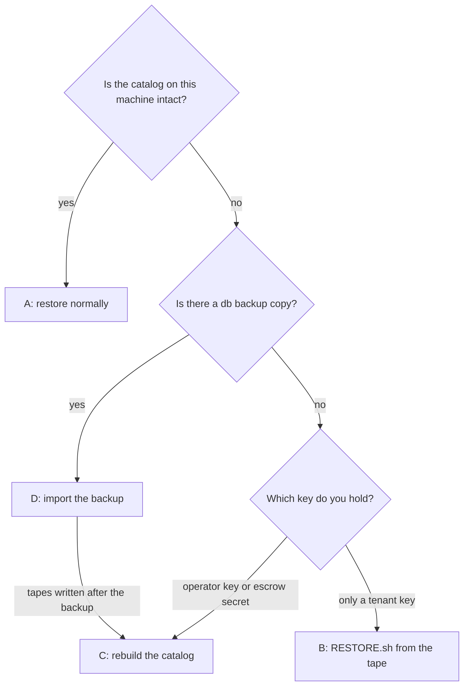

# Keys and recovery

This page covers the keys tapectl makes, who can open what on a tape, the Heir Kit,
and how to get data back when something is lost: a key file, the catalog, the
whole machine, or the person who ran it. Read it once before your first production
write, while nothing is lost yet. Most of what it asks of you has to be done
ahead of time: writing down the escrow secret, making the kit, keeping a
key-bearing copy of the home off the machine.

> [!NOTE]
> Commands are written `tapectl …`. On a host installed with `scripts/first-run.sh`,
> tapectl runs as the `tapectl` service user and its home is
> `/var/lib/tapectl/.tapectl`, so the same command there is `tapectl-op …` (or
> `sudo -u tapectl -H tapectl …`). Paths below written `<home>` mean that
> directory, or `~/.tapectl` for a personal install.

**Contents**

- [The keys at a glance](#the-keys-at-a-glance)
- [Tenant keys](#tenant-keys)
- [The escrow recipient](#the-escrow-recipient)
- [Who can open what on a tape](#who-can-open-what-on-a-tape)
- [What your backups contain](#what-your-backups-contain)
- [Rings of trust: giving someone access](#rings-of-trust-giving-someone-access)
- [What each loss costs](#what-each-loss-costs)
- [The Heir Kit](#the-heir-kit)
- [Recovery runbooks](#recovery-runbooks)
- [For the heir: no tapectl, no catalog](#for-the-heir-no-tapectl-no-catalog)
- [Related pages](#related-pages)

---

## The keys at a glance

All encryption is [age](https://age-encryption.org) X25519, with several
recipients per file. Any single recipient's private key decrypts the file on its
own.

| Key | How many | Where the private half lives | Rotated? |
|---|---|---|---|
| Tenant key pair `<tenant>-primary` / `<tenant>-backup` | two per tenant, both active | `<home>/keys/<tenant>-primary.age.key`, `-backup.age.key` (mode 0600) | yes, `key rotate` |
| Operator key pair `<operator>-primary` / `-backup` | two, for the operator tenant `init` creates | `<home>/keys/<operator>-*.age.key` | yes, `key rotate` |
| Escrow recipient `<operator>-escrow` | exactly one for the life of the archive | **nowhere on any machine.** It is on paper, in the Heir Kit | **never** |

The database (`tapectl.db`) holds public keys and fingerprints only. Every private
half is a file under `<home>/keys/`. This is why the catalog is safe to back up and
to escrow, and it is also why a catalog backup on its own brings no keys back.

---

## Tenant keys

A **tenant** is the unit of ownership and of encryption. Every unit belongs to
exactly one tenant. `tenant add` creates two independent key pairs for it:

```text
$ tapectl tenant add family -d "family photos and letters"
tenant "family" created (id=2) with primary and backup keys
```

```text
$ tapectl key list --tenant family
+----------------+---------+--------+--------+-----------------------------+---------------------+
| Alias          | Type    | Active | Escrow | Fingerprint                 | Created             |
+----------------+---------+--------+--------+-----------------------------+---------------------+
| family-backup  | backup  | yes    |        | age1k83yzew0lqgc2ghf7ktc... | 2026-09-29 08:19:49 |
+----------------+---------+--------+--------+-----------------------------+---------------------+
| family-primary | primary | yes    |        | age194da4h246gzse65r0a3k... | 2026-09-29 08:19:49 |
+----------------+---------+--------+--------+-----------------------------+---------------------+
```

The names *primary* and *backup* are labels, not a hierarchy. Both pairs are
active, both are recipients of everything the tenant owns, and either one decrypts
it alone. The second pair exists so that losing one file costs nothing.
`init` does the same for the operator tenant, so the operator also has
`<operator>-primary` and `<operator>-backup`.

On disk, the private half of the alias shown in `key list` is
`<home>/keys/<alias>.age.key`, and the public half is `<alias>.age.pub`:

```text
keys/
├── family-backup.age.key    0600   private — this is the key
├── family-backup.age.pub           public
├── family-primary.age.key   0600
├── family-primary.age.pub
├── mike-backup.age.key      0600   the operator's pair
├── mike-primary.age.key     0600
├── mike-escrow.age.pub             escrow: public half ONLY
└── …
```

**Exporting.** [`key export`](cli/key.md#tapectl-key-export) prints the **public**
half only, as one `age1…` line. Nothing in tapectl prints or exports a private key.

```bash
tapectl key export family-primary > family-primary.age.pub
```

**More keys.** [`key generate`](cli/key.md#tapectl-key-generate) adds another pair
to a tenant. [`key import`](cli/key.md#tapectl-key-import) adds someone else's
public key as a recipient (see [Rings of trust](#rings-of-trust-giving-someone-access)).
Every *active* key of the tenant is a recipient of what is staged or written from
then on.

**Rotation.** [`key rotate`](cli/key.md#tapectl-key-rotate) deactivates every
active key of a tenant and mints a new pair:

```text
$ tapectl key rotate --tenant family
rotated keys for "family": 2 deactivated, 2 new keys generated
```

The new pair is named `<tenant>-rotated-primary-<N>` / `<tenant>-rotated-backup-<N>`.
The old key files are **not deleted**. Old tapes stay encrypted to the old keys,
and tapectl's own `restore` trial-decrypts with every `.age.key` file in `keys/`
that belongs to the tenant or to the operator, active or deactivated. So after a
rotation, a tenant needs *all* their key files, old and new, to read everything.

Which files are a tenant's is decided by the catalog, not by the file name alone.
Tenant names may contain `-`, so `family-old-primary.age.key` could be tenant
`family`'s key `old-primary` or tenant `family-old`'s key `primary`. A key file
belongs to the tenant whose key row has its alias (the file name without
`.age.key`), so `restore` for `family` does not load `family-old`'s keys. A file
with no key row at all (the case after a [catalog rebuilt from tapes
alone](#c-the-catalog-is-gone-and-you-hold-the-operator-or-escrow-key)) goes by
its `<tenant>-` prefix instead, and is tried for every tenant whose name prefixes
it. A wrong guess costs one failed trial decryption. A withheld key would cost the
data.

Rotation never touches the escrow recipient. It **refuses** when no escrow recipient
is registered:

```text
error: key rotate refuses: no escrow recipient is registered (ADR-0005) — run `tapectl key generate --escrow` (or `key import --escrow`) before rotating any keys
```

> [!NOTE]
> A tape's tenant envelope is sealed when the volume is *written*, and its data
> slices are sealed when the unit is *staged*. If a rotation falls between the two,
> no single key generation opens both. tapectl handles that on its own. By hand,
> pass every key you hold to `RESTORE.sh` (`--key` can be repeated).

---

## The escrow recipient

The **escrow recipient** is one age identity for the whole archive
([ADR-0005](adr/0005-permanent-escrow-recipient.md)). It is a recipient of every
data slice and every envelope tapectl writes, and it is never rotated or replaced.
If every machine and every key file is lost, the escrow secret on paper still
opens every tape.

`init` mints it and prints the secret **once**:

```text
$ tapectl init --operator mike

================================================================================
  ESCROW IDENTITY GENERATED -- THIS SECRET IS SHOWN EXACTLY ONCE, RIGHT NOW
================================================================================

  tapectl does NOT store this secret anywhere: not in the database, not in
  a config file, not in any file on this machine. Close this terminal without
  transcribing it and it is gone forever -- the escrow recipient becomes
  useless for every future encryption it was meant to protect.

  Per ADR-0005: copy the secret below onto paper NOW. Store that paper in at
  least two independent physical locations. Verify the transcription
  character-by-character before doing anything else.

  SECRET -- transcribe this line:

    AGE-SECRET-KEY-1…(redacted)

  Public key (already saved to disk and the database -- safe to keep there):

    age130teljw9ws8rpmlf7w66penltdv4q59yf4xaqq9xjv45t8qmaqfqqrnmm7

================================================================================
```

> [!WARNING]
> **The escrow secret (`AGE-SECRET-KEY-1…`, 74 characters) is shown on that screen
> and nowhere else, ever.** tapectl keeps only the public half. Copy it onto paper
> in CAPITALS before you do anything else, then check the copy (the Heir Kit's
> cover sheet has the box and the check). Anyone holding the secret and a
> cartridge can read everything on it, every tenant included. Keep it out of
> password managers, cloud notes and photos. It belongs in a sealed envelope, in
> two places, and nowhere else.

The public half is kept as `<home>/keys/<operator>-escrow.age.pub` and in the
catalog. `key list --tenant mike` (the operator) lists it as `mike-escrow`, with
Type `escrow` and `ESCROW (ADR-0005)` in the Escrow column.

Rules that follow from "one identity, forever":

- **No command replaces a registered escrow identity.** Both `key generate --escrow`
  and `key import --escrow` refuse while one exists.
- **A rebuilt machine adopts the original.** `init --escrow-public-key age1…`
  registers an existing public key instead of minting a new one. This is the first
  step of disaster recovery ([runbook C](#c-the-catalog-is-gone-and-you-hold-the-operator-or-escrow-key)).
  A plain `init` on a rebuilt machine creates a *different* escrow identity that
  none of your tapes know.
- **Staging refuses without one.** `init --no-escrow` exists only for adopting an
  escrow identity afterwards with `key import --escrow`. Until one is registered,
  `stage create` and `key rotate` refuse.
- **If the secret leaks**, the escrow line is compromised for good, for every tape
  already written. ADR-0005 treats swapping in a fresh escrow identity as a
  deliberate, documented act that orphans older tapes from the new line. tapectl
  has no command for it.

---

## Who can open what on a tape

A sealed tape has plaintext navigation at the front, encrypted envelopes, the
encrypted data, and a plaintext seal marker at the end
([volume-format-v2.md §1](design/volume-format-v2.md)). The recipients of each
file:

| Tape file | Encrypted to | Contains |
|---|---|---|
| File 0 ID thunk, File 1 guide, File 2 `RESTORE.sh`, File 3 front index, last-file seal marker | nobody (plaintext) | label, layout, sizes and ciphertext hashes. No names, no content |
| Tenant envelope, one per tenant on the tape | that tenant's active keys **+** operator's active keys **+** escrow (keys active when the volume was written) | `MANIFEST.toml` (units, file list, slice positions, plaintext hashes), `RECOVERY.md`, dar catalogs |
| Operator envelope and its backup | operator's active keys **+** escrow | the same for *every* tenant on the tape, plus `PLAN.toml` and `catalog.db` (ownership and escrow receipts, used by `catalog rebuild`) |
| Data slice | owning tenant's active keys **+** operator's active keys **+** escrow (keys active when the unit was staged) | one dar archive slice |

So:

- a **tenant key** opens that tenant's envelope and slices, and nothing belonging
  to another tenant;
- an **operator key** opens every envelope and every slice, and is the key
  `catalog rebuild` needs;
- the **escrow secret** opens everything the operator key opens, on every tape
  ever written;
- anyone who can load the cartridge can read File 1's section *"What the
  unencrypted parts of this tape reveal"*: the label, the date, how many tenants
  share the tape, and the size and hash of every file. No file names, no unit or
  tenant names, no content.

---

## What your backups contain

| Copy | Catalog | Private keys | `config.toml` |
|---|---|---|---|
| `tapectl db backup --to X.db` | yes | **no** | no |
| `tapectl db backup --to X.db --include-keys` | yes | yes, as a directory `X.keys/` beside it | no |
| The daily backup timer (`tapectl-backup.timer`, see [install.md §7](install.md#7-the-timers-and-the-operator-wrapper)) | yes | no, unless you set `TAPECTL_BACKUP_INCLUDE_KEYS=1` in its unit | no |
| The Heir Kit's `catalog.db.age` | yes, encrypted to escrow | **no** | no |
| A tarball of the whole home ([install.md §9](install.md#9-moving-to-a-new-host)) | yes | yes | yes |

```text
$ tapectl db backup --to /tmp/tour/backup/tapectl.db
database backed up to /tmp/tour/backup/tapectl.db (private keys not included — pass --include-keys to copy them)
$ tapectl db backup --to /tmp/tour/backup/tapectl.db --include-keys
database backed up to /tmp/tour/backup/tapectl.db; private keys copied to /tmp/tour/backup/tapectl.keys/ — treat that directory as secret
```

With `--include-keys` the key directory is named after the destination with its
extension replaced by `.keys`: `--to /media/usb/tapectl.db` also writes
`/media/usb/tapectl.keys/`. It holds every file of `keys/`, active and deactivated
keys alike. The directory is created mode 0700 and the private key files keep
mode 0600. The command also logs a warning naming that directory.

`db backup` copies `tapectl.db` and, with `--include-keys`, `keys/`. Nothing else
in the home is copied: not `config.toml`, not the dar catalogs in `catalogs/`,
not the stage reports in `stage-reports/`. Only a tarball of the home carries
those.

`db backup` never creates directories, so a mistyped or unmounted path cannot
quietly put a backup, and its keys, on the local disk. It refuses, and writes
nothing, when:

- the destination directory does not exist
  (`db backup refuses: the destination directory /media/usb does not exist — create it, or mount the medium it lives on, and run again (db backup does not create directories)`);
- `--to` is itself a directory (`--to` names the backup *file*, for example
  `/media/usb/tapectl.db`);
- with `--include-keys`, `--to` ends in `.keys`, which is where the key directory
  would go.

`--dry-run` checks the same things and names the key directory it would write.

**Somewhere off this machine there must be a copy that includes the keys.** Either
`db backup --include-keys` or a tarball of the home, on media you treat as being as
secret as the escrow paper. Otherwise the escrow secret is the only way back into
your tapes, and tapectl's own `restore` cannot use it (see the loss table below).

---

## Rings of trust: giving someone access

A unit belongs to exactly one tenant. The tenant boundary is the only access
boundary on tape. There are no per-unit or per-person grants inside a tenant.
Three rings, from the inside out:

1. **The operator** holds the operator keys and every tenant's keys on the host,
   and can read everything.
2. **A tenant key-holder** can read that tenant's data and nothing else.
3. **The escrow custodian** (an envelope in a safe) can read everything, but
   only by opening the envelope.

To move data between tenants, [`tenant reassign`](cli/tenant.md#tapectl-tenant-reassign)
changes ownership in the catalog. Tapes already written stay encrypted to the old
tenant's keys. Only data staged after the reassignment is encrypted to the new
tenant.

### Handing a tenant its own keys

Giving someone read access to a tenant's data means giving them that tenant's
private keys. tapectl has **no command that exports a private key**, so you copy
the files by hand, as a user who can read the home:

```bash
# 1. which aliases exist: all of them, active or not (older tapes need the old ones)
tapectl key list --tenant family

# 2. copy each alias's .age.key file to the removable medium, mode 0600
#    (service-user install shown; for a personal install the home is ~/.tapectl)
mkdir -p /media/usb/family-keys
sudo install -m 0600 -o "$USER" \
    /var/lib/tapectl/.tapectl/keys/family-primary.age.key \
    /var/lib/tapectl/.tapectl/keys/family-backup.age.key \
    /media/usb/family-keys/
```

- Copy by exact alias, as `key list` names them, not with a `family-*` glob,
  which would also pick up the keys of a tenant named `family-old`. tapectl's own
  `restore` goes by alias the same way (see [Tenant keys](#tenant-keys)).
- An alias created by `key import` has only a `.age.pub` in `keys/`. Its private
  half belongs to the person you imported it from.
- A FAT or exFAT stick ignores the 0600 mode. Anyone who finds that stick can
  read the tenant's data from any tape they can get at.
- Also give them the labels of the volumes holding their data
  (`tapectl catalog locate <unit>`). With no catalog, they otherwise have to try
  every tape.

**What they can do with only those files and a tape** (no tapectl, no catalog;
[runbook B](#b-a-tenant-holding-only-their-key-files-and-a-tape)):

- `RESTORE.sh --info` and `--verify` need no key: tape layout, seal verdict, and a
  keyless integrity check of every file.
- `RESTORE.sh --find-envelope --key …` opens their tenant envelope and shows which
  units and versions the tape holds for them.
- `RESTORE.sh --restore --key … --unit … --to …` restores a unit.
- They **cannot** open another tenant's envelope or slices, or the operator
  envelope, so they cannot use `catalog rebuild`. They do not need it.

### Adding a person's own key instead

If the other person makes their own key pair (`age-keygen -o me.key`, and they send
you only `age-keygen -y me.key`, the public half), you can add it as an extra
recipient. No private key changes hands:

```bash
tapectl key import --tenant family --alias sister sister.age.pub
```

```text
key "family-sister" imported
```

Two honest limits:

- It covers **only what is staged and written after the import.** Tapes that
  already exist are not re-encrypted. To cover old data, re-stage it onto new tapes.
- **`key rotate` deactivates it** along with the tenant's own keys ("3 deactivated").
  A plain `key import` of the same public key is then refused, and the refusal
  says how to bring it back:

  ```text
  $ tapectl key rotate --tenant family
  rotated keys for "family": 3 deactivated, 2 new keys generated
  $ tapectl key import --tenant family --alias sister sister.age.pub
  error: key import refuses: this public key is already in the catalog as "family-sister" (tenant "family", deactivated — `key rotate` deactivates the keys it replaces). To make it a recipient of new writes again, re-run with --reactivate.
  ```

  `--reactivate` makes it a recipient of new writes again, under the alias it was
  registered with (`--alias` can be left out):

  ```bash
  tapectl key import --tenant family --reactivate sister.age.pub
  ```

  ```text
  key "family-sister" reactivated: a recipient of new writes for tenant "family" again
  ```

  Reactivate only a key you still trust. If the rotation was because that key
  leaked, have the person make a new pair and import that instead.

`key import` also refuses, by name, a public key that is already active for this
tenant ("nothing to import"), one registered to another tenant (a key belongs to
one tenant), and the escrow identity, which is a recipient of every write already
and is never a tenant key.

---

## What each loss costs

"Lost" means gone. If a key was **stolen** rather than lost, the thief can read
every tape encrypted to it for as long as those tapes exist. Rotating stops
*future* exposure, but only re-staging onto new tapes and destroying the old ones
removes the past.

| What is lost | What still works | What to do |
|---|---|---|
| **One tenant key file** (say `family-primary.age.key`) | Everything. The other pair, the operator keys and the escrow secret are all recipients of the same files | `tapectl key rotate --tenant family` so new data does not depend on a pair with a missing half. Keep the surviving old file: older tapes still need it |
| **All of one tenant's key files** | tapectl's `restore` still reads that tenant's data using the operator keys; `RESTORE.sh` works with the operator key or escrow secret | `key rotate --tenant family`, then give the tenant their new files. They can no longer read old tapes independently; only the operator or escrow can |
| **The whole home** (catalog, keys, config), escrow paper intact | Every tape is still readable with the escrow secret, through `RESTORE.sh --key`, or through `restore raw-volume` + `age` + `dar` once a new home carries the original escrow identity (runbook C, step 3). The catalog comes back from the kit's `catalog.db.age` and `catalog rebuild` | [Runbook C](#c-the-catalog-is-gone-and-you-hold-the-operator-or-escrow-key). Unless a key-bearing backup survives, **tapectl's own `restore unit\|file` cannot read the old tapes**: it reads keys only from `keys/`, and the escrow secret must never be put there. Old data comes back through `RESTORE.sh`. Rotate every tenant and the operator before staging anything new |
| **The escrow paper** (every copy), home intact | Everything, today: the operator and tenant keys open every tape | Make sure a key-bearing copy of the home exists off the machine, because it is now your only way back. The secret cannot be re-printed (it was never stored), and no command registers a replacement identity. Every future tape still carries the old escrow recipient, which nobody can use |
| **The home and the escrow paper** | Only what survives elsewhere: a `db backup --include-keys` copy or a home tarball restores everything; a tenant holding their own key files can still restore their own data with `RESTORE.sh` | Without any of those, the data on tape cannot be decrypted by anyone. This is the loss the Heir Kit's two failure domains exist to prevent |

---

## The Heir Kit

The Heir Kit ([ADR-0009](adr/0009-heir-kit-contents-and-staleness.md)) is what
survives the machine: a printed cover sheet naming the escrow identity, with a box
where you copy the secret by hand, plus the whole catalog encrypted to the escrow
recipient.

```text
$ tapectl key escrow-kit --out ~/heir-kit
heir kit written to ~/heir-kit
  COVER.txt        the printable cover sheet (print this)
  escrow-kit.html  same content with a QR, for a browser's print dialog
  catalog.db.age   encrypted catalog, 672130 bytes, covering 2 sealed volume(s)

still to do, and only you can do it:
  1. print COVER.txt (or the HTML page)
  2. copy the escrow SECRET (AGE-SECRET-KEY-1..., shown once by `tapectl init`)
     by hand into the box marked WRITE IT HERE -- the kit prints only the
     public half, and without the secret the sheet opens nothing
  3. seal it in a tamper-evident envelope
  4. store copies in at least TWO independent failure domains
```

| File | What it is |
|---|---|
| `COVER.txt` | The cover sheet in plain text. It is the part meant to last decades: readable with `cat` long after browsers change. It prints the escrow **identity** (the public `age1…`, which decrypts nothing) and a boxed area headed `THE ESCROW SECRET -- WRITE IT HERE`. Its example commands say `/dev/nst0`, and the sheet says that is only an example: `ls -l /dev/tape/by-id/` lists the drives on the machine at hand |
| `escrow-kit.html` | The same words, with the identity also as a QR code. Self-contained; print it from any browser |
| `catalog.db.age` | The **whole** `tapectl.db`, encrypted to the escrow recipient: units, versions, which volume is on which cartridge, and which location it is in. It holds no private keys |

The command stops at the files. The rest of the ceremony is yours:

1. **Print** `COVER.txt` (or the HTML page).
2. **Hand-copy the secret** from your original transcription into the box, in
   CAPITALS, one character per cell. It is 74 characters and begins
   `AGE-SECRET-KEY-1`. After that prefix the letters B, I, O and the digit 1 never
   occur.
3. **Check the pair.** Type the secret alone on one line of a file and run
   `age-keygen -y` on it. The output must be exactly the `age1…` printed on the
   sheet. A miscopied character is refused with `invalid checksum`. Then delete the
   file:
   ```bash
   age-keygen -y escrow.key      # must print the sheet's age1… exactly
   shred -u escrow.key
   ```
4. **Seal** the sheet, with `catalog.db.age` on a USB stick or disc, in a
   tamper-evident envelope.
5. **Store two copies in independent failure domains**, not two shelves in one
   building. Paper belongs in a UL-350 rated safe, or Class-125 if it shares the
   safe with tape.

**Refresh after every write session.** The secret and the identity never go
stale: the escrow identity is a recipient of every tape, old and new, so the
secret in an old kit opens tapes written after it too. What goes stale is
`catalog.db.age`, which lists only the volumes that existed when the kit was
made. The heir can still recover a later tape with the secret, through
`catalog rebuild --from-volume` or `RESTORE.sh`, but only if they know to look for
it. The cover sheet's CUSTODY section says so:

```text
  * REFRESH after each writing session. The secret opens EVERY
    tape ever written -- it is a recipient of all of them, old
    and new. What goes stale is catalog.db.age in this envelope:
    it lists only the volumes that existed when this kit was
    made (see GENERATED). For a tape written later, rebuild the
    catalog from that tape (tapectl catalog rebuild
    --from-volume) or generate a fresh kit. Running
    `tapectl audit` warns when this kit has fallen behind.
```

`key escrow-kit` records when it ran, and `audit` warns (exit 1, never blocking)
while no kit exists:

```text
  [escrow_kit_missing] archive: 1 sealed volume(s) exist but no heir kit has ever been generated — nothing off-site can decrypt them
```

Once a kit exists and volumes have been sealed after it, the warning is
`escrow_kit_stale`: "*N* volume(s) were sealed after the last heir kit
(*time*): the kit's escrow secret still opens them (it is a recipient of every
tape), but the kit's encrypted catalog (catalog.db.age) does not list them —
regenerate the kit, or rebuild the catalog from those tapes with `tapectl catalog
rebuild --from-volume`". Both suggest `tapectl key escrow-kit --out <dir>`.

A refresh changes `catalog.db.age` **and the cover sheet that describes it**. The
sheet prints the catalog's size in bytes (under WHAT ELSE IS IN THIS ENVELOPE)
and how many sealed cartridges it knew (under GENERATED), so an old sheet beside
a new catalog states the wrong size and count, and a wrong size can look like
tampering. The identity and the secret do not change. For each envelope:

1. Put the new `catalog.db.age` in, with the newly printed `COVER.txt` in front.
2. Either copy the secret into the new sheet's box, check the pair again, and
   shred the old sheet; or keep the old hand-filled sheet behind the new one for
   its secret, with its byte count and cartridge count struck out. The new sheet
   says that when its box is empty, the secret is on another piece of paper in
   the same envelope.
3. Re-seal it.

---

## Recovery runbooks

Every `--device` below is written as `"$TAPE"`. Find the drive by serial and set it
first. `/dev/nstN` numbers change between reboots on a host with more than one
drive, and a wrong number reads a different tape.

```bash
ls -l /dev/tape/by-id/                   # the *-nst entry is the no-rewind device
TAPE=/dev/tape/by-id/scsi-<SERIAL>-nst
```

Which runbook to use depends on what you hold, not on how bad the loss is:



### A. Restore a unit or a file normally

The catalog knows which volume holds what. Find a copy, then restore from it:

```bash
tapectl catalog locate family/letters
tapectl restore unit --unit family/letters --from L8-0002 --to /tmp/restore/unit --device "$TAPE" --dry-run
tapectl restore unit --unit family/letters --from L8-0002 --to /tmp/restore/unit --device "$TAPE"
tapectl restore file --file 1998-letter-to-mum.txt --unit family/letters --from L8-0002 --to /tmp/restore --device "$TAPE"
```

```text
would restore "family/letters" v1 from L8-0002 (1 slices) to /tmp/restore/unit
restored "family/letters" v1 from L8-0002 (1 slices) to /tmp/restore/unit
restored "1998-letter-to-mum.txt" from "family/letters" on L8-0002 to /tmp/restore
```

`--version N` picks an older version. The default is the newest one on that
volume. Restoring as a non-root user logs a warning that restored files will be
owned by you, not by their archived owners. tapectl tries every key file in
`keys/` that belongs to the unit's tenant or to the operator, deactivated ones
included (see [Tenant keys](#tenant-keys) for how a file's owner is decided), so
a rotation in between needs nothing from you. Full reference:
[restore](cli/restore.md).

### B. A tenant holding only their key files and a tape

This is the Heir Path. It needs `mt`, `dd`, `age`, `dar`, `sha256sum`, `tar`, `bash`
and coreutils. It does not need tapectl. Install them all first. `RESTORE.sh`
checks for each one before it touches the tape and stops with
`FATAL: missing required tool: <name>`. On tapes written before that check
gained `tar` (2026-09-28), a missing `tar` shows up only later, after the
envelope has been read and decrypted.

1. **Read the tape's identity** (File 0) to confirm you have the right cartridge:
   ```bash
   mt -f "$TAPE" setblk 524288
   mt -f "$TAPE" rewind
   dd if="$TAPE" bs=512k | tr -d '\0' | less
   ```
   With tapectl installed, `tapectl volume identify --device "$TAPE"` prints the
   same text, but only once tapectl has a home. Until then every command except
   `init` stops with ``error: tapectl is not initialized — run `tapectl init` first``. Do
   not answer that with a plain `init`, which mints a new escrow identity that
   none of the tapes know. With the Heir Kit cover sheet's `age1…` public key
   in hand, `tapectl init --operator <name> --escrow-public-key age1…` adopts
   the original identity ([runbook C](#c-the-catalog-is-gone-and-you-hold-the-operator-or-escrow-key),
   step 3). Without it, `tapectl init --operator <name> --no-escrow` makes a
   home with none, and `tapectl key import --escrow age1…` adopts the original
   once you find it. A second `init` on that home is refused
   (`error: tapectl is already initialized at …`).

   File 0 then tells you how to read the recovery guide (File 1) with a
   `dd … | tr -d '\0' > GUIDE.md` line. Its commands say `/dev/nst0`, and File 0
   says that is an example: use your `"$TAPE"`.

   > [!IMPORTANT]
   > On tapes written before the 2026-09-28 fix, File 0 prints that guide-reading
   > line with `tr -d '\\0'`, two backslashes. Typed that way, it deletes every
   > backslash and every digit `0` from the output (`2026` comes out as `226`) and
   > leaves the padding in. Type `tr -d '\0'`, with one backslash, as every command
   > on this page does. Tapes written since print it correctly.

2. **Get `RESTORE.sh` off the tape** (File 2):
   ```bash
   mt -f "$TAPE" rewind
   mt -f "$TAPE" fsf 2
   dd if="$TAPE" bs=512k | tr -d '\0' > RESTORE.sh
   chmod +x RESTORE.sh
   export TAPE_DEVICE="$TAPE"        # otherwise RESTORE.sh uses its built-in default, /dev/nst0
   ```
   File 1 (`mt fsf 1` instead of `fsf 2`) is the full recovery guide, including
   the by-hand procedure if the script is unusable.

3. **Look before decrypting.** Neither command needs a key:
   ```bash
   ./RESTORE.sh --info       # layout table and seal verdict: SEALED / UNSEALED / DAMAGED (ends disagree)
   ./RESTORE.sh --verify     # hashes every file against the front index; nonzero exit on any FAIL
   ```

4. **Find your envelope** and see which units and versions are yours. Pass every
   key file you hold. `--key` can be repeated, and each key is tried on its own:
   ```bash
   ./RESTORE.sh --find-envelope --key family-primary.age.key --key family-backup.age.key
   ```

5. **Restore**:
   ```bash
   ./RESTORE.sh --restore --key family-primary.age.key --key family-backup.age.key \
       --unit family/letters --to ~/restored
   ```
   Without `--version N` the newest version on the tape is restored. Without
   `--unit` the script restores the unit if the envelope it opened holds only
   one. With several, it lists them and stops with `FATAL: multiple units found —
   specify one with --unit NAME` (exit 1). Run it again with `--unit`.
   Each slice is checked against the front index's hash before it is decrypted.

   **Disk space.** Every slice of the unit is decrypted to disk before dar
   extracts them, into a scratch directory inside `--to` that is removed
   afterwards. With both on one disk, a unit needs about twice its size free
   there, plus one slice. The script measures this before it reads any slice and
   stops with `not enough disk space` if it will not fit. Choose a larger disk
   with `--to`, or put the decrypted slices on another disk with
   `--scratch DIR`. Do not restore into `/tmp`, which is RAM on many systems.

The same steps work with the operator key or the escrow secret, which open every
tenant's envelope. `--unit` then picks the right one.

### C. The catalog is gone, and you hold the operator or escrow key

The home is lost or unusable, with no `db backup` copy (if you have one, use
[runbook D](#d-restore-the-catalog-from-a-db-backup-copy)). This rebuilds the
catalog from the Heir Kit and the tapes. [install.md §8](install.md#8-getting-the-catalog-back)
is the same procedure for a service-user host.

**The order matters: home, then keys, then rows.** `db import` replaces the
*whole* live database, so anything rebuilt before it is lost.

1. **Install tapectl** ([install.md](install.md)).

2. **Make the key file.** For the escrow secret, type it from the cover sheet
   alone on one line of `escrow.key`, then check it:
   ```bash
   age-keygen -y escrow.key      # must print the sheet's age1… exactly
   ```
   For the operator key, use the operator's `.age.key` file from wherever it
   survived.

3. **Create the home with the ORIGINAL escrow identity.** Never run a plain
   `init` here. It would mint a new identity that none of your tapes know, and
   no command can undo that (you would have to delete the new home and start
   again).
   ```bash
   tapectl init --operator mike --escrow-public-key age130teljw9ws8rpmlf7w66penltdv4q59yf4xaqq9xjv45t8qmaqfqqrnmm7
   ```
   From the recorded session, which rebuilt into a separate `--home ~/.tapectl-rebuilt`
   (on a real rebuild, use your normal home):
   ```text
   tapectl initialized at ~/.tapectl-rebuilt
     operator: mike
     database: ~/.tapectl-rebuilt/tapectl.db
     config:   ~/.tapectl-rebuilt/config.toml
     escrow:   adopted age130teljw9ws8rpmlf7w66penltdv4q59yf4xaqq9xjv45t8qmaqfqqrnmm7 (imported — its secret lives on the heir kit, not here)
     dar:      dar (found at /usr/bin/dar)
   ```
   If you hold only the operator key and cannot find the escrow public key, run
   `tapectl init --operator mike --no-escrow` now and
   `tapectl key import --escrow age1…` once you find it. Until then escrow
   coverage cannot be confirmed, and `audit` does **not** say so: with no
   identity to compare against, it skips its escrow checks, so a clean `audit`
   tells you nothing about escrow. `catalog locate` shows `-` in its Escrow
   column for every copy, and both `stage create` and `key rotate` (step 9)
   refuse. Their error offers `key generate --escrow` alongside
   `key import --escrow`. Here, only `key import --escrow` with the original
   key is right, because `key generate --escrow` mints a new identity that none
   of your tapes know, the same trap as a plain `init`.

4. **Register the drive** (optional for reading, since every command below takes
   `--device`, but needed before writing again):
   ```bash
   # --device-sg is the drive's SCSI generic node (lsscsi -g); --generation is the DRIVE's
   tapectl backend add --name lto6 --device-tape "$TAPE" --device-sg /dev/sg3 --generation LTO-6
   ```

5. **Put private keys back, if any survived.** If a `db backup --include-keys`
   copy (the `.keys/` directory beside the backup file) or a home tarball
   survived, copy its `*.age.key` files (mode 0600) and the `*.age.pub` files
   beside them into `<home>/keys/`. The kit does not contain them.

6. **Import the kit's catalog, if you have the kit.** This gives back locations,
   cartridges, history and policy, which the tapes alone do not carry:
   ```bash
   age -d -i escrow.key -o catalog.db catalog.db.age
   tapectl db import catalog.db
   tapectl db fsck
   ```
   `db import` asks before it overwrites the live database. `-y` answers for you.

7. **Rebuild from each tape.** Without the kit, that means every tape. With the
   kit imported, it means every tape sealed after the kit was made, and neither
   `volume list` nor `audit` can name those, because the kit's catalog has no
   row for them. The shelf is the list. `tapectl volume list` shows every volume
   the kit knew (the cover sheet's "Sealed cartridges known at generation time"
   counts the sealed ones), and `tapectl volume identify --device "$TAPE"` prints
   the label of the loaded cartridge. A cartridge whose label is missing from the
   list, or listed but not `sealed`, needs the rebuild (for one listed as
   `initialized`, see runbook D's last bullet). When in doubt, rebuild every
   cartridge: rebuilding a tape the catalog already has is safe. One cartridge
   at a time, in any order. `--label` is a wrong-tape guard:
   ```bash
   tapectl catalog rebuild --from-volume --key escrow.key --device "$TAPE" --label L8-0002
   ```
   ```text
   rebuilt from volume "L8-0002" (uuid 6ff3d909-0486-4310-a31e-68a0fd0d1ec5), 3 envelope(s) opened
     inserted: 2 tenant(s), 4 unit(s), 4 snapshot(s), 4 stage set(s),
               4 slice(s), 4 write(s), 4 position(s), 11 file row(s), 1 volume
     cartridge "E01003L8_1775794348" registered from this tape's own identity and bound
     the slice hashes recorded are the tape's own claim; run `tapectl volume verify L8-0002` to check them
     escrow receipts: 4 stage set(s) carried theirs on the tape
   ```
   Running it twice is safe: the second run finds its own rows and adds nothing.
   It mostly inserts what is missing, but it does change rows it finds in three
   cases, and prints a line for each:

   - **It binds the cartridge**, and records the chip serial on a cartridge row
     that lacked one (`medium serial learned onto cartridge "…"`).
   - **It marks a displaced volume `erased`.** If the catalog has a different
     volume open on the same cartridge (the kit knew it under an older label, and
     the cartridge was re-initialised since), that volume's bytes are gone, and
     the rebuild records it as `volume init` would have. The warning names every
     unit on it and how many copies each has left, flagging
     `*** unit "…" now has ZERO copies ***`. When no chip serial proves which
     cartridge this is, and the other volume is still live, the rebuild refuses
     instead and says how to settle it.
   - **With the escrow key, it attests** escrow coverage the catalog lists as
     unknown (see "Escrow coverage" below).

   A tenant key is refused: it cannot open the operator envelope.

8. **Verify each tape and audit**:
   ```bash
   tapectl volume verify L8-0002 --device "$TAPE"
   tapectl audit
   ```
   `volume verify` exits 0 when every file on the tape matched its recorded hash.
   It exits 2 when it proved the medium bad: the volume is quarantined and no
   longer counts as a copy, so its content has to go to another cartridge. It
   exits 3 when it could not decide (no cartridge loaded, the wrong tape, a drive
   or read error): the volume is left as it was, so check the drive and verify
   again.

   `audit` reports what is actually true. One rebuilt cartridge is one copy, and
   if your policy asks for two, `audit` exiting 2 is the correct answer.

   One exception, after step 6: what `audit` says about the Heir Kit
   (`escrow_kit_missing`, `escrow_kit_stale`) is measured against the kit
   *before* the one you imported. A kit's catalog is copied just before the kit
   records that it was made, so after importing a first kit `audit` reports
   that no kit was ever generated, and a later kit's stale count can include
   tapes it already lists. Make a fresh kit once the rebuild is done
   ([The Heir Kit](#the-heir-kit)); that clears it.

9. **Rotate what needs it, before staging anything new.** Everything staged is
   encrypted to the active keys of its tenant and of the operator, plus the
   escrow recipient. A tenant, the operator included, needs a rotation when one
   of its active keys has no private half anyone holds. Nothing warns you:
   neither `audit` nor `config check` reports it, and `stage create` encrypts
   to the lost key without a word.

   **If step 5 put key files back**, compare each tenant's rows with its files,
   the operator included, both ways. Match by exact alias, as in
   [Tenant keys](#tenant-keys):
   ```bash
   tapectl key list --tenant family
   ls <home>/keys/
   ```

   - **A row with Active `yes` and no `<alias>.age.key` in `<home>/keys/`: that
     tenant needs a rotation.** This is the usual case when the key files came
     from a `db backup --include-keys` copy older than the kit, with a
     `key rotate` in between. The kit's catalog lists the rotated pair as
     active, and the backup never had their private files. Two rows are fine
     without one: the escrow row (its secret lives on the Heir Kit, never in
     `keys/`), and a key you added with `key import`, whose private half
     belongs to the person you imported it from
     ([Adding a person's own key instead](#adding-a-persons-own-key-instead)).
     The rotation deactivates that key as well, so bring it back afterwards
     with `key import --reactivate`.
   - **A `.age.pub` file the list lacks: register it before rotating that
     tenant.** `key rotate` names its new pair `<tenant>-rotated-primary-<N>`,
     where N counts the keys the catalog lists for that tenant. On a catalog
     that is missing rows, N can be a number the old machine already used, and
     the rotation refuses: `error: key already exists: mike-rotated-primary-3`.
     The alias is the file name without the `<tenant>-` prefix and `.age.pub`:
     ```bash
     tapectl key import --tenant mike --alias rotated-primary-3 <home>/keys/mike-rotated-primary-3.age.pub
     tapectl key import --tenant mike --alias rotated-backup-3 --key-type backup <home>/keys/mike-rotated-backup-3.age.pub
     ```
     An imported key is active until the rotation deactivates it. A refused
     rotation leaves the catalog unchanged, so if a file slips through, import
     the one the error names and rotate again.

   Then rotate each tenant the first check named:
   ```bash
   tapectl key rotate --tenant family
   ```

   **If no private keys came back**, rotate every tenant *and* the operator.
   Otherwise new data is encrypted to keys whose private halves are gone (the
   escrow recipient would be the only way in):
   ```bash
   tapectl key rotate --tenant mike
   tapectl key rotate --tenant family
   ```
   Old tapes are then readable only with the escrow secret, through
   [runbook B](#b-a-tenant-holding-only-their-key-files-and-a-tape). tapectl's
   `restore` cannot use it.

   **If you skipped step 6** (no kit), rotate the operator even when its key
   files came back. `init` in step 3 gave the operator a new key pair with
   catalog rows, and step 5 copied the old files over those names, so the rows
   now name public keys whose private halves are gone. `restore` still reads old
   tapes with the old files, but new data would be encrypted to the lost keys.
   If the old machine ever rotated the operator, register its rotated files
   first, as above:
   ```bash
   tapectl key rotate --tenant mike
   ```

10. **Destroy the typed secret**: `shred -u escrow.key`. The escrow secret must not
    stay on a machine.

What a catalog rebuilt from tapes alone (step 7 without step 6) **does not have**:

- **Key rows.** Rebuilt tenants have no keys, so nothing can be staged for them
  until you rotate (step 9) or register a surviving key again. `restore` still
  finds key files you put back in step 5: with no row to go by, it tries each
  file for every tenant whose name prefixes it (see [Tenant keys](#tenant-keys)).
  To make ownership exact again, register **every** key of the tenant that has a
  file in `<home>/keys/`, the rotated ones included, from its `.age.pub`
  (`age-keygen -y` on the `.age.key` prints it if the `.age.pub` did not
  survive):
  ```bash
  tapectl key import --tenant family --alias primary <home>/keys/family-primary.age.pub
  tapectl key import --tenant family --alias backup --key-type backup <home>/keys/family-backup.age.pub
  tapectl key import --tenant family --alias rotated-primary-2 <home>/keys/family-rotated-primary-2.age.pub
  tapectl key import --tenant family --alias rotated-backup-2 --key-type backup <home>/keys/family-rotated-backup-2.age.pub
  ```
  Registering only some of them can make a later `key rotate --tenant family`
  refuse. It does when the count of rows lands on an N whose
  `family-rotated-primary-<N>` file is already in `<home>/keys/` (with the four
  files above, registering just the first two does it; step 9 says why).
  Every imported key is active, including ones the old catalog had
  deactivated, so all of them become recipients of everything staged from then
  on. If any should not be (a key rotated out because it leaked, or a
  person's key you no longer want), run `key rotate --tenant family` once they
  are all registered. This is for tenant keys only: the operator's aliases
  already belong to the new pair `init` made, so rotate the operator instead
  (step 9).
- **Source paths and tags.** `unit list` shows them empty. The tape never recorded
  where the data came from on disk.
- **Locations.** Add them with `location add` and place each volume with
  `volume move`.
- **Escrow coverage on tapes that predate the on-tape receipt.** A tape carries
  each stage set's recipient list (as with "escrow receipts: 4 stage set(s)
  carried theirs" above), so any production tape comes back covered. A tape
  written before receipts existed comes back **unknown**, shown as `?` in
  `catalog locate`. `audit` warns and `volume write` refuses to re-copy it. The
  fix is **attestation**: run the rebuild again with `--key escrow.key`. If that
  is the escrow identity this catalog registered, tapectl decrypts one slice
  header per stage set and records the coverage it proved. A rebuild done with
  the escrow key attests in the same pass, and one done with the operator key
  does not.
- **Proof of integrity.** The hashes recorded are the tape's own claim.
  `volume verify` checks them.

### D. Restore the catalog from a `db backup` copy

The home and its `keys/` survive, but the database is damaged or lost. Use the
newest copy (on a service-user install, the daily timer writes them to
`/var/backups/tapectl/`):

```bash
tapectl db import /var/backups/tapectl/tapectl-20260924T030000Z.db
tapectl db fsck
tapectl audit
```

- `db import` is a raw page copy and checks no foreign keys, which is why `db fsck`
  follows. It asks before overwriting. `-y` answers for you.
- If `keys/` was lost too, copy the files from the backup's key directory
  (`tapectl-20260924T030000Z.keys/` beside the file above, present only if keys
  were included) into `<home>/keys/`, keeping the private key files at mode 0600.
  The backup carries the key rows, so `restore` knows whose each file is.
- **A backup is only as new as the last copy taken.** For each volume sealed
  after the backup was taken, run `catalog rebuild --from-volume` as in runbook C,
  step 7. One gap remains: if the backup was taken while a volume was still
  `initialized` (after `volume init`, before `volume write`), the rebuild attaches
  the tape's units to that row but leaves its status alone and says so. Until
  sealed, nothing on it counts as a copy, and the rebuild's own warning ends
  "the status itself will not change automatically". To avoid this, take a backup at the end of every write session
  (`sudo systemctl start tapectl-backup.service` on a timer install).

### E. Moving to a new host

Nothing is lost. The home (catalog, keys, config) moves as one tarball, and the
escrow identity moves inside the catalog. Follow
[install.md §9](install.md#9-moving-to-a-new-host), and treat the tarball as
every private key in the archive.

---

## For the heir: no tapectl, no catalog

Someone who inherits the cartridges and a sealed envelope, and has never heard of
tapectl, needs to know this:

- **Do not erase, degauss or reformat the cartridges.** Left alone, they stay
  readable for decades.
- **You need an LTO drive that can read that generation.** The label on the
  cartridge and File 0 (`Media: LTO-6`, for example) name the generation. Check
  the drive maker's read-compatibility table, because not every generation reads
  the ones two back. A data-recovery firm can read a cartridge if you cannot
  find a drive.
- **Find the drive's device name.** The cover sheet and every tape print their
  commands with `/dev/nst0`, and say that is only an example.
  `ls -l /dev/tape/by-id/` lists the tape drives. Use the entry ending in `-nst`
  wherever those commands say `/dev/nst0`. A wrong device reads a different tape,
  or fails.
- **Tools:** `mt` (package `mt-st`), `dd`, `age` and `age-keygen`
  ([age-encryption.org](https://age-encryption.org)), `dar`
  ([dar.linux.free.fr](http://dar.linux.free.fr)), `sha256sum`, `head`,
  `truncate`, `tar` and `bash`, which any Linux machine has or can install.
- **The key is the secret handwritten on the cover sheet** (`AGE-SECRET-KEY-1…`).
  The printed `age1…` value is only a check. Type the secret on one line of a
  file and confirm that `age-keygen -y` on that file prints the `age1…`.
- **Every tape explains itself.** File 0 says what the tape is. **File 1 is a
  complete recovery guide**, written so that a person or an AI assistant can
  follow it, including a by-hand procedure if the script is damaged. File 2 is
  `RESTORE.sh`. Start with [runbook B](#b-a-tenant-holding-only-their-key-files-and-a-tape),
  using the escrow key file as the `--key`.
- **`catalog.db.age` in the envelope** says which cartridge holds what and where
  it is stored. `age -d -i escrow.key -o catalog.db catalog.db.age` decrypts it
  to an SQLite file. It makes the search easier, and you can recover data
  without it.
- **With tapectl installed**, first give it a home: it refuses every other command
  until one exists (``error: tapectl is not initialized — run `tapectl init` first``).
  Do **not** run a plain `init`, which makes a new escrow identity that none of
  the tapes know. Use the identity printed on the cover sheet:
  `tapectl init --operator <name> --escrow-public-key age1…`
  ([runbook C](#c-the-catalog-is-gone-and-you-hold-the-operator-or-escrow-key),
  step 3). Then `tapectl volume identify --device <drive>` prints a tape's File 0,
  and `tapectl restore raw-volume --device <drive> --to ./out` dumps every file
  off a tape the catalog has never seen. The rest of runbook C rebuilds a working
  catalog.

---

## Related pages

- [README](../README.md) and the [documentation index](README.md)
- [Concepts](concepts.md): tenants, units, versions, copies, the escrow recipient
- [Operator guide](operator-guide.md): day-to-day work, cadence, the annual heir drill
- [Install](install.md): the service user, the backup timer, §8 getting the catalog back, §9 moving hosts
- [Walkthrough](walkthrough.md) · [Configuration](configuration.md) · [Troubleshooting](troubleshooting.md)
- Command reference: [key](cli/key.md), [restore](cli/restore.md),
  [catalog rebuild](cli/catalog.md#tapectl-catalog-rebuild), [db](cli/db.md),
  [init](cli/init.md)
- Decisions: [ADR-0005 the permanent escrow recipient](adr/0005-permanent-escrow-recipient.md),
  [ADR-0009 the Heir Kit](adr/0009-heir-kit-contents-and-staleness.md),
  [the on-tape format](design/volume-format-v2.md)
